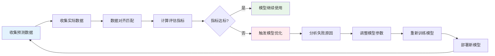
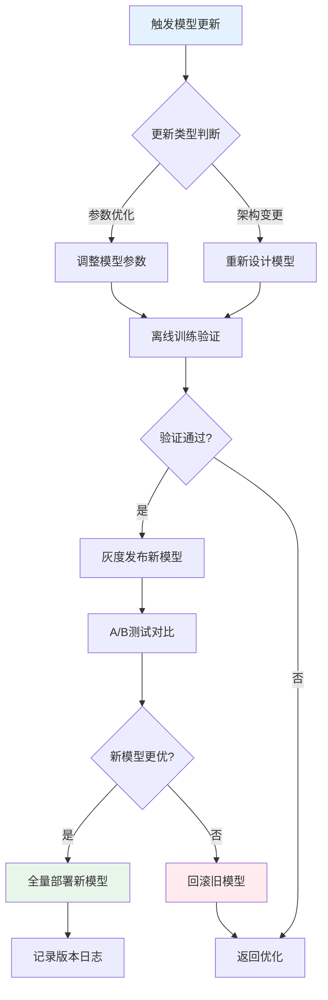
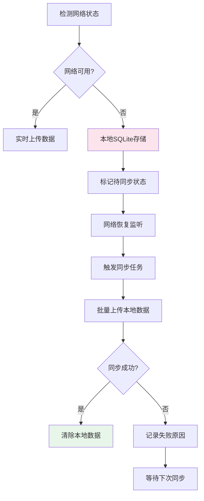
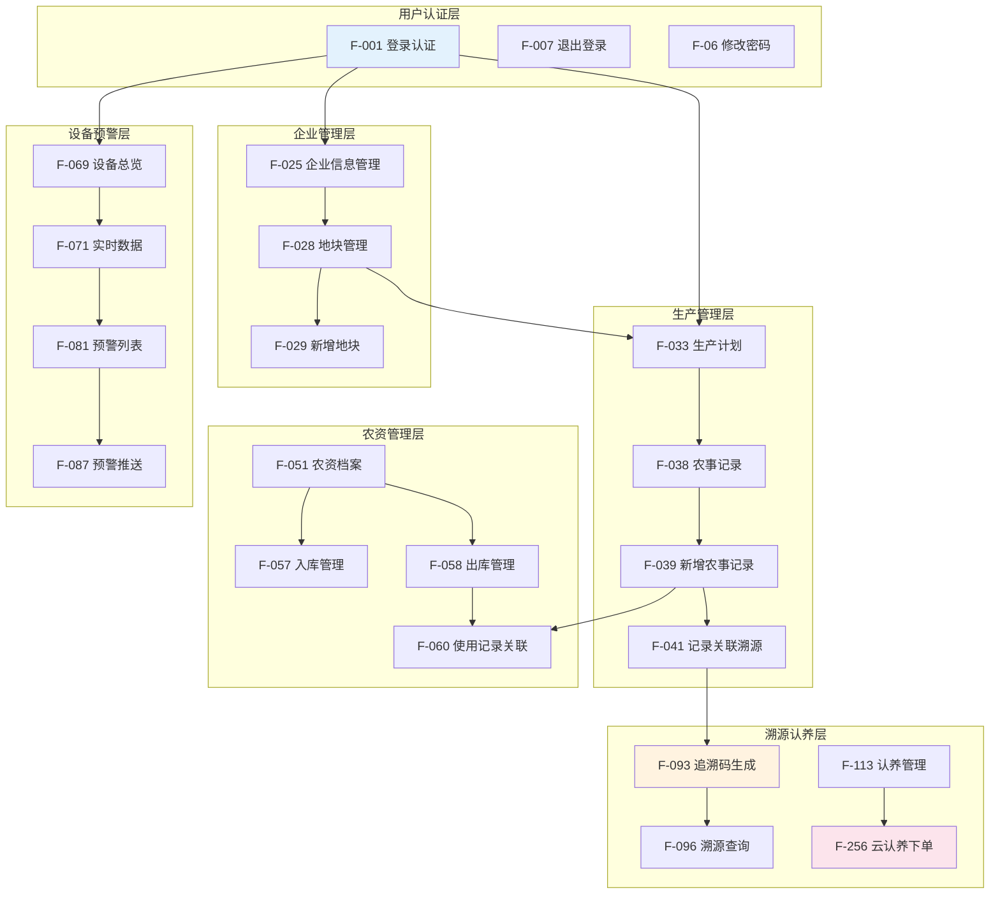
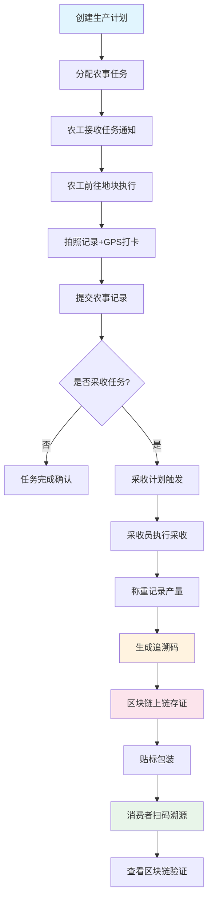
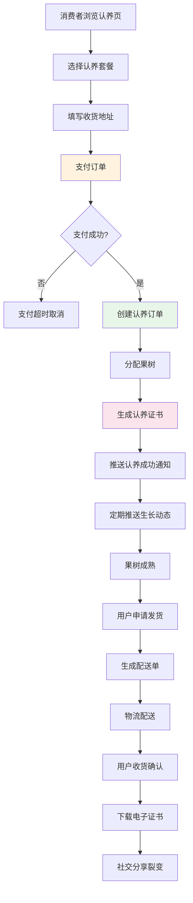
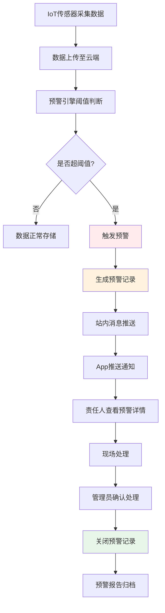
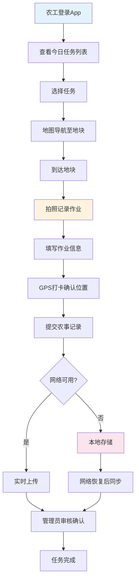
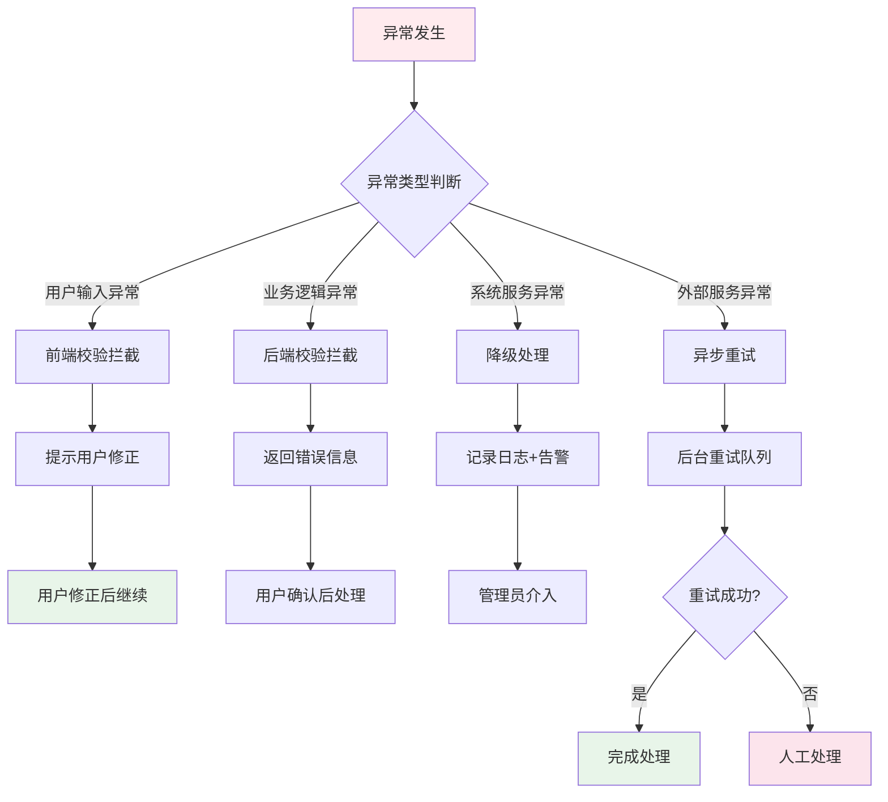
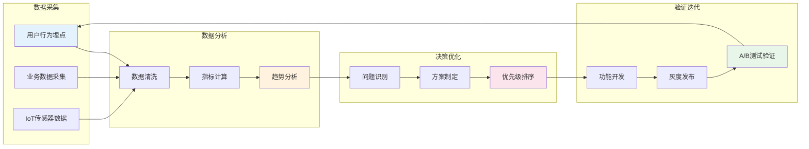

# 智慧果园管理系统 产品需求说明书

| 文档信息     | 内容                            |
| -------- | ----------------------------- |
| **文档版本** | V2.0                          |
| **编制日期** | 2026-06-16                    |
| **产品名称** | 智慧果园管理系统                      |
| **覆盖端**  | PC管理端 · 移动工作端 · 数据大屏端 · H5溯源端 |
| **文档状态** | 正式版                           |

***

## 目录

1. [第一章 产品概述](#第一章-产品概述)
2. [第二章 用户分析](#第二章-用户分析)
3. [第三章 用户故事与需求框架](#第三章-用户故事与需求框架)
4. [第四章 系统架构设计](#第四章-系统架构设计)
5. [第五章 产品设计方案](#第五章-产品设计方案)
6. [第六章 功能需求详述](#第六章-功能需求详述)
7. [第七章 权限体系设计](#第七章-权限体系设计)
8. [第八章 业务流程与闭环](#第八章-业务流程与闭环)
9. [第九章 性能与安全要求](#第九章-性能与安全要求)
10. [第十章 部署与运维](#第十章-部署与运维)
11. [第十一章 接口设计](#第十一章-接口设计)
12. [第十二章 数据字典](#第十二章-数据字典)
13. [第十三章 页面清单](#第十三章-页面清单)
14. [第十四章 产品亮点](#第十四章-产品亮点)
15. [第十五章 效益分析](#第十五章-效益分析)
16. [第十六章 数据表结构设计](#第十六章-数据表结构设计)
17. [第十七章 版本规划与里程碑](#第十七章-版本规划与里程碑)
18. [第十八章 测试要求与验收标准](#第十八章-测试要求与验收标准)
19. [第十九章 风险分析与应对](#第十九章-风险分析与应对)
20. [第二十章 成功指标与KPI](#第二十章-成功指标与KPI)
21. [第二十一章 竞品分析](#第二十一章-竞品分析)
22. [第二十二章 用户旅程图](#第二十二章-用户旅程图)
23. [第二十三章 异常处理流程](#第二十三章-异常处理流程)
24. [第二十四章 数据驱动闭环](#第二十四章-数据驱动闭环)
25. [第二十五章 数据埋点与统计](#第二十五章-数据埋点与统计)
26. [第二十六章 第三方服务对接](#第二十六章-第三方服务对接)
27. [第二十七章 国际化与多语言支持](#第二十七章-国际化与多语言支持)
28. [第二十八章 法律合规性](#第二十八章-法律合规性)
29. [第二十九章 无障碍设计](#第二十九章-无障碍设计)
30. [附录](#附录)

***

## 第一章 产品概述

### 1.1 产品背景

随着农业现代化转型加速，传统苹果种植面临诸多挑战：生产管理粗放、信息记录依靠纸质、农资浪费严重、病虫害预警滞后、消费端对食品安全追溯需求日益强烈。"智慧果园管理系统"以数字化手段全面覆盖苹果种植园的生产管理、物联感知、农资调度、品质追溯及消费互动等全链路环节，实现从土地到餐桌的数字化闭环。

### 1.2 产品定位

面向苹果种植企业的一体化智慧农业管理平台，连接管理者、农工、消费者三类核心角色，打通生产管理、质量追溯、销售认养三大业务场景。

### 1.3 核心价值主张

| 价值维度     | 具体体现                                 |
| -------- | ------------------------------------ |
| **降本增效** | 农事计划数字化、农资精细化管理，减少人工记录成本与农资浪费        |
| **风险可控** | IoT实时监测 + AI预警 + 无人机巡检，将病虫害、气候风险主动前置 |
| **品质可信** | 区块链溯源 + H5扫码展示，向消费者提供可验证的全链路品质证明     |
| **消费互动** | 云认养模式将果园变成消费者参与的生活方式产品，创造高溢价增量       |
| **决策智能** | 生长/天气/病虫/产量/价格五大AI模型，辅助管理者科学决策       |

### 1.4 系统版图与端侧架构

```
智慧果园管理系统
├── PC管理后台        ← 管理者/管理员使用，全功能操作台
├── 移动工作端        ← 农工/基层管理人员使用，现场采集与处理
├── 数据大屏端        ← 企业高管/展览展示，全局数据驾驶舱
└── H5溯源端          ← 消费者使用，扫码溯源/认养互动
```

***

## 第二章 用户分析

### 2.1 用户角色全景

| 角色          | 典型身份      | 使用终端    | 核心诉求              |
| ----------- | --------- | ------- | ----------------- |
| **超级管理员**   | IT/系统负责人  | PC      | 权限管控、系统配置、用户管理    |
| **企业管理者**   | 总经理/园长    | PC + 大屏 | 全局数据掌控、经营决策支撑     |
| **基地管理员**   | 种植基地负责人   | PC + 移动 | 农事计划排期、农资调度、设备监控  |
| **农技员/植保员** | 专业技术人员    | PC + 移动 | 病虫害识别、农药施用指导、记录上报 |
| **普通农工**    | 一线种植工人    | 移动端     | 任务接收、农事记录上报、农资领用  |
| **采收员**     | 负责采摘的工人   | 移动端     | 采收任务执行、产量称重记录     |
| **溯源消费者**   | 终端消费者     | H5      | 扫码了解产品来源与种植过程     |
| **认养用户**    | 购买认养权的消费者 | H5/移动   | 远程看果树、收货、证书展示     |
| **供应商**     | 农资供应方     | ——      | 供货信息录入（通过管理员操作）   |

### 2.2 核心痛点分析

#### 2.2.1 管理层痛点

| #  | 痛点              | 影响        | 系统方案                   |
| -- | --------------- | --------- | ---------------------- |
| P1 | 无法实时了解各地块当前生产状态 | 管理盲区，决策滞后 | 首页驾驶舱 + 移动端实时上报        |
| P2 | 农资消耗无从溯源，浪费严重   | 成本不可控     | 农资全生命周期管理（入库→出库→领用→退料） |
| P3 | 病虫害预警完全依赖肉眼巡园   | 发现时已成灾    | IoT监测 + AI预警 + 无人机巡检   |
| P4 | 多基地数据难以汇总对比     | 经营分析困难    | 数据大屏实时聚合               |

#### 2.2.2 农工层痛点

| #  | 痛点             | 影响        |
| -- | -------------- | --------- |
| P5 | 纸质工单易丢失、字迹难辨认  | 历史数据无法追溯  |
| P6 | 病虫害不认识、不知道怎么处理 | 处理延误或用药错误 |
| P7 | 农资领用排队等待、核销繁琐  | 效率低，易出错   |
| P8 | 设备故障不知道谁来负责维修  | 响应慢，损失大   |

#### 2.2.3 消费者痛点

| #   | 痛点             | 影响       |
| --- | -------------- | -------- |
| P9  | 买苹果不知道农药用了多少   | 食品安全顾虑   |
| P10 | 想体验种苹果但没有土地    | 消费需求无法满足 |
| P11 | 无法验证产品的有机/绿色认证 | 信任危机     |

***

## 第三章 用户故事与需求框架

### 3.1 Epic级别用户故事

#### Epic 1：生产管理数字化

> **US-001** 作为基地管理员，我想要创建完整的苹果生产计划（从整地到采收），以便农工能按计划有序执行，并在完成后自动汇总到我的工作台。

> **US-002** 作为农技员，我在田间发现了疑似腐烂病的症状，我想用手机拍照后快速识别病害类型并获取用药建议，以便当天完成防治处理。

> **US-003** 作为普通农工，我想通过手机查看今天分配给我的农事任务，并在完成后一键签到打卡，不需要跑去办公室报告。

> **US-004** 作为采收员，我想在果园现场用手机记录每箱苹果的实际重量和采收人员，以便后台自动统计本次采收总量并生成采收报告。

#### Epic 2：IoT感知与预警

> **US-005** 作为基地管理员，当土壤湿度低于阈值时，我希望第一时间收到预警推送，查看具体是哪个地块的哪台传感器报警，并能在手机上直接下发灌溉指令。

> **US-006** 作为植保员，我想查看过去7天的气象趋势，结合当前物候期判断未来3天的病虫害风险指数，提前安排预防施药。

> **US-007** 作为基地管理员，我希望定期安排无人机对园区进行自动巡检，并将飞行轨迹和拍摄画面保存到系统，以便远程查看果园情况。

#### Epic 3：品质追溯与区块链

> **US-008** 作为企业品控负责人，我希望每一批次苹果从育苗、农事作业、农资投入到采收、包装的全流程数据都能上链存证，让消费者扫码即可查看无法篡改的生产记录。

> **US-009** 作为消费者，我收到了一箱苹果，想通过扫箱上的二维码了解这箱苹果产自哪个果园、用了什么农药、由谁采摘，以确认食品安全。

#### Epic 4：云认养互动

> **US-010** 作为认养用户，我在认养了一棵苹果树后，希望能随时查看"我的果树"的实时生长照片和生长记录，在苹果成熟时收到通知并申请发货，感受参与农业的乐趣。

> **US-011** 作为基地管理员，我希望统一管理所有认养果树的状态，定期为认养用户推送生长动态，在采收期为其打包苹果并完成配送，减少人工沟通成本。

#### Epic 5：AI辅助决策

> **US-012** 作为企业管理者，在每季度开始前，我想看到AI生成的产量预测报告，结合市场价格模型制定销售策略，而不仅仅靠经验判断。

> **US-013** 作为基地管理员，我想通过AI助手直接用语音或文字提问"最近哪个地块病虫害风险最高"，获取结合历史数据的智能回答，而不需要翻阅多个报表。

### 3.2 需求优先级框架

| 优先级 | 定义   | 说明              |
| --- | ---- | --------------- |
| P0  | 核心功能 | 系统运行必备，影响核心业务流程 |
| P1  | 重要功能 | 重要业务模块，但有替代方案   |
| P2  | 增强功能 | 提升用户体验，非必备      |

***

## 第四章 系统架构设计

### 4.1 整体架构

```
┌─────────────────────────────────────────────────────────┐
│                   智慧果园管理平台                       │
├────────────┬─────────────┬──────────────┬───────────────┤
│  PC管理后台 │  移动工作端  │   数据大屏端   │   H5溯源端   │
│ (浏览器访问) │(App/H5访问) │  (大屏浏览器)  │ (微信/浏览器) │
└────────────┴─────────────┴──────────────┴───────────────┘
                          │
                    ┌─────┴─────┐
                    │  统一API   │
                    │  网关层    │
                    └─────┬─────┘
         ┌────────────────┼──────────────────┐
    ┌────┴────┐    ┌───────┴──────┐   ┌──────┴──────┐
    │ 业务服务 │    │   IoT服务    │   │  AI模型服务  │
    │(农事/农资/│   │(设备接入/数  │   │(生长/天气/  │
    │追溯/认养) │    │据流/预警引擎)│   │产量/价格)   │
    └────┬────┘    └───────┬──────┘   └──────┬──────┘
         └────────────────┼──────────────────┘
                    ┌─────┴─────┐
                    │   数据存储  │
                    │ 数据库/区块链│
                    └───────────┘
```

### 4.2 PC后台导航结构

```
智慧果园（PC管理后台）
├── 🏠 系统首页
├── 🏢 企业管理
│   ├── 基本信息管理
│   └── 地块管理
├── 🌾 农事管理
│   ├── 生产计划
│   ├── 农事记录
│   ├── 农事巡查
│   └── 无人机巡检
├── 📦 农资管理
│   ├── 农资信息
│   ├── 库存管理
│   ├── 出入库管理
│   ├── 农资使用记录
│   ├── 退料管理
│   └── 供应商管理
├── 📡 设备管理
│   ├── 设备实时监控
│   ├── 设备信息管理
│   ├── 设备日志
│   └── 设备维护
├── 🔔 预警管理
│   ├── 设备预警
│   ├── 农事预警
│   ├── 内部报告
│   └── 预警设置
├── 🏷️ 产品追溯
│   ├── 追溯码管理
│   ├── 溯源配置
│   ├── 溯源查询
│   └── 区块链存证
├── 🍎 采收管理
│   ├── 采收计划
│   ├── 采收记录
│   └── 采后处理
├── 🌳 认养管理
│   ├── 认养果树管理
│   ├── 认养订单管理
│   ├── 农事操作记录
│   └── 认养采收管理
├── 🧠 模型预测中心
│   ├── 生长模型
│   ├── 天气预测模型
│   ├── 病虫害预测模型
│   ├── 物候期模型
│   ├── 产量预测模型
│   ├── 价格预测模型
│   └── 模型配置
├── 📊 经营报表
│   ├── 经营概览
│   ├── 成本分析
│   ├── 收入分析
│   └── 地块效益
├── 👥 人员绩效
│   ├── 绩效看板
│   └── 绩效详情
├── 🛒 销售管理
│   ├── 订单管理
│   ├── 客户管理
│   └── 销售统计
├── 📋 任务调度
│   ├── 任务分配
│   └── 人员排班
├── 📝 作业指导
│   ├── 作业标准库
│   └── 农资用量计算
├── 📜 合格证管理
│   ├── 合格证模板
│   ├── 合格证开具
│   └── 合格证查询
├── 🥽 VR全景
├── ⚙ 系统设置
└── 👤 用户设置
```

***

## 第五章 产品设计方案

### 5.1 设计原则

1. **一致性**：全端统一设计语言，保证用户体验连贯
2. **实用性**：以用户任务为导向，减少操作步骤
3. **高效性**：关键信息一目了然，减少认知负担
4. **可扩展性**：设计预留扩展空间，适应业务发展

### 5.2 设计系统规范

#### 5.2.1 色彩体系

| 色彩类型  | 色值      | 用途           |
| ----- | ------- | ------------ |
| 主色-标准 | #22a84a | 按钮、链接、状态标签   |
| 主色-深色 | #1a7a3c | 导航栏、强调元素     |
| 主色-浅色 | #f0faf3 | 卡片背景、hover状态 |
| 辅助色-蓝 | #1890ff | 信息提示、链接      |
| 辅助色-橙 | #fa8c16 | 警告、提醒        |
| 辅助色-红 | #ff4d4f | 错误、紧急预警      |
| 辅助色-紫 | #722ed1 | 特殊功能标识       |
| 辅助色-黄 | #faad14 | 提示、注意        |

#### 5.2.2 主色调渐变

| 渐变名称 | 色值                                        | 用途       |
| ---- | ----------------------------------------- | -------- |
| 主色渐变 | linear-gradient(135deg, #1a7a3c, #22a84a) | Header背景 |
| 品牌渐变 | linear-gradient(135deg, #ff6b35, #ff8c42) | 头像、强调元素  |

#### 5.2.3 功能色定义

| 状态 | 色值      | 背景色     | 边框色     |
| -- | ------- | ------- | ------- |
| 成功 | #52c41a | #f6ffed | #b7eb8f |
| 警告 | #faad14 | #fffbe6 | #ffe58f |
| 错误 | #ff4d4f | #fff2f0 | #ffccc7 |
| 信息 | #1890ff | #e6f7ff | #91d5ff |

#### 5.2.4 中性色定义

| 色阶       | 色值      | 用途     |
| -------- | ------- | ------ |
| gray-50  | #fafafa | 最浅背景   |
| gray-100 | #f5f5f5 | 页面背景   |
| gray-200 | #e8e8e8 | 分割线    |
| gray-300 | #d9d9d9 | 禁用边框   |
| gray-400 | #bfbfbf | 禁用文字   |
| gray-500 | #8c8c8c | 次要文字   |
| gray-600 | #595959 | 次要文字强调 |
| gray-700 | #434343 | 正文文字   |
| gray-800 | #262626 | 标题文字   |
| gray-900 | #1f1f1f | 最深文字   |

#### 5.2.5 文字色定义

| 类型             | 色值       | 用途       |
| -------------- | -------- | -------- |
| text-primary   | gray-900 | 标题、重要文字  |
| text-secondary | gray-700 | 正文       |
| text-tertiary  | gray-500 | 次要文字     |
| text-disabled  | gray-400 | 禁用文字     |
| text-inverse   | #ffffff  | 深色背景上的文字 |

#### 5.2.6 间距系统

| 名称        | 值    | 用途        |
| --------- | ---- | --------- |
| space-xs  | 4px  | 紧凑元素间距    |
| space-sm  | 8px  | 小组件间距     |
| space-md  | 12px | 标准元素间距    |
| space-lg  | 16px | 页面边距、卡片间距 |
| space-xl  | 20px | 大区块间距     |
| space-2xl | 24px | 页面级区块间距   |

#### 5.2.7 圆角系统

| 名称          | 值      | 用途      |
| ----------- | ------ | ------- |
| radius-sm   | 6px    | 按钮、输入框  |
| radius-md   | 8px    | 小卡片     |
| radius-lg   | 10px   | 大卡片、面板  |
| radius-xl   | 12px   | 模态框     |
| radius-full | 9999px | 标签、胶囊按钮 |

#### 5.2.8 阴影系统

| 名称        | 值                           | 用途    |
| --------- | --------------------------- | ----- |
| shadow-sm | 0 1px 2px rgba(0,0,0,0.05)  | 轻微凸起  |
| shadow-md | 0 2px 12px rgba(0,0,0,0.08) | 标准卡片  |
| shadow-lg | 0 4px 24px rgba(0,0,0,0.12) | 弹窗、浮层 |
| shadow-xl | 0 8px 40px rgba(0,0,0,0.16) | 强调浮层  |

### 5.3 响应式布局策略

#### 5.3.1 PC端断点

| 断点 | 屏幕宽度        | 布局变化        |
| -- | ----------- | ----------- |
| XL | ≥1600px     | 7列指标卡片      |
| LG | 1344-1600px | 5列指标卡片，完整导航 |
| MD | 1024-1344px | 4列指标卡片，汉堡菜单 |
| SM | 768-1024px  | 3列指标卡片，单栏布局 |
| XS | ≤768px      | 2列指标卡片，移动布局 |

#### 5.3.2 移动端适配

| 设备类型            | 屏幕宽度        | 适配策略  |
| --------------- | ----------- | ----- |
| iPhone 14/15/16 | 390px-428px | 标准移动端 |
| iPad            | 768-1024px  | 平板适配  |

#### 5.3.3 响应式组件策略

- **导航栏**：1344px以下切换为汉堡菜单，移动端显示底部Tab导航
- **指标卡片**：根据屏幕宽度动态调整列数（7→5→4→3→2）
- **表格**：移动端支持横向滚动，固定首列
- **模态框**：移动端全屏展示，PC端居中展示

### 5.4 交互体验设计

#### 5.4.1 页面加载动画

| 参数   | 值                            | 说明     |
| ---- | ---------------------------- | ------ |
| 动画类型 | fadeInUp                     | 淡入+上移  |
| 初始状态 | opacity: 0, translateY: 10px | 加载前    |
| 结束状态 | opacity: 1, translateY: 0    | 加载完成   |
| 时长   | 0.3s                         | 标准动画时长 |
| 缓动函数 | ease                         | 平滑过渡   |

#### 5.4.2 Toast提示

| 参数   | 值                          | 说明        |
| ---- | -------------------------- | --------- |
| 位置   | top: 70px, right: 20px     | 固定在右上角    |
| 类型   | success/warning/error/info | 四种状态      |
| 进入动画 | slideInRight               | 从右侧滑入     |
| 停留时间 | 3秒                         | 自动消失      |
| 成功色  | #52c41a                    | success状态 |
| 警告色  | #fa8c16                    | warning状态 |
| 错误色  | #ff4d4f                    | error状态   |
| 信息色  | #1890ff                    | info状态    |

#### 5.4.3 实时数据指示器

| 参数   | 值                 | 说明   |
| ---- | ----------------- | ---- |
| 类型   | pulse             | 脉冲动画 |
| 颜色   | #52c41a（绿色）       | 在线状态 |
| 动画周期 | 2s无限循环            | 持续动画 |
| 应用场景 | 设备在线状态、摄像头在线、实时数据 | 使用位置 |

#### 5.4.4 状态标签动画

| 状态   | 动画效果   | 应用场景        |
| ---- | ------ | ----------- |
| 紧急预警 | 红色脉冲光晕 | 红色预警标签      |
| 在线状态 | 绿色闪烁   | 设备在线、摄像头在线  |
| 滚动消息 | 横向滚动   | 预警/通知/喜讯滚动条 |

#### 5.4.5 模态框动画

| 参数   | 值                            | 说明    |
| ---- | ---------------------------- | ----- |
| 进入动画 | scale(0.95→1) + opacity(0→1) | 缩放+淡入 |
| 时长   | 0.2s                         | 快速响应  |
| 缓动函数 | ease                         | 平滑过渡  |
| 背景遮罩 | rgba(0,0,0,0.5)              | 半透明遮罩 |

***

## 第六章 功能需求详述

### 6.1 PC管理后台功能

#### 6.1.1 账号与权限管理

**页面**：`login.html`、`user_settings.html`

| 需求编号  | 功能描述                            | 优先级 |
| ----- | ------------------------------- | --- |
| F-001 | 支持用户名+密码登录，密码输入框支持显示/隐藏切换       | P0  |
| F-002 | 支持"记住登录状态"选项，有效期7天              | P1  |
| F-003 | 登录页面展示系统名称（智慧果园）、苹果果园背景图和品牌Logo | P0  |
| F-004 | 登录失败显示明确的错误提示（账号不存在/密码错误/账号已停用） | P0  |
| F-005 | 连续5次密码错误后账号锁定15分钟               | P1  |
| F-006 | 支持修改密码（登录后在用户菜单中触发）             | P1  |
| F-007 | 退出登录清除本地Token，跳转回登录页            | P0  |
| F-008 | 支持修改头像、昵称、联系电话、所属部门等个人信息        | P1  |
| F-009 | 展示当前账号的角色权限列表（只读）               | P1  |
| F-010 | 登录日志查看（最近10次登录记录，含IP、时间、设备）     | P2  |

#### 6.1.2 系统首页（驾驶舱）

**页面**：`home.html`

| 需求编号  | 功能描述                                 | 优先级 |
| ----- | ------------------------------------ | --- |
| F-011 | 展示当前登录用户名、角色、未读消息数量（红点提示）            | P0  |
| F-012 | 全局顶部导航提供系统所有一级模块的快速跳转                | P0  |
| F-013 | 顶部导航在窄屏（≤1344px）自动折叠为汉堡菜单            | P1  |
| F-014 | 展示今日天气（温度/天气状态/风力/湿度）、当前日期、当前物候期     | P0  |
| F-015 | 展示核心KPI指标卡：今日农事任务数、设备在线率、活跃预警数、本月采收量 | P0  |
| F-016 | 骨架屏加载动画，避免数据加载时的白屏闪烁                 | P1  |
| F-017 | 实时预警列表：按红/橙/黄/蓝四级分类展示最新预警，点击跳转预警详情   | P0  |
| F-018 | 待办任务列表：展示待我处理的任务（含紧急/普通/低优先级标签）      | P0  |
| F-019 | 系统通知公告：展示未读/已读状态的通知消息                | P1  |
| F-020 | 模块快速入口卡片：企业管理/农事管理/农资管理/设备管理等模块卡片    | P0  |
| F-021 | 首页数据支持Toast提示反馈（操作成功/失败/信息）          | P1  |
| F-022 | 基地实景监控区块：展示4个摄像头实时画面（果园东区/西区/南区/北区）  | P0  |
| F-023 | 模型预测快讯区块：横向滚动卡片展示生长/病虫害/产量/价格预测结果    | P0  |
| F-024 | 数据自动刷新：首页核心数据每30秒自动刷新一次              | P1  |

#### 6.1.3 企业管理

**页面**：`enterprise_base.html`、`enterprise_plot.html`

| 需求编号  | 功能描述                                | 优先级 |
| ----- | ----------------------------------- | --- |
| F-025 | 企业基础信息录入与编辑（企业名称、简介、联系方式、营业执照、法人信息） | P0  |
| F-026 | 企业Logo/封面图上传与管理                     | P1  |
| F-027 | 资质证书管理：有机认证、绿色食品认证等证书的上传、有效期提醒      | P1  |
| F-028 | 地块列表：展示所有地块的名称、面积、种植品种、当前物候期、负责人    | P0  |
| F-029 | 新增地块：支持设置地块名称、区域、面积、种植品种、行株距等信息     | P0  |
| F-030 | 地块编辑与删除                             | P0  |
| F-031 | 地块状态管理：正常/休耕/维护中等状态切换               | P1  |
| F-032 | 地块搜索与筛选（按区域、品种、状态）                  | P1  |

#### 6.1.4 农事管理

**页面**：`farming_plan.html`、`farming_record.html`、`farming_patrol.html`、`drone_patrol.html`

| 需求编号  | 功能描述                                   | 优先级 |
| ----- | -------------------------------------- | --- |
| F-033 | 计划列表：展示所有生产计划的名称、关联地块、计划时间、负责人、状态      | P0  |
| F-034 | 新增计划：支持录入计划名称、作业类型、目标地块、计划人员、预计开始/结束日期 | P0  |
| F-035 | 计划状态自动更新（按日期判断是否延误）                    | P1  |
| F-036 | 计划导出为Excel/PDF                         | P2  |
| F-037 | 计划关联农事记录（计划 → 执行记录可追溯）                 | P0  |
| F-038 | 记录列表：展示日期、作业类型、地块、作业人员、农资用量、备注         | P0  |
| F-039 | 新增农事记录（支持关联计划、农资、图片上传）                 | P0  |
| F-040 | 按日期范围、地块、作业类型多维度检索                     | P1  |
| F-041 | 记录数据联动追溯模块，自动写入溯源链                     | P0  |
| F-042 | 巡查任务管理：新增巡查计划（目标地块、巡查人、预定时间）           | P0  |
| F-043 | 巡查记录：上报内容包含位置、照片、发现问题描述、处理建议           | P0  |
| F-044 | 巡查轨迹记录（与GPS/GIS地图联动）                   | P1  |
| F-045 | 巡查报告自动汇总，管理员可查看和审核                     | P1  |
| F-046 | 巡检任务管理：创建无人机巡检任务（目标区域、飞行时间、飞手）         | P0  |
| F-047 | 飞行轨迹地图展示（飞行路径可视化）                      | P1  |
| F-048 | 巡检照片/视频记录管理（自动挂接到地块和日期）                | P0  |
| F-049 | 巡检报告生成：根据照片和飞手填报自动生成Word/PDF报告         | P2  |
| F-050 | 无人机设备状态管理（电量/状态/飞行次数）                  | P1  |

#### 6.1.5 农资管理

**页面**：`material_info.html`、`material_inventory.html`、`material_io.html`、`material_usage.html`、`material_return.html`、`material_supplier.html`

| 需求编号  | 功能描述                                   | 优先级 |
| ----- | -------------------------------------- | --- |
| F-051 | 农资档案管理：农药/化肥/农具等类型信息录入（名称、规格、用途、安全间隔期） | P0  |
| F-052 | 农资分类管理（农药/肥料/农具/其他）                    | P0  |
| F-053 | 批次管理：同一农资多个批次可单独追踪                     | P1  |
| F-054 | 实时库存总览（库存量、库存金额、低库存预警标识）               | P0  |
| F-055 | 库存盘点：录入实盘数量，自动计算盈亏                     | P1  |
| F-056 | 低库存自动预警（库存≤设定阈值时触发）                    | P0  |
| F-057 | 入库单录入（供应商、农资、数量、单价、入库日期、批次号）           | P0  |
| F-058 | 出库单录入（领用人、用途地块、数量、出库日期）                | P0  |
| F-059 | 出入库历史记录查询（按时间、类型、农资名称筛选）               | P1  |
| F-060 | 使用记录自动关联农事记录和地块                        | P0  |
| F-061 | 农药安全间隔期提醒（使用日期 + 安全间隔期 → 自动计算最早上市日期）   | P0  |
| F-062 | 使用统计报表（按地块/月份/农资类型汇总）                  | P1  |
| F-063 | 退料申请录入（退回的农资、数量、原因）                    | P1  |
| F-064 | 退料审批流程                                 | P1  |
| F-065 | 退料后自动更新库存                              | P1  |
| F-066 | 供应商档案录入（名称、联系人、电话、供应类目、资质）             | P1  |
| F-067 | 供应商评级与备注                               | P2  |
| F-068 | 供应商与采购记录关联                             | P1  |

#### 6.1.6 IoT设备管理

**页面**：`device_monitor.html`、`device_info.html`、`device_log.html`、`device_maintain.html`

| 需求编号  | 功能描述                              | 优先级 |
| ----- | --------------------------------- | --- |
| F-069 | 设备总览大盘：在线/离线/维护中数量统计              | P0  |
| F-070 | 设备地图展示（按地块可视化设备分布）                | P1  |
| F-071 | 实时数据展示：温度、湿度、土壤水分、光照、CO₂等传感器实时数据  | P0  |
| F-072 | 数据趋势图（折线图展示历史传感器数据，支持时间范围筛选）      | P1  |
| F-073 | 设备档案管理（设备名称、SN码、型号、安装位置、安装日期、负责人） | P0  |
| F-074 | 设备状态管理（在线/离线/维护中）及状态变更记录          | P0  |
| F-075 | 设备分类：气象站/土壤传感器/摄像头/虫情监测仪/水肥一体机等   | P0  |
| F-076 | 设备操作日志查询（上线/下线/数据异常/人工操作等）        | P1  |
| F-077 | 日志按设备、日期、事件类型检索                   | P1  |
| F-078 | 维护工单管理（故障描述、处理人、预计完成日期、处理结果）      | P1  |
| F-079 | 维护历史记录                            | P1  |
| F-080 | 定期维护提醒（按保养周期）                     | P2  |

#### 6.1.7 预警管理

**页面**：`alert_device.html`、`alert_farming.html`、`alert_internal_report.html`、`alert_settings.html`

| 需求编号  | 功能描述                                    | 优先级 |
| ----- | --------------------------------------- | --- |
| F-081 | 设备异常预警列表（传感器数据超阈值、设备离线等）                | P0  |
| F-082 | 预警四级分类：红色（紧急）/橙色（严重）/黄色（警告）/蓝色（提示）      | P0  |
| F-083 | 预警详情查看（触发时间、地块位置、传感器数据、建议处理方案）          | P0  |
| F-084 | 预警处理状态管理（待处理/处理中/已解决）                   | P0  |
| F-085 | 批量操作（批量确认/批量关闭）                         | P1  |
| F-086 | 农事预警：气象灾害预警（霜冻/暴雨/大风）、病虫害扩散预警、关键物候期节点提醒 | P0  |
| F-087 | 预警推送到相关责任人（站内消息 + App推送）                | P0  |
| F-088 | 预警事件汇总报告（周/月维度自动生成）                     | P1  |
| F-089 | 报告支持导出PDF                               | P2  |
| F-090 | 预警阈值配置（每类传感器的上下限设置）                     | P0  |
| F-091 | 预警规则配置（触发条件、通知人员、推送渠道）                  | P0  |
| F-092 | 静默时段设置（夜间免打扰）                           | P2  |

#### 6.1.8 产品追溯

**页面**：`trace_code.html`、`trace_config.html`、`trace_query.html`、`trace_blockchain.html`

| 需求编号  | 功能描述                          | 优先级 |
| ----- | ----------------------------- | --- |
| F-093 | 追溯码生成（批次号 → 唯一追溯二维码）          | P0  |
| F-094 | 追溯码与产品批次、地块、采收记录、农事记录自动关联     | P0  |
| F-095 | 追溯码批量生成与导出（用于贴标打印）            | P1  |
| F-096 | 追溯码查询：通过编号或扫码查询追溯详情           | P0  |
| F-097 | 追溯码状态管理（未激活/已激活/已查询次数）        | P1  |
| F-098 | 溯源展示内容配置（C端页面显示哪些字段，每个字段是否公开） | P1  |
| F-099 | 品牌信息、联系方式、企业简介等展示内容配置         | P1  |
| F-100 | 后台溯源查询：按追溯码/批次号快速检索追溯记录       | P0  |
| F-101 | 查询结果展示完整追溯链（农事→农资→采收→包装→物流）   | P0  |
| F-102 | 关键农事记录和检测报告自动上链存证             | P1  |
| F-103 | 展示区块链Hash值和上链时间，支持链上验证入口      | P1  |
| F-104 | 区块链存证报告导出                     | P2  |

#### 6.1.9 采收管理

**页面**：`harvest_plan.html`、`harvest_record.html`、`harvest_post.html`

| 需求编号  | 功能描述                             | 优先级 |
| ----- | -------------------------------- | --- |
| F-105 | 采收计划制定（目标地块、采收日期、采收班次、预计产量）      | P0  |
| F-106 | 采收人员分配与计划下发                      | P0  |
| F-107 | 采收计划与生产计划联动                      | P1  |
| F-108 | 采收记录录入（地块、批次、采收人、起止时间、实际产量、分级情况） | P0  |
| F-109 | 采收数据按地块/品种/时间维度统计分析              | P1  |
| F-110 | 采收记录自动关联追溯模块                     | P0  |
| F-111 | 采后处理流程记录（清洗、分级、包装、入库、出库）         | P1  |
| F-112 | 冷库/储藏管理（温湿度记录，产品在库状态）            | P1  |

#### 6.1.10 云认养管理

**页面**：`adoption_tree.html`、`adoption_order.html`、`adoption_farming.html`、`adoption_harvest.html`

| 需求编号  | 功能描述                                  | 优先级 |
| ----- | ------------------------------------- | --- |
| F-113 | 认养果树档案：每棵参与认养的果树单独建档（位置、品种、编号、当前认养状态） | P0  |
| F-114 | 果树认养状态管理（未认养/认养中/已到期）                 | P0  |
| F-115 | 批量更新果树生长状态（周期性更新照片和生长记录）              | P0  |
| F-116 | 果树地图定位（在地块地图上标注具体位置）                  | P1  |
| F-117 | 认养订单列表（订单号、认养用户、认养套餐、认养期限、金额、状态）      | P0  |
| F-118 | 订单状态流转：待付款 → 待分配 → 认养中 → 已结束          | P0  |
| F-119 | 订单详情查看（用户信息、认养果树、收货地址、付款记录）           | P0  |
| F-120 | 支持为用户手动分配果树或重新分配                      | P0  |
| F-121 | 为认养果树记录专项农事操作（施肥、修剪、套袋等），并自动推送给认养用户   | P0  |
| F-122 | 操作记录附带图片上传，增强用户信任感                    | P0  |
| F-123 | 支持为特定认养用户定制备注留言                       | P1  |
| F-124 | 认养采收记录：记录认养果树的采收时间、实际产量、分级结果          | P0  |
| F-125 | 配送管理：根据用户收货地址生成配送单，支持物流单号录入           | P0  |
| F-126 | 采收通知推送给认养用户                           | P0  |

#### 6.1.11 模型预测中心

**页面**：`model_growth.html`、`model_weather.html`、`model_pest.html`、`model_phenology.html`、`model_yield.html`、`model_price.html`、`model_config.html`

| 需求编号  | 功能描述                            | 优先级 |
| ----- | ------------------------------- | --- |
| F-127 | 基于温度积累、日照时数预测果树生长节点（各物候期预计到达日期） | P1  |
| F-128 | 各地块生长曲线可视化（ECharts折线图）          | P1  |
| F-129 | 支持手动调整模型参数（品种系数、区域修正值）          | P2  |
| F-130 | 未来7天精准气象预报（温度/降水/风速/湿度）         | P1  |
| F-131 | 极端天气预警（霜冻、冰雹、暴雨阈值触发）            | P0  |
| F-132 | 历史气象数据查询与导出                     | P2  |
| F-133 | 基于温湿度、历史发病率预测未来3-7天主要病虫害风险指数    | P1  |
| F-134 | 高风险病虫害自动关联推荐防治方案（用药建议）          | P1  |
| F-135 | 病虫害风险热力地图（按地块可视化）               | P2  |
| F-136 | 当前物候期显示及各物候期关键操作提示              | P0  |
| F-137 | 物候期日历（可视化全年物候期时间轴）              | P1  |
| F-138 | 物候期实际与预测偏差分析                    | P2  |
| F-139 | 基于历史产量、当前生长状态预测本季总产量（分地块）       | P1  |
| F-140 | 产量预测置信区间展示（乐观/基准/悲观三档）          | P2  |
| F-141 | 产量预测与历史对比分析                     | P2  |
| F-142 | 基于历史市场行情预测未来1-3个月苹果收购价格趋势       | P2  |
| F-143 | 价格预警（当预测价格明显低于成本线时触发）           | P2  |
| F-144 | 最优销售窗口期建议                       | P2  |
| F-145 | 各模型参数统一配置（权重、数据源、刷新周期）          | P1  |
| F-146 | 模型训练任务触发和状态查看                   | P2  |

##### AI模型详细参数配置

系统包含六大AI预测模型，各模型参数配置如下：

#### 生长预测模型参数

| 参数名称  | 参数说明           | 默认值  | 可调范围      |
| ----- | -------------- | ---- | --------- |
| 品种系数  | 不同苹果品种的生长速率修正  | 1.0  | 0.8-1.2   |
| 区域修正值 | 地理位置对生长的影响修正   | 0.95 | 0.85-1.15 |
| 温度权重  | 温度对生长预测的影响权重   | 0.4  | 0.3-0.5   |
| 日照权重  | 日照时数对生长预测的影响权重 | 0.3  | 0.2-0.4   |
| 土壤权重  | 土壤条件对生长预测的影响权重 | 0.2  | 0.1-0.3   |
| 灌溉权重  | 灌溉情况对生长预测的影响权重 | 0.1  | 0.05-0.15 |
| 预测周期  | 生长预测的时间范围      | 30天  | 7-90天     |
| 置信度阈值 | 低于此值不显示预测结果    | 80%  | 70%-95%   |

**输入参数**：地块ID、品种、当前物候期、历史气象数据、土壤数据
**输出参数**：预计采收日期、成熟度百分比、各物候期预计到达日期

#### 天气预测模型参数

| 参数名称        | 参数说明       | 默认值      | 可调范围     |
| ----------- | ---------- | -------- | -------- |
| 预测天数        | 气象预报的时间范围  | 7天       | 3-15天    |
| 数据源权重-气象局   | 国家气象局数据权重  | 0.6      | 0.4-0.8  |
| 数据源权重-本地IoT | 本地传感器数据权重  | 0.4      | 0.2-0.6  |
| 霜冻预警阈值      | 触发霜冻预警的温度值 | 0℃       | -5℃\~5℃  |
| 冰雹预警阈值      | 触发冰雹预警的概率值 | 30%      | 20%-50%  |
| 暴雨预警阈值      | 触发暴雨预警的降水量 | 50mm/24h | 30-100mm |
| 高温预警阈值      | 触发高温预警的温度值 | 35℃      | 30-40℃   |

**输入参数**：地理位置、历史气象数据、本地IoT气象数据
**输出参数**：未来7天温度/降水/风速/湿度预报、极端天气预警

#### 病虫害预测模型参数

| 参数名称    | 参数说明        | 默认值  | 可调范围    |
| ------- | ----------- | ---- | ------- |
| 预测周期    | 病虫害风险预测时间范围 | 7天   | 3-14天   |
| 温度影响系数  | 温度对病虫害发生的影响 | 0.35 | 0.2-0.5 |
| 湿度影响系数  | 湿度对病虫害发生的影响 | 0.35 | 0.2-0.5 |
| 历史发病率权重 | 历史数据对预测的影响  | 0.3  | 0.2-0.4 |
| 风险阈值-低  | 低风险等级阈值     | 30%  | 20%-40% |
| 风险阈值-中  | 中风险等级阈值     | 50%  | 40%-60% |
| 风险阈值-高  | 高风险等级阈值     | 70%  | 60%-80% |
| 置信度阈值   | 低于此值不显示预测结果 | 70%  | 60%-85% |

**输入参数**：地块ID、温湿度数据、历史发病率、当前物候期
**输出参数**：病虫害类型、风险指数（0-100）、防治建议、高风险地块列表

#### 物候期预测模型参数

| 参数名称    | 参数说明          | 默认值   | 可调范围       |
| ------- | ------------- | ----- | ---------- |
| 有效积温基准  | 各物候期所需有效积温基准值 | 见品种配置 | 可自定义       |
| 萌芽期积温   | 萌芽期所需有效积温     | 150℃  | 100-200℃   |
| 花期积温    | 花期所需有效积温      | 300℃  | 250-350℃   |
| 果实膨大期积温 | 果实膨大期所需有效积温   | 800℃  | 700-900℃   |
| 成熟期积温   | 成熟期所需有效积温     | 1200℃ | 1000-1400℃ |
| 日均温基准   | 有效积温计算的日均温基准  | 10℃   | 5-15℃      |
| 品种修正系数  | 不同品种的积温修正     | 1.0   | 0.8-1.2    |

**输入参数**：地块ID、品种、历史温度数据、当前日期
**输出参数**：当前物候期、各物候期预计到达日期、物候期日历

#### 产量预测模型参数

| 参数名称    | 参数说明         | 默认值  | 可调范围      |
| ------- | ------------ | ---- | --------- |
| 历史产量权重  | 历史产量数据对预测的影响 | 0.4  | 0.3-0.5   |
| 生长状态权重  | 当前生长状态对预测的影响 | 0.3  | 0.2-0.4   |
| 气象条件权重  | 气象条件对预测的影响   | 0.2  | 0.1-0.3   |
| 病虫害影响权重 | 虫害情况对预测的影响   | 0.1  | 0.05-0.2  |
| 乐观偏差    | 乐观预测的偏差系数    | +10% | +5%\~+20% |
| 悲观偏差    | 悲观预测的偏差系数    | -10% | -5%\~-20% |
| 置信度阈值   | 低于此值不显示预测结果  | 85%  | 75%-95%   |
| 单位换算    | 产量单位（kg/吨）   | kg   | kg/吨      |

**输入参数**：地块ID、历史产量、当前生长状态、气象数据、病虫害数据
**输出参数**：预计产量（kg）、置信区间（乐观/基准/悲观）、产量趋势图

#### 价格预测模型参数

| 参数名称   | 参数说明         | 默认值     | 可调范围      |
| ------ | ------------ | ------- | --------- |
| 预测周期   | 价格预测的时间范围    | 90天     | 30-180天   |
| 历史行情权重 | 市场历史行情对预测的影响 | 0.4     | 0.3-0.5   |
| 供需关系权重 | 市场供需对预测的影响   | 0.3     | 0.2-0.4   |
| 品质等级权重 | 产品品质对价格的影响   | 0.2     | 0.1-0.3   |
| 季节因素权重 | 季节性对价格的影响    | 0.1     | 0.05-0.15 |
| 成本线预警  | 价格低于成本线的预警阈值 | 成本价-10% | 成本价±20%   |
| 最优窗口期  | 建议销售的最佳时间段   | 预测最高价区间 | 可自定义      |

**输入参数**：品种、品质等级、历史市场行情、供需数据、季节因素
**输出参数**：预测价格区间、价格趋势图、最优销售窗口期建议、价格预警

#### 模型配置管理

| 配置项     | 说明            | 操作权限  |
| ------- | ------------- | ----- |
| 全局参数调整  | 调整所有模型的通用参数   | 超级管理员 |
| 单模型参数调整 | 调整单个模型的特定参数   | 企业管理员 |
| 数据源配置   | 配置模型的数据来源     | 超级管理员 |
| 刷新周期设置  | 设置模型预测结果的刷新频率 | 企业管理员 |
| 模型训练触发  | 手动触发模型重新训练    | 超级管理员 |
| 预测结果导出  | 导出模型预测结果数据    | 企业管理员 |

#### AI模型评估指标

各AI模型需定期评估性能，确保预测准确性和业务价值。

##### 模型评估指标定义

| 模型类型        | 核心评估指标            | 辅助评估指标       | 目标值         |
| ----------- | ----------------- | ------------ | ----------- |
| **生长预测模型**  | MAPE（平均绝对百分比误差）   | RMSE、预测偏差    | MAPE ≤ 15%  |
| **天气预测模型**  | 准确率（预测结果与实际匹配比例）  | 预警命中率、误报率    | 准确率 ≥ 85%   |
| **病虫害预测模型** | F1分数（精确率与召回率调和平均） | ROC-AUC、混淆矩阵 | F1 ≥ 0.75   |
| **物候期预测模型** | 时间偏差（预测日期与实际日期偏差） | 物候期识别准确率     | 偏差 ≤ 3天     |
| **产量预测模型**  | MAPE（平均绝对百分比误差）   | 区间覆盖率、趋势准确率  | MAPE ≤ 20%  |
| **价格预测模型**  | 方向准确率（涨跌方向预测准确率）  | 区间覆盖率、波动预测   | 方向准确率 ≥ 70% |

##### 模型评估流程



##### 模型评估周期

| 模型类型    | 评估周期 | 评估数据量     | 评估报告   |
| ------- | ---- | --------- | ------ |
| 生长预测模型  | 每月   | ≥100条预测记录 | 月度模型报告 |
| 天气预测模型  | 每周   | ≥50条预测记录  | 周度模型报告 |
| 病虫害预测模型 | 每月   | ≥50条预测记录  | 月度模型报告 |
| 物候期预测模型 | 每季度  | ≥20条预测记录  | 季度模型报告 |
| 产量预测模型  | 每季度  | ≥30条预测记录  | 季度模型报告 |
| 价格预测模型  | 每周   | ≥50条预测记录  | 周度模型报告 |

#### AI模型更新策略

##### 模型版本管理

| 版本类型                      | 说明        | 更新触发条件      |
| ------------------------- | --------- | ----------- |
| **主版本（v1.x → v2.x）**      | 模型架构重大变更  | 评估指标连续3次不达标 |
| **次版本（v1.1 → v1.2）**      | 模型参数优化    | 评估指标单次不达标   |
| **补丁版本（v1.1.1 → v1.1.2）** | Bug修复、小优化 | 发现模型Bug     |

##### 模型更新流程



##### 模型灰度发布策略

| 发布阶段  | 用户比例   | 持续时间 | 监控指标        |
| ----- | ------ | ---- | ----------- |
| 灰度阶段1 | 5%用户   | 3天   | 预测准确率、用户反馈  |
| 灰度阶段2 | 20%用户  | 5天   | 预测准确率、系统稳定性 |
| 灰度阶段3 | 50%用户  | 7天   | 预测准确率、业务指标  |
| 全量发布  | 100%用户 | -    | 全面监控        |

##### 模型训练数据需求

| 模型类型    | 最小训练数据量    | 数据质量要求    | 数据更新频率 |
| ------- | ---------- | --------- | ------ |
| 生长预测模型  | ≥1000条历史记录 | 数据完整性≥90% | 每月更新   |
| 天气预测模型  | ≥365天气象数据  | 数据连续性≥95% | 每日更新   |
| 病虫害预测模型 | ≥500条病虫害记录 | 标注准确率≥95% | 每月更新   |
| 物候期预测模型 | ≥3年物候期数据   | 数据完整性≥90% | 每年更新   |
| 产量预测模型  | ≥3年产量数据    | 数据完整性≥90% | 每年更新   |
| 价格预测模型  | ≥1年价格数据    | 数据连续性≥95% | 每日更新   |

#### AI模型监控方案

##### 模型性能监控

| 监控指标    | 监控方式     | 告警阈值     | 告警通知    |
| ------- | -------- | -------- | ------- |
| 预测准确率   | 自动计算评估指标 | 连续下降>10% | 邮件+站内通知 |
| 预测延迟    | 监控预测响应时间 | >5秒      | 站内通知    |
| 模型服务可用性 | 监控服务健康状态 | <99%     | 邮件+短信   |
| 数据输入异常  | 监控输入数据质量 | 缺失率>20%  | 站内通知    |

##### 模型漂移检测

| 检测类型     | 检测方法          | 检测周期 | 处理方案     |
| -------- | ------------- | ---- | -------- |
| **数据漂移** | 比较输入数据分布变化    | 每周   | 触发模型重新训练 |
| **概念漂移** | 比较预测结果与实际结果偏差 | 每月   | 触发模型参数优化 |
| **模型退化** | 监控评估指标趋势      | 每月   | 触发模型更新   |

#### 6.1.12 VR全景

**页面**：`vr_panorama.html`

| 需求编号  | 功能描述                        | 优先级 |
| ----- | --------------------------- | --- |
| F-147 | 嵌入VR全景展示（360°全景图/视频，支持拖拽探索） | P1  |
| F-148 | 多地块场景切换（不同区块的全景视图）          | P1  |
| F-149 | 全景图上叠加热点标注（点击可查看地块信息、设备状态）  | P2  |
| F-150 | 支持在移动端VR体验（陀螺仪交互）           | P2  |

#### 6.1.13 经营报表与财务分析

**页面**：`report_overview.html`、`report_cost.html`、`report_revenue.html`、`report_profit.html`

| 需求编号  | 功能描述                          | 优先级 |
| ----- | ----------------------------- | --- |
| F-151 | 经营概览仪表盘：展示总收入、总成本、净利润、利润率核心指标 | P0  |
| F-152 | 收入趋势图：按月/季度/年度展示收入变化趋势        | P0  |
| F-153 | 成本占比分析：农资成本、人工成本、设备维护成本占比饼图   | P0  |
| F-154 | 利润分析：净利润率趋势、同比环比分析            | P1  |
| F-155 | 农资成本分析：按农资类型/地块统计农资支出         | P0  |
| F-156 | 人工成本分析：按人员/班组统计人工支出           | P0  |
| F-157 | 设备维护成本：设备维修保养费用统计             | P1  |
| F-158 | 成本对比：同期成本对比分析                 | P1  |
| F-159 | 收入构成分析：认养收入、批发收入、零售收入对比       | P0  |
| F-160 | 客户收入排行：按客户统计收入贡献              | P1  |
| F-161 | 产品收入分析：按产品品种统计收入              | P1  |
| F-162 | 地块效益排行：各地块产量、成本、利润对比排行        | P0  |
| F-163 | 地块效益详情：单个地块的投入产出分析            | P1  |
| F-164 | 报表导出：支持Excel/PDF格式导出          | P1  |

#### 6.1.14 人员绩效管理

**页面**：`performance_dashboard.html`、`performance_detail.html`

| 需求编号  | 功能描述                   | 优先级 |
| ----- | ---------------------- | --- |
| F-165 | 农工绩效看板：展示所有农工的绩效概览     | P0  |
| F-166 | 任务完成率统计：按时完成/延期/未完成任务数 | P0  |
| F-167 | 作业质量评分：基于检查记录的质量评分     | P1  |
| F-168 | 工作量统计：每人每日/每周完成任务数     | P1  |
| F-169 | 绩效考核报表：按人员/班组/地块汇总     | P0  |
| F-170 | 绩效排名：农工绩效综合排名          | P1  |
| F-171 | 激励建议：根据绩效自动生成激励建议      | P2  |
| F-172 | 绩效导出：支持Excel格式导出       | P1  |

#### 6.1.15 销售与客户管理

**页面**：`sales_order.html`、`sales_customer.html`、`sales_statistics.html`

| 需求编号  | 功能描述                    | 优先级 |
| ----- | ----------------------- | --- |
| F-173 | 订单列表：认养订单、批发订单、零售订单统一管理 | P0  |
| F-174 | 订单详情：查看订单详细信息           | P0  |
| F-175 | 订单状态跟踪：待支付/已支付/已发货/已完成  | P0  |
| F-176 | 订单创建：手动创建订单             | P1  |
| F-177 | 客户列表：认养用户、批发客户信息维护      | P0  |
| F-178 | 客户详情：查看客户详细信息和历史订单      | P1  |
| F-179 | 客户分类：按客户类型/等级分类管理       | P1  |
| F-180 | 销售统计报表：按渠道/客户/产品类型汇总    | P0  |
| F-181 | 发货管理：物流跟踪、发货通知          | P0  |
| F-182 | 销售趋势：按时间维度展示销售变化        | P1  |

#### 6.1.16 任务分配与调度

**页面**：`task_assign.html`、`task_schedule.html`

| 需求编号  | 功能描述                      | 优先级 |
| ----- | ------------------------- | --- |
| F-183 | 任务分配：将农事计划拆解为具体任务，分配给指定农工 | P0  |
| F-184 | 任务优先级设置：紧急/普通/低优先级        | P0  |
| F-185 | 任务状态跟踪：待接收/进行中/已完成/已取消    | P0  |
| F-186 | 任务批量分配：支持批量选择人员分配同类任务     | P1  |
| F-187 | 人员排班：按班组/个人安排每日工作任务       | P0  |
| F-188 | 任务调整：支持任务重新分配、延期、取消       | P1  |
| F-189 | 移动端任务接收：农工在移动端收到任务通知      | P0  |

#### 6.1.17 作业指导与帮助

**页面**：`guide_standard.html`、`guide_calculator.html`

| 需求编号  | 功能描述                      | 优先级 |
| ----- | ------------------------- | --- |
| F-190 | 作业标准库：各类农事作业的标准化操作流程      | P0  |
| F-191 | 任务关联作业指导：打开任务时显示对应的作业指导文档 | P0  |
| F-192 | 视频教程：关键作业步骤的视频演示          | P1  |
| F-193 | 常见问题库：病虫害识别与防治指南          | P0  |
| F-194 | 农资用量计算：输入地块面积自动计算推荐用量     | P0  |
| F-195 | 用量记录：保存历史用量计算记录           | P1  |

#### 6.1.18 承诺达标合格证管理

**页面**：`cert_manage.html`、`cert_issue.html`、`cert_query.html`

| 需求编号  | 功能描述                                | 优先级 |
| ----- | ----------------------------------- | --- |
| F-196 | 合格证模板管理：支持创建、编辑、删除合格证模板             | P0  |
| F-197 | 模板字段配置：可配置合格证包含的字段（产品信息、检测结果、承诺声明等） | P0  |
| F-198 | 模板预览：编辑模板时实时预览效果                    | P1  |
| F-199 | 模板状态管理：启用/禁用模板                      | P1  |
| F-200 | 合格证开具：根据模板生成合格证，填写产品批次、检测数据等信息      | P0  |
| F-201 | 检测数据关联：自动关联产品检测报告数据                 | P0  |
| F-202 | 承诺声明：自动生成承诺达标声明（符合国家食品安全标准等）        | P0  |
| F-203 | 电子签章：支持电子签名或盖章                      | P1  |
| F-204 | 合格证编号：自动生成唯一编号                      | P0  |
| F-205 | 二维码生成：为每张合格证生成唯一二维码，扫码可验证           | P0  |
| F-206 | 合格证列表：查看已开具的所有合格证                   | P0  |
| F-207 | 合格证详情：查看合格证详细信息                     | P0  |
| F-208 | 扫码验证：支持通过二维码或编号查询验证合格证真伪            | P0  |
| F-209 | 导出打印：支持合格证导出为PDF并打印                 | P1  |
| F-210 | 状态管理：作废、补发合格证                       | P1  |
| F-211 | 合格证统计：按时间段统计开具数量、作废数量               | P1  |
| F-212 | 产品批次追溯：通过合格证追溯产品批次信息                | P1  |

#### 6.1.19 系统设置

**页面**：`system_settings.html`、`user_settings.html`

| 需求编号  | 功能描述                        | 优先级 |
| ----- | --------------------------- | --- |
| F-213 | 用户管理：新增/编辑/停用用户账号，分配角色      | P0  |
| F-214 | 角色权限管理：自定义角色及功能菜单权限配置       | P0  |
| F-215 | 数据字典管理：作业类型、农资类型、预警级别等字典值配置 | P1  |
| F-216 | 日志审计：用户操作日志查询（按模块/时间/操作人）   | P1  |
| F-217 | 系统通知配置（推送渠道、通知模板）           | P1  |
| F-218 | 数据备份与恢复配置                   | P2  |

***

#### 原型页面功能对照 · PC管理后台（依据 `html/` 实际原型提取）

> 下表依据 `html/` 目录下对应端实际原型页面提取，列出每页关键字段与主要操作，作为本章功能需求详述的原型溯源对照，便于评审与研发对齐。

| 页面文件 | 页面功能 | 关键字段 / 主要操作 |
| ------ | ------ | ------ |
| `adoption\_farming.html` | 认养农事 | 字段：认养果树、搜索认养人...、认养果树、认养果树、认养果树、认养果树；操作：搜索、重置、新建农事记录、导出全部记录 |
| `adoption\_harvest.html` | 认养采收 | 字段：实际采收量（斤）、搜索认养人...、实际采收量（斤）、实际采收量（斤）、实际采收量（斤）、请输入实际采收量；操作：搜索、重置、新建采收记录、导出采收 |
| `adoption\_order.html` | 认养订单 | 字段：搜索订单号/认养人...、退款金额、退款金额、请输入退款金额、退款金额、请输入备注信息；操作：搜索、重置、新建认养订单、导出订单 |
| `adoption\_tree.html` | 认养果树 | 字段：果树编号、果树编号、果树编号、搜索果树编号...、果树编号、果树编号；操作：搜索、重置、新增果树、‹ |
| `alert\_device.html` | 设备预警 | 字段：预警标题、搜索设备名称...、预警标题、预警标题、预警标题、请输入处理说明...；操作：搜索、重置、导出数据、打印报表 |
| `alert\_farming.html` | 农事预警 | 字段：搜索预警标题、地块...、日期范围、日期范围、日期范围、日期范围、日期范围；操作：搜索、重置、导出数据、‹ |
| `alert\_internal\_report.html` | 内部报告 | 字段：生成日期、搜索报告名称...、生成日期、生成日期、生成日期、生成日期；操作：生成今日日报、生成周报、生成月报、自定义报告 |
| `alert\_settings.html` | 预警设置 | 字段：规则名称、规则名称、搜索规则名称...、规则名称、请输入规则名称、规则名称；操作：搜索、重置、+ 新建规则、导入规则 |
| `c\_cards.html` | 布局框架演示 | 字段：— |
| `cert\_issue.html` | 证书签发 | 字段：选择模板、选择模板、输入批次号、选择模板、如：500g/袋、选择模板；操作：保存草稿、生成合格证 |
| `cert\_manage.html` | 证书管理 | 字段：开始日期、结束日期、搜索证书编号、客户名称...；操作：搜索、重置、新建证书、导出证书 |
| `cert\_query.html` | 证书查询 | 字段：输入合格证编号或产品批次号；操作：查询、重置、导出记录、‹ |
| `device\_info.html` | 设备信息 | 字段：导出范围、搜索设备名称或编号...、导出范围、导出范围、导出范围、导出范围；操作：搜索、重置、新增设备、导出数据 |
| `device\_log.html` | 设备日志 | 字段：导出范围、导出范围、搜索日志内容...、导出范围、导出范围、导出范围；操作：搜索、重置、导出日志、清空日志 |
| `device\_maintain.html` | 设备维护 | 字段：导出范围、导出范围、导出范围、搜索维护内容...、导出范围、导出范围；操作：搜索、重置、新建维护、导出记录 |
| `device\_monitor.html` | 设备监控 | 字段：搜索设备名称或编号...、exportFormat、exportFormat、请输入维护内容；操作：搜索、重置、批量控制、导出报表 |
| `drone\_patrol.html` | 无人机巡检 | 字段：飞行高度（米）、飞行高度（米）、飞行高度（米）、飞行高度（米）、飞行高度（米）、搜索航线...；操作：导出报告、+ 新建巡检任务、巡检概览、航线规划 |
| `enterprise\_base.html` | 基本信息 | 字段：搜索基地名称...；操作：搜索、重置、新建基地、批量导入 |
| `enterprise\_plot.html` | 地块管理 | 字段：搜索地块编号...；操作：搜索、重置、新增地块、导出地块 |
| `farming\_patrol.html` | 巡园管理 | 字段：所属基地、所属基地、所属基地、所属基地、所属基地、搜索巡园人员...；操作：搜索、重置、+ 新建巡查、↓ 导出巡查 |
| `farming\_plan.html` | 农事计划 | 字段：计划名称、计划名称、计划名称、开始日期、结束日期、搜索计划名称...；操作：搜索、重置、新建计划、导出计划 |
| `farming\_record.html` | 农事记录 | 字段：所属基地、所属基地、所属基地、开始日期、结束日期、搜索记录内容...；操作：搜索、重置、新建记录、导出记录 |
| `guide\_calculator.html` | 农事计算器 | 字段：输入地块面积、地块面积(亩)、地块面积(亩)、地块面积(亩)、地块面积(亩)、输入目标产量；操作：重置、开始计算 |
| `guide\_standard.html` | 农事标准 | 字段：标准名称、标准名称、标准名称、搜索作业标准...、请输入标准名称、标准名称；操作：搜索、重置、新增标准、导出标准 |
| `harvest\_plan.html` | 采收计划 | 字段：计划名称、计划名称、开始日期、结束日期、搜索计划名称...、请输入计划名称；操作：搜索、重置、新建计划、导出计划 |
| `harvest\_post.html` | 采收发货 | 字段：选择导出格式、搜索批次编号或地块...、选择导出格式、选择导出格式、选择导出格式、选择导出格式；操作：搜索、重置、导出记录、取消 |
| `harvest\_record.html` | 采收记录 | 字段：所属基地、所属基地、所属基地、开始日期、结束日期、搜索记录编号...；操作：搜索、重置、新建记录、导出记录 |
| `home.html` | 系统首页 | 字段：—；操作：新建计划、发布通知、查看简报、× |
| `home\_addition.html` | 布局框架演示 | 字段：— |
| `index.html` | 管理后台 | 字段：—；操作：生产管理 ›、物资管理 ›、设备管理 ›、预警管理 › |
| `login.html` | 登录 | 字段：请输入用户名、请输入密码、用户名；操作：登 录、立即进入 |
| `material\_info.html` | 农资信息 | 字段：农资编号、农资编号、农资编号、搜索农资名称/编号...、自动生成、请输入农资名称；操作：搜索、重置、新建农资、导出农资 |
| `material\_inventory.html` | 农资库存 | 字段：入库单号、入库单号、搜索农资名称...、自动生成、入库单号、入库单号；操作：搜索、重置、入库登记、导出库存 |
| `material\_io.html` | 农资出入库 | 字段：单号、单号、单号、单号、搜索单号...、自动生成；操作：搜索、重置、入库登记、出库登记 |
| `material\_return.html` | 农资退货 | 字段：退库单号、退库单号、开始日期、结束日期、搜索退库单号...、自动生成；操作：搜索、新建退库、导出退库记录、待审核 |
| `material\_supplier.html` | 农资供应商 | 字段：供应商编号、供应商编号、搜索供应商名称...、自动生成、请输入供应商名称、请输入联系人；操作：搜索、新增供应商、批量导入、导出供应商 |
| `material\_usage.html` | 农资使用 | 字段：导出范围、搜索农资名称...、导出范围、导出范围、导出范围、导出范围；操作：搜索、导出使用记录、取消、导出 |
| `model\_config.html` | 模型配置 | 字段：输入阈值百分比、输入阈值百分比、输入置信度百分比、输入偏差百分比、输入天数、输入百分比；操作：触发重训练 |
| `model\_growth.html` | 生长模型 | 字段：—；操作：采纳建议、采纳建议、采纳建议、采纳建议 |
| `model\_pest.html` | 病虫害模型 | 字段：—；操作：采纳建议 |
| `model\_phenology.html` | 物候期模型 | 字段：—；操作：发布任务、发布任务、发布任务 |
| `model\_price.html` | 价格模型 | 字段：— |
| `model\_weather.html` | 气象模型 | 字段：— |
| `model\_yield.html` | 产量模型 | 字段：— |
| `performance\_dashboard.html` | 绩效看板 | 字段：周期、周期；操作：筛选 |
| `performance\_detail.html` | 绩效详情 | 字段：— |
| `report\_cost.html` | 成本报表 | 字段：—；操作：搜索、重置、导出 |
| `report\_overview.html` | 报表总览 | 字段：— |
| `report\_profit.html` | 利润报表 | 字段：—；操作：搜索、重置、导出 |
| `report\_revenue.html` | 营收报表 | 字段：—；操作：搜索、重置、导出 |
| `sales\_customer.html` | 客户管理 | 字段：搜索客户名称、电话...、客户编号、客户编号、客户编号、客户编号、请输入客户名称；操作：搜索、重置、新建客户、导出客户 |
| `sales\_order.html` | 销售订单 | 字段：搜索订单号、客户名称...、快递公司、快递公司、快递公司、请输入运单号、请输入备注信息；操作：搜索、重置、新建订单、导出订单 |
| `sales\_statistics.html` | 销售统计 | 字段：年份：、年份：、年份：；操作：查询 |
| `system\_settings.html` | 系统设置 | 字段：搜索用户名/手机号...、搜索字典名称...、搜索操作内容...、请输入用户名、请输入姓名、请输入密码；操作：新增用户、新增角色、新增字典、立即备份 |
| `system\_settings\_fixed.html` | ǻ۹԰ - ϵͳ | 字段：搜索用户名手机号..、搜索字典名称...、搜索操作内容...、请输入用户名、请输入姓名、请输入密码；操作：新增用户、新增角色、新增字典、立即备份 |
| `task\_assign.html` | 任务分配 | 字段：任务名称、任务名称、任务名称、搜索任务名称、农工姓名...、请输入任务名称、任务名称；操作：搜索、重置、新建任务、导出全部任务 |
| `task\_schedule.html` | 任务调度 | 字段：任务名称、任务名称、任务名称、搜索任务名称或负责人...、请输入任务名称、任务名称；操作：搜索、重置、新建任务、导出全部任务 |
| `trace\_blockchain.html` | 溯源区块链 | 字段：输入溯源码...、输入交易哈希...；操作：搜索、重置、关闭、验证 |
| `trace\_code.html` | 溯源编码 | 字段：产品名称、输入产品名称搜索...、产品名称、产品名称、产品名称、自动生成；操作：搜索、重置、生成追溯码、打印全部标签 |
| `trace\_config.html` | 溯源配置 | 字段：搜索模板名称...、模板名称、请输入模板名称、请输入企业名称、模板名称、模板名称；操作：新建模板、搜索、重置、关闭 |
| `trace\_query.html` | 溯源查询 | 字段：输入溯源码...、输入产品名称...、输入批次号...；操作：搜索、重置、关闭、查看二维码 |
| `user\_settings.html` | 用户设置 | 字段：用户名、用户名、用户名、用户名、用户名、用户名；操作：保存修改、修改密码、更换号码、立即开启 |
| `vr\_panorama.html` | VR全景 | 字段：场景名称、搜索场景名称...、请输入场景名称、场景名称、请输入场景描述、场景名称；操作：上传全景、搜索、重置、关闭 |

### 6.2 移动工作端功能

#### 6.2.1 登录与首页

**页面**：`mb_login.html`、`mb_home.html`

| 需求编号  | 功能描述                                 | 优先级 |
| ----- | ------------------------------------ | --- |
| F-219 | 手机号 + 验证码登录，支持微信快捷登录                 | P0  |
| F-220 | 首页展示今日天气、模型预警摘要（滚动消息条）               | P0  |
| F-221 | 快捷入口：画地块/记农事/巡果园/看设备/识病虫/看天气/拍标签/无人机 | P0  |
| F-222 | 首页底部Tab导航（首页/地块/任务/助手/我的）            | P0  |
| F-223 | 滚动消息条：首页顶部展示滚动消息，包含预警/通知/喜讯三类消息      | P0  |
| F-224 | 模型快讯卡片：展示生长模型/病虫害模型/市场预测             | P0  |
| F-225 | 环境设备看板：展示6个环境指标实时数据                  | P0  |
| F-226 | 企业内部资讯流：展示重要/培训/技术/会议四类资讯            | P1  |

#### 6.2.2 地块管理

**页面**：`mb_map.html`、`mb_plot.html`、`mb_draw_plot.html`

| 需求编号  | 功能描述                         | 优先级 |
| ----- | ---------------------------- | --- |
| F-227 | 地块地图展示（GIS地图叠加地块边界和状态）       | P0  |
| F-228 | 手机端地块绘制（滑动手指在地图上勾画地块边界）      | P1  |
| F-229 | 地块详情查看（当前物候期、传感器实时数据、最近农事记录） | P0  |

#### 6.2.3 农事任务管理

**页面**：`mb_record_task.html`、`mb_plan.html`

| 需求编号  | 功能描述                                   | 优先级 |
| ----- | -------------------------------------- | --- |
| F-230 | 农事记录快速填报（选择地块 → 作业类型 → 用药用肥 → 拍照 → 提交） | P0  |
| F-231 | 我的任务列表（待执行/执行中/已完成任务分Tab展示）            | P0  |
| F-232 | 任务签到签退（GPS打卡，记录实际作业时间）                 | P1  |

#### 6.2.4 巡查管理

**页面**：`mb_patrol.html`

| 需求编号  | 功能描述                           | 优先级 |
| ----- | ------------------------------ | --- |
| F-233 | 手机端巡查记录（地块选择、问题照片上传、问题描述、处理建议） | P0  |
| F-234 | 巡查实时轨迹上报（GPS定位同步到后台）           | P1  |

#### 6.2.5 病虫害识别

**页面**：`mb_disease.html`

| 需求编号  | 功能描述                            | 优先级 |
| ----- | ------------------------------- | --- |
| F-235 | 拍照识别病虫害（AI图像识别，返回病害名称、置信度、危害描述） | P1  |
| F-236 | 识别结果关联推荐防治方案（用药名称、剂量、施用时间）      | P1  |
| F-237 | 支持上传照片和实时拍摄两种方式                 | P1  |

#### 6.2.6 设备管理

**页面**：`mb_device.html`

| 需求编号  | 功能描述                    | 优先级 |
| ----- | ----------------------- | --- |
| F-238 | 移动端设备列表（展示在线/离线设备的实时数据） | P0  |
| F-239 | 设备详情查看（传感器实时值、历史趋势图）    | P0  |
| F-240 | 设备故障上报                  | P1  |

#### 6.2.7 农资管理

**页面**：`mb_material.html`

| 需求编号  | 功能描述                   | 优先级 |
| ----- | ---------------------- | --- |
| F-241 | 农资快速领用申请（选择农资、数量、用途地块） | P1  |
| F-242 | 我的领用记录查询               | P1  |

#### 6.2.8 模型预测查看

**页面**：`mb_growth.html`、`mb_weather_predict.html`、`mb_pest_risk.html`、`mb_yield.html`、`mb_price.html`

| 需求编号  | 功能描述                               | 优先级 |
| ----- | ---------------------------------- | --- |
| F-243 | 移动端模型预测结果展示（生长/天气/病虫害/产量/价格，卡片式布局） | P1  |
| F-244 | 一键查看高风险预警建议                        | P1  |

#### 6.2.9 AI智能助手

**页面**：`mb_ai_assistant.html`、`mb_ai_agent.html`

| 需求编号  | 功能描述                            | 优先级 |
| ----- | ------------------------------- | --- |
| F-245 | AI助手聊天界面（仿微信气泡UI，支持文本问答）        | P1  |
| F-246 | 按分类标签推荐常见问题（病虫害/天气/农事/农资/价格/设备） | P1  |
| F-247 | 换一批推荐问题（刷新推荐列表）                 | P2  |
| F-248 | 问答历史记录保存                        | P2  |
| F-249 | 病虫害识别：图片上传识别，提供防治方案             | P0  |
| F-250 | 任务自动规划：根据用户需求生成作业计划             | P1  |
| F-251 | 智能预警建议：结合多模型数据提供预防建议            | P1  |
| F-252 | 农资推荐：根据地块和作物情况推荐农资              | P1  |
| F-253 | 产量预测查询：获取地块产量预测                 | P1  |
| F-254 | 价格行情查询：获取市场价格信息                 | P1  |
| F-255 | 天气查询：获取未来天气预测                   | P1  |

#### 6.2.10 云认养（用户端）

**页面**：`mb_adoption.html`、`mb_adoption_browse.html`、`mb_adoption_cert.html`、`mb_adoption_detail.html`、`mb_adoption_farming.html`、`mb_adoption_tagging.html`、`mb_adoption_harvest.html`

| 需求编号  | 功能描述                             | 优先级 |
| ----- | -------------------------------- | --- |
| F-256 | 我的认养列表（已认养果树卡片，展示生长状态、认养期限、最新动态） | P0  |
| F-257 | 认养果树浏览页（未认养果树展示，支持按品种/位置筛选）      | P0  |
| F-258 | 认养详情页（果树照片、生长记录时间轴、农事操作记录）       | P0  |
| F-259 | 电子认养证书展示（可下载/分享）                 | P1  |
| F-260 | 认养采收通知与申请发货                      | P0  |

#### 6.2.11 任务导航与路径规划

**页面**：`mb_navigation.html`

| 需求编号  | 功能描述                       | 优先级 |
| ----- | -------------------------- | --- |
| F-261 | 任务导航：点击任务自动规划从当前位置到目标地块的路线 | P0  |
| F-262 | 地块导航：地图上显示地块位置，支持一键导航      | P1  |
| F-263 | 离线地图：支持离线地图缓存，无网络时也能导航     | P2  |

#### 6.2.12 语音录入与快捷操作

**页面**：`mb_quick_entry.html`

| 需求编号  | 功能描述                        | 优先级 |
| ----- | --------------------------- | --- |
| F-264 | 语音记录：支持语音录入农事记录，自动转文字       | P0  |
| F-265 | 快捷模板：常用作业类型的记录模板（施肥/施药/修剪等） | P0  |
| F-266 | 批量拍照：一次拍摄多张照片并批量上传          | P1  |
| F-267 | 快捷打卡：到达地块自动提示打卡             | P1  |

#### 6.2.13 我的中心

**页面**：`mb_mine.html`

| 需求编号  | 功能描述                         | 优先级 |
| ----- | ---------------------------- | --- |
| F-268 | 个人信息与账号管理                    | P0  |
| F-269 | 我的认养/我的农资/我的标签/我的计划/我的提问快捷入口 | P0  |
| F-270 | 客服入口、意见反馈、版本信息               | P1  |

#### 6.2.14 服务中心

**页面**：`mb_service.html`

| 需求编号  | 功能描述                | 优先级 |
| ----- | ------------------- | --- |
| F-271 | 专家团队介绍与直接咨询入口       | P1  |
| F-272 | 农事知识库（常见问题FAQ、操作指南） | P1  |
| F-273 | 在线客服（图文留言）          | P2  |

#### 6.2.15 离线作业支持

| 需求编号  | 功能描述                   | 优先级 |
| ----- | ---------------------- | --- |
| F-274 | 离线任务查看：下载任务列表，无网络时也能查看 | P1  |
| F-275 | 离线记录：离线时记录农事作业，联网后自动同步 | P0  |
| F-276 | 离线地图：缓存地块地图，无网络时也能查看位置 | P2  |
| F-277 | 数据同步状态：显示离线数据同步进度      | P1  |

##### 离线场景详细设计

移动端需支持在无网络环境下进行农事作业，确保业务连续性。

#### 离线数据存储策略

| 数据类型    | 存储方式             | 存储容量          | 更新策略     |
| ------- | ---------------- | ------------- | -------- |
| 任务列表    | SQLite本地数据库      | 最近7天任务（约100条） | 每日自动下载更新 |
| 地块地图    | 本地文件缓存（PNG/JSON） | 全部地块地图（约50MB） | 每周更新一次缓存 |
| 农事记录    | SQLite本地数据库      | 最近100条未同步记录   | 联网后自动上传  |
| 农资信息    | SQLite本地数据库      | 常用农资信息（约200条） | 每周更新一次   |
| 病虫害识别图片 | 本地文件存储           | 最近50张待识别图片    | 联网后自动上传  |
| 用户信息    | SQLite本地数据库      | 当前用户基本信息      | 登录时下载    |

#### 离线数据同步策略



#### 数据冲突处理规则

| 冲突场景     | 决策规则     | 处理方式                 |
| -------- | -------- | -------------------- |
| 农事记录时间冲突 | 以服务器时间为准 | 本地记录标记为历史版本，不覆盖服务器数据 |
| 任务状态冲突   | 以最新状态为准  | 比较时间戳，取最新状态          |
| 地块信息冲突   | 以服务器数据为准 | 本地缓存失效，重新下载          |
| 农资库存冲突   | 以服务器库存为准 | 本地显示"库存可能已更新，请联网确认"  |

#### 离线功能限制说明

| 功能      | 离线可用性   | 限制说明           |
| ------- | ------- | -------------- |
| 查看任务列表  | ✅ 完全可用  | 仅显示最近7天任务      |
| 创建农事记录  | ✅ 完全可用  | 本地存储，联网后同步     |
| 地块地图导航  | ✅ 完全可用  | 使用缓存地图         |
| 病虫害AI识别 | ⚠️ 降级可用 | 使用本地轻量模型，置信度较低 |
| 设备监控    | ❌ 不可用   | 需实时网络连接        |
| 预警接收    | ❌ 不可用   | 需实时网络推送        |
| 认养管理    | ❌ 不可用   | 需实时网络连接        |
| AI助手问答  | ❌ 不可用   | 需实时网络连接        |

#### 离线轻量模型说明

为支持离线病虫害识别，移动端内置轻量AI模型：

| 模型参数    | 说明                       |
| ------- | ------------------------ |
| 模型大小    | 约5MB（压缩后）                |
| 支持病虫害类型 | 常见10种病虫害：①腐烂病 ②轮纹病 ③斑点落叶病 ④褐斑病 ⑤白粉病 ⑥蚜虫 ⑦红蜘蛛 ⑧食心虫 ⑨卷叶蛾 ⑩天牛 |
| 识别置信度   | 较低（约60-70%），建议联网后重新识别    |
| 模型更新频率  | 每月更新一次，联网时自动下载           |

#### 6.2.16 VR全景（移动端）

**页面**：`vr_panorama.html`

| 需求编号  | 功能描述                            | 优先级 |
| ----- | ------------------------------- | --- |
| F-278 | 移动端VR全景展示（使用pannellum库实现360°全景） | P1  |
| F-279 | 多地块场景切换（场景tabs切换不同区块的全景视图）      | P1  |
| F-280 | 全景热点标注点击（弹窗展示地块信息、设备状态）         | P2  |
| F-281 | 支持手势拖拽探索全景图                     | P1  |
| F-282 | 陀螺仪交互控制（底部控制环支持陀螺仪模式）           | P2  |
| F-283 | 返回上一页按钮                         | P0  |

***

#### 原型页面功能对照 · 移动工作端（依据 `html/` 实际原型提取）

> 下表依据 `html/` 目录下对应端实际原型页面提取，列出每页关键字段与主要操作，作为本章功能需求详述的原型溯源对照，便于评审与研发对齐。

| 页面文件 | 页面功能 | 关键字段 / 主要操作 |
| ------ | ------ | ------ |
| `mb\_adoption.html` | 认养管理 | 字段：—；操作：查看详情、确认订单、查看详情、确认发货 |
| `mb\_adoption\_browse.html` | 实景监控 | 字段：搜索果树品种...；操作：立即认养 |
| `mb\_adoption\_cert.html` | 认养证书 | 字段：— |
| `mb\_adoption\_detail.html` | 认养详情 | 字段：— |
| `mb\_adoption\_farming.html` | 绑定农事 | 字段：—；操作：确认绑定、确定 |
| `mb\_adoption\_harvest.html` | 采摘预约 | 字段：—；操作：确认预约、完成 |
| `mb\_adoption\_tagging.html` | 认养挂牌 | 字段：请输入认养人姓名、请输入果树编号、请输入认养周期、认养人姓名、认养人姓名、认养人姓名；操作：生成挂牌、确定 |
| `mb\_ai\_agent.html` | AI助手 | 字段：输入您的问题... |
| `mb\_ai\_assistant.html` | AI助手 | 字段：输入您想了解的内容... |
| `mb\_device.html` | 设备监控 | 字段：—；操作：查看详情、刷新数据、申请维护、关闭 |
| `mb\_disease.html` | 识病虫 | 字段：—；操作：开始识别 |
| `mb\_draw\_plot.html` | 画地块 | 字段：请输入地块名称、请输入备注信息（选填）；操作：清除、撤销、闭合、保存地块 |
| `mb\_drone\_patrol.html` | 无人机巡园 | 字段：—；操作：⏸️ 暂停、🔙 返航、标记误报、确认异常 |
| `mb\_expert.html` | 问专家 | 字段：请输入问题标题、请详细描述您的问题...；操作：取消、提交 |
| `mb\_feedback.html` | 反馈 | 字段：请输入标题、请详细描述您的问题或建议；操作：全部、待审核、处理中、已完成 |
| `mb\_growth.html` | 生长阶段 | 字段：— |
| `mb\_home.html` | 首页 | 字段：—；操作：我知道了 |
| `mb\_label.html` | 领标签 | 字段：标签类型、请输入数量、标签类型、备注信息（选填）；操作：申请、申请、申请、取消 |
| `mb\_login.html` | 登录 | 字段：请输入用户名、请输入密码、记住密码；操作：登 录、微信一键登录 |
| `mb\_map.html` | 果园地图 | 字段：— |
| `mb\_material.html` | 领农资 | 字段：农资名称、请输入数量、农资名称、备注信息（选填）；操作：申请、申请、申请、申请 |
| `mb\_mine.html` | 我的 | 字段：—；操作：退出登录、取消、确定、查看全部地块 |
| `mb\_navigation.html` | 任务导航 | 字段：—；操作：开始导航 |
| `mb\_patrol.html` | 巡果园 | 字段：请描述异常情况...；操作：一键打卡、确认上报、确 定、留在页面 |
| `mb\_pest\_risk.html` | 病虫害风险 | 字段：— |
| `mb\_plan.html` | 农事计划 | 字段：—；操作：知道了 |
| `mb\_plot.html` | 地块管理 | 字段：—；操作：全部、待执行、已逾期、立即记录 |
| `mb\_price.html` | 价格预测 | 字段：— |
| `mb\_quick\_entry.html` | 快捷操作 | 字段：—；操作：清空、保存记录 |
| `mb\_record\_task.html` | 记农事 | 字段：请输入备注信息...；操作：下一步、上一步、下一步、上一步 |
| `mb\_service.html` | 服务 | 字段：—；操作：确 定 |
| `mb\_troubleshoot.html` | 查故障 | 字段：搜索故障问题... |
| `mb\_weather\_predict.html` | 气象预测 | 字段：— |
| `mb\_yield.html` | 产量估测 | 字段：— |
| `vr\_panorama.html` | VR基地全景 - 智慧果园 | 字段：— |

### 6.3 数据大屏端功能

#### 6.3.1 企业管理驾驶舱

**页面**：`da_dashboard.html`

| 需求编号  | 功能描述                                  | 优先级 |
| ----- | ------------------------------------- | --- |
| F-284 | 全局KPI指标卡（今日产量/本月产量/在册地块数/设备在线率/认养收入等） | P0  |
| F-285 | 采收量趋势图（月/季/年维度折线图）                    | P0  |
| F-286 | 设备实时状态汇总（在线/离线/维护中设备数占比饼图）            | P0  |
| F-287 | 环境监测实时数值展示（温度/湿度/土壤水分/光照/CO₂，4宫格布局）   | P0  |
| F-288 | 预警事件统计（最近预警列表 + 各级别数量）                | P0  |
| F-289 | 农事计划执行进度可视化（进度条）                      | P1  |
| F-290 | 认养业务数据（在售树数/已认养数/认养收入趋势）              | P1  |
| F-291 | 大屏自动刷新（每30秒刷新一次关键数据）                  | P1  |
| F-292 | 入口切换按钮（PC管理后台/移动端/VR全景/H5溯源快速跳转）      | P1  |

#### 6.3.2 VR全景展示

**页面**：`vr_panorama.html`

| 需求编号  | 功能描述                  | 优先级 |
| ----- | --------------------- | --- |
| F-293 | 大屏端VR全景展示（支持大屏幕全屏显示）  | P1  |
| F-294 | 多场景切换（不同地块的全景视图）      | P1  |
| F-295 | 全景热点标注（地块信息、设备状态叠加显示） | P2  |

***

#### 原型页面功能对照 · 数据大屏端（依据 `html/` 实际原型提取）

> 下表依据 `html/` 目录下对应端实际原型页面提取，列出每页关键字段与主要操作，作为本章功能需求详述的原型溯源对照，便于评审与研发对齐。

| 页面文件 | 页面功能 | 关键字段 / 主要操作 |
| ------ | ------ | ------ |
| `da\_dashboard.html` | 生产指挥大屏 | 字段：—；操作：状态、产量预估、病虫风险、暂停 |
| `vr\_panorama.html` | 基地地图展示 - 智慧果园 | 字段：搜索地块、设备、任务... |

### 6.4 H5溯源端功能

#### 6.4.1 溯源查询

**页面**：`trace_h5.html`、`trace_intro.html`、`h5_trace_detail.html`

| 需求编号  | 功能描述                                        | 优先级 |
| ----- | ------------------------------------------- | --- |
| F-296 | 产品基本信息展示（产品名称、规格、品种、产地、采收日期）                | P0  |
| F-297 | 区块链存证标识展示（Hash值、上链时间、验证入口）                  | P0  |
| F-298 | 溯源时间轴（农事操作 → 农资投入 → 检测报告 → 采收 → 包装 → 物流全流程） | P0  |
| F-299 | 生产图片画廊（果园实拍图、农事操作图）                         | P0  |
| F-300 | 质量认证证书列表（有机/绿色认证等，支持查看原件）                   | P0  |
| F-301 | 底部Tab：溯源信息/生产环境/质量认证切换                      | P1  |
| F-302 | 分享功能（微信分享/链接复制）                             | P1  |
| F-303 | 关注企业公众号引导（认养业务转化）                           | P2  |

#### 6.4.2 企业信息展示

| 需求编号  | 功能描述                          | 优先级 |
| ----- | ----------------------------- | --- |
| F-304 | 企业故事展示：企业简介、品牌故事、种植理念         | P1  |
| F-305 | 联系方式卡片：企业联系电话、客服热线，支持一键拨号     | P1  |
| F-306 | 生产环境展示：种植环境数据（温度/湿度/光照/土壤pH等） | P1  |

#### 6.4.3 电商模块

**页面**：`h5_store.html`、`h5_cart.html`、`h5_checkout.html`、`h5_order.html`

| 需求编号  | 功能描述              | 优先级 |
| ----- | ----------------- | --- |
| F-307 | 商品商城：展示和购买果园产品    | P0  |
| F-308 | 认养套餐购买：在线购买认养果树套餐 | P0  |
| F-309 | 商品详情：展示商品详细信息     | P0  |
| F-310 | 商品搜索：支持关键词搜索      | P1  |
| F-311 | 购物车：添加商品到购物车      | P0  |
| F-312 | 订单管理：查看订单状态、物流信息  | P0  |
| F-313 | 优惠券/积分：领取优惠券、积分抵扣 | P1  |

#### 6.4.4 社交互动与会员体系

**页面**：`h5_community.html`、`h5_member.html`

| 需求编号  | 功能描述                 | 优先级 |
| ----- | -------------------- | --- |
| F-314 | 认养用户社区：分享果树生长照片、认养心得 | P1  |
| F-315 | 评论点赞：对认养动态进行评论和点赞    | P1  |
| F-316 | 排行榜：认养果树生长竞赛、互动排行榜   | P2  |
| F-317 | 会员等级：普通会员/银卡/金卡/钻石卡  | P1  |
| F-318 | 积分体系：消费积分、签到积分、分享积分  | P1  |
| F-319 | 会员权益：专属折扣、优先发货、专属客服  | P1  |
| F-320 | 互动活动：直播入口、抽奖、签到      | P1  |

#### 6.4.5 客户服务

| 需求编号  | 功能描述              | 优先级 |
| ----- | ----------------- | --- |
| F-321 | 在线客服：7×24小时在线客服咨询 | P0  |
| F-322 | 售后服务：退换货申请、售后咨询   | P0  |
| F-323 | 常见问题：FAQ帮助中心      | P1  |

#### 6.4.6 消费者首页

**页面**：`index.html`

| 需求编号  | 功能描述                     | 优先级 |
| ----- | ------------------------ | --- |
| F-324 | 欢迎板块：品牌Logo展示、标题、副标题     | P0  |
| F-325 | 天气展示：天气图标、温度、天气描述        | P1  |
| F-326 | 用户入口：用户头像点击进入个人中心        | P0  |
| F-327 | 快捷入口网格：商城/认养/溯源/活动四个快捷入口 | P0  |
| F-328 | 热销商品横向滚动：商品卡片、价格、标签展示    | P1  |
| F-329 | 最新活动卡片：活动图片、活动信息展示       | P1  |
| F-330 | 底部Tab导航：首页/商城/认养/购物车/我的  | P0  |

### 6.5 功能依赖关系与交互矩阵

#### 6.5.1 核心功能依赖关系图



#### 6.5.2 功能交互矩阵

| 功能模块     | 数据输入      | 数据输出        | 交互模块           |
| -------- | --------- | ----------- | -------------- |
| **账号管理** | 用户登录信息    | Token、用户信息  | 所有模块           |
| **企业管理** | 企业信息、地块信息 | 地块列表、地块详情   | 农事管理、设备管理、溯源管理 |
| **农事管理** | 农事记录、农资使用 | 农事记录列表、农资消耗 | 农资管理、溯源管理、预警管理 |
| **农资管理** | 入库/出库信息   | 库存数据、使用记录   | 农事管理、溯源管理      |
| **设备管理** | IoT传感器数据  | 实时数据、设备状态   | 预警管理、溯源管理      |
| **预警管理** | 预警规则、设备数据 | 预警通知、预警记录   | 农事管理、设备管理      |
| **溯源管理** | 农事记录、采收记录 | 追溯码、溯源信息    | H5溯源端、认养管理     |
| **认养管理** | 认养订单、果树信息 | 认养状态、生长动态   | H5溯源端、农事管理     |
| **AI模型** | 地块数据、气象数据 | 预测结果、预警建议   | 预警管理、农事管理      |
| **采收管理** | 采收记录、产量数据 | 采收统计、追溯码    | 溯源管理、认养管理      |

#### 6.5.3 跨端功能映射表

| 业务功能     | PC端功能               | 移动端功能              | H5端功能              | 大屏端功能             |
| -------- | ------------------- | ------------------ | ------------------ | ----------------- |
| **用户认证** | F-001\~F-010 登录/设置  | F-268\~F-270 登录/我的 | F-326 用户入口         | -                 |
| **地块管理** | F-028\~F-032 地块CRUD | F-229 地块查看         | -                  | F-284 地块统计        |
| **农事管理** | F-033\~F-050 计划/记录  | F-230\~F-232 任务执行  | -                  | F-289 农事进度        |
| **农资管理** | F-051\~F-068 农资全流程  | F-241\~F-242 农资领用  | -                  | -                 |
| **设备监控** | F-069\~F-080 设备管理   | F-238\~F-240 设备查看  | -                  | F-285\~F-287 设备状态 |
| **预警管理** | F-081\~F-092 预警配置   | F-244 预警接收         | -                  | F-288 预警统计        |
| **溯源查询** | F-093\~F-104 溯源管理   | -                  | F-296\~F-303 消费者溯源 | -                 |
| **认养管理** | F-113\~F-126 认养后台   | F-256\~F-260 认养查看  | F-307\~F-320 认养购买  | F-290 认养数据        |
| **AI模型** | F-127\~F-146 模型配置   | F-243\~F-255 AI助手  | -                  | F-284\~F-295 模型预测 |
| **采收管理** | F-105\~F-112 采收后台   | F-232 采收执行         | -                  | F-284 采收统计        |

***

#### 原型页面功能对照 · H5溯源端（依据 `html/` 实际原型提取）

> 下表依据 `html/` 目录下对应端实际原型页面提取，列出每页关键字段与主要操作，作为本章功能需求详述的原型溯源对照，便于评审与研发对齐。

| 页面文件 | 页面功能 | 关键字段 / 主要操作 |
| ------ | ------ | ------ |
| `h5\_adoption.html` | 我的认养 - 智慧果园 | 字段：—；操作：立即认养 |
| `h5\_cart.html` | 购物车 | 字段：—；操作：−、+、−、+ |
| `h5\_checkout.html` | 结算订单 - 智慧果园 | 字段：—；操作：提交订单 |
| `h5\_community.html` | 认养社区 | 字段：—；操作：发布 |
| `h5\_favorites.html` | 我的收藏 - 智慧果园 | 字段：— |
| `h5\_member.html` | 我的 | 字段：—；操作：退出登录 |
| `h5\_messages.html` | 我的消息 - 智慧果园 | 字段：— |
| `h5\_order.html` | 订单管理 | 字段：—；操作：查看详情、再次购买、查看物流、取消 |
| `h5\_profile.html` | 个人信息 - 智慧果园 | 字段：— |
| `h5\_settings.html` | 设置 - 智慧果园 | 字段：—；操作：退出登录 |
| `h5\_store.html` | 商城 | 字段：搜索苹果、礼盒、认养套餐...；操作：提交订单 |
| `h5\_trace\_detail.html` | 溯源详情 - 智慧果园 | 字段：— |
| `index.html` | 消费者首页 | 字段：—；操作：提交订单 |
| `trace\_h5.html` | 苹果数字履历 - 产品溯源 | 字段：— |
| `trace\_intro.html` | 苹果数字履历 - 智慧果园 | 字段：— |

## 第七章 权限体系设计

### 7.1 角色定义

| 角色代码              | 角色名称    | 说明                      |
| ----------------- | ------- | ----------------------- |
| SUPER\_ADMIN      | 超级管理员   | 平台最高权限，可管理所有企业账号和系统配置   |
| ENTERPRISE\_ADMIN | 企业管理员   | 企业内全功能管理权限，不可跨企业操作      |
| BASE\_MANAGER     | 基地管理员   | 负责单个种植基地的日常管理，含计划/农资/设备 |
| AGRO\_TECH        | 农技员/植保员 | 农事技术操作权限，侧重农事记录和预警处理    |
| WORKER            | 普通农工    | 仅限移动端任务执行与记录填报          |
| HARVEST\_OP       | 采收操作员   | 采收计划执行与采收记录填报           |
| DATA\_VIEWER      | 数据观察员   | 只读权限，可查看所有数据但不可操作       |
| ADOPTION\_MGR     | 认养运营专员  | 专职管理云认养相关功能             |

### 7.2 权限矩阵

| 功能模块      | 操作       | 超级管理员 | 企业管理员 | 基地管理员 | 农技员 | 普通农工 | 采收操作员 | 数据观察员 | 认养运营专员 |
| --------- | -------- | :---: | :---: | :---: | :-: | :--: | :---: | :---: | :----: |
| 系统首页      | 查看       |   ✅   |   ✅   |   ✅   |  ✅  |  ⚠️  |   ⚠️  |   ✅   |    ✅   |
| 企业管理      | 查看       |   ✅   |   ✅   |   ✅   |  ✅  |   ❌  |   ❌   |   ✅   |    ❌   |
| 企业管理      | 新增/编辑    |   ✅   |   ✅   |   ❌   |  ❌  |   ❌  |   ❌   |   ❌   |    ❌   |
| 地块管理      | 查看       |   ✅   |   ✅   |   ✅   |  ✅  |   ✅  |   ✅   |   ✅   |   ⚠️   |
| 地块管理      | 新增/编辑/删除 |   ✅   |   ✅   |   ✅   |  ❌  |   ❌  |   ❌   |   ❌   |    ❌   |
| 农事计划      | 查看       |   ✅   |   ✅   |   ✅   |  ✅  |   ✅  |   ✅   |   ✅   |    ❌   |
| 农事计划      | 新增/编辑/删除 |   ✅   |   ✅   |   ✅   |  ⚠️ |   ❌  |   ❌   |   ❌   |    ❌   |
| 农事记录      | 新增（填报）   |   ✅   |   ✅   |   ✅   |  ✅  |   ✅  |   ❌   |   ❌   |    ❌   |
| IoT设备监控   | 查看       |   ✅   |   ✅   |   ✅   |  ✅  |   ✅  |   ❌   |   ✅   |    ❌   |
| IoT设备管理   | 新增/编辑    |   ✅   |   ✅   |   ✅   |  ❌  |   ❌  |   ❌   |   ❌   |    ❌   |
| 预警查看      | 查看       |   ✅   |   ✅   |   ✅   |  ✅  |   ✅  |   ✅   |   ✅   |    ❌   |
| 预警处理      | 确认/关闭    |   ✅   |   ✅   |   ✅   |  ✅  |   ❌  |   ❌   |   ❌   |    ❌   |
| 产品追溯码     | 生成/管理    |   ✅   |   ✅   |   ✅   |  ❌  |   ❌  |   ✅   |   ✅   |    ❌   |
| 认养果树管理    | 全操作      |   ✅   |   ✅   |   ✅   |  ❌  |   ❌  |   ❌   |   ✅   |    ✅   |
| 模型预测中心    | 查看       |   ✅   |   ✅   |   ✅   |  ✅  |  ⚠️  |   ❌   |   ✅   |    ❌   |
| 系统设置-用户管理 | 全操作      |   ✅   |   ✅   |   ❌   |  ❌  |   ❌  |   ❌   |   ❌   |    ❌   |

> 图例：**✅** 允许 | **❌** 禁止 | **⚠️** 部分允许（仅限本人/本地块）

#### 7.2.1 "部分允许"（⚠️）边界条件说明

| 功能模块 | 角色 | ⚠️限制范围 |
| -------- | ---- | ---------- |
| 系统首页-查看 | 普通农工 | 仅显示本人任务概览、本地块天气、本人农事进度，不显示全企业统计和经营数据 |
| 系统首页-查看 | 采收操作员 | 仅显示当日采收任务和产量汇总，不显示农事/设备/预警数据 |
| 地块管理-查看 | 认养运营专员 | 仅查看已开放认养的地块信息（树种、面积、位置），不查看地块农资和设备绑定信息 |
| 农事计划-新增/编辑/删除 | 农技员 | 仅可编辑本人创建的计划，不可删除他人创建的计划；删除操作需基地管理员审批 |
| 模型预测中心-查看 | 普通农工 | 仅可查看本地块的病虫害风险和天气预测，不查看模型参数配置和全局产量预测 |

#### 7.2.2 字段级权限

| 功能模块 | 角色 | 受限字段 | 限制方式 |
| -------- | ---- | -------- | -------- |
| 农事记录-新增 | 普通农工 | 农资用量（成本类字段）、病虫害评估等级 | 仅农技员及以上角色可填写 |
| 用户管理-编辑 | 企业管理员 | 角色分配、企业切换 | 超级管理员专属操作 |
| 预警设置-编辑 | 基地管理员 | 阈值上限调整 | 企业管理员审批后生效 |
| 设备信息-编辑 | 基地管理员 | 设备报废/转移 | 需企业管理员确认 |
| 追溯码管理 | 采收操作员 | 追溯码批量生成 | 仅企业管理员及以上可操作 |

#### 7.2.3 按钮级权限

| 功能模块 | 按钮/操作 | 可操作角色 | 说明 |
| -------- | ---------- | ---------- | ---- |
| 农事记录 | "删除" | 基地管理员及以上 | 普通农工/农技员无删除按钮 |
| 预警处理 | "关闭预警" | 基地管理员及以上 | 普通农工仅可查看预警详情 |
| 设备管理 | "报废设备" | 企业管理员及以上 | 基地管理员无报废按钮 |
| 产品追溯 | "区块链上链" | 企业管理员及以上 | 仅企业管理员可触发手动上链 |
| 认养管理 | "退款" | 企业管理员及以上 | 认养运营专员无退款按钮 |
| 系统设置 | "导出数据" | 基地管理员及以上 | 普通农工/采收操作员无导出按钮 |

### 7.3 数据隔离策略

| 策略     | 说明                           | <br /> |
| ------ | ---------------------------- | :----- |
| 租户隔离   | 企业间数据完全隔离，org\_id全链路传递       | <br /> |
| 角色数据权限 | 普通农工/采收员等基层角色只能查看和操作"本人"相关数据 | <br /> |
| 实时生效   | 权限变更实时生效（下次接口请求即生效，无需重新登录）   | <br /> |
| 临时授权   | 支持临时授权（有效期内授予额外权限，过期自动撤销）    | P2     |

***

## 第八章 业务流程与闭环

### 8.1 生产-采收-追溯闭环

```
[生产计划制定] ──→ [农事任务分配] ──→ [农工移动端执行]
        ↑                                        ↓
[AI模型辅助决策]                     [农事记录上报（含农资信息）]
        ↑                                        ↓
[IoT实时感知]   ←── [预警处理]  ←── [异常检测/超阈值]
                                                 ↓
                              [采收计划 → 采收执行 → 称重记录]
                                                 ↓
                              [追溯码生成 → 区块链存证 → 贴标]
                                                 ↓
                              [H5溯源端 → 消费者扫码验证]
```

### 8.2 云认养业务闭环

```
[消费者浏览认养页] ──→ [选树/下单/付款] ──→ [后台分配认养果树]
                                                      ↓
[消费者收货确认] ←── [物流配送] ←── [配送单生成]   [农事操作实时推送]
        ↑                                             ↓
[电子证书下载]                          [采收完成 → 发货通知推送]
        ↑                                             ↓
[社交分享裂变]                         [认养用户申请发货 → 配送]
```

### 8.3 IoT预警处理闭环

```
[传感器上报数据] ──→ [预警引擎阈值判断] ──→ [触发预警]
                                                    ↓
[关闭预警记录]  ←── [管理员处理确认]  ←── [站内消息+App推送]
        ↑                                           ↓
[预警报告归档]                          [责任人手机端查看预警详情]
                                                    ↓
                                        [现场处理（农工执行）]
```

### 8.4 移动端作业闭环

```
[农工登录App] ──→ [查看今日任务] ──→ [前往作业地块（地图导航）]
                                                ↓
[任务完成，管理员确认] ←── [提交记录] ←── [拍照 + 填写作业信息 + GPS打卡]
```

### 8.5 业务流程可视化（Mermaid流程图）

#### 生产-采收-追溯闭环流程图



#### 云认养业务闭环流程图



#### IoT预警处理闭环流程图



#### 移动端作业闭环流程图



#### 异常分支说明

以下异常场景在上述闭环流程中虽未完全画出，但系统必须处理：

| 流程 | 异常场景 | 处理方式 | 用户提示 |
| ---- | -------- | -------- | -------- |
| **生产-采收-追溯** | 农工提交记录时网络中断 | 本地缓存自动保存，恢复网络后后台同步（参考6.2.15离线作业支持） | "网络异常，记录已保存至本地，恢复后将自动上传" |
| **生产-采收-追溯** | 追溯码生成失败（区块链服务不可用） | 先生成追溯码（数据库记录），区块链存证标记为"待上链"，后台异步重试 | "追溯码已生成，区块链存证将稍后完成" |
| **生产-采收-追溯** | 采收时称重设备断连 | 支持手动录入重量，标注"人工录入"，设备恢复后自动校验 | "称重设备离线，请手动录入重量" |
| **云认养** | 支付超时或失败 | 订单状态设为"待支付"，15分钟内可重新支付，超时自动取消 | "支付超时，订单已取消，请重新下单" |
| **云认养** | 推送生长动态时用户已取消认养 | 检查认养状态，已取消/过期则跳过推送，不发送通知 | 无提示 |
| **IoT预警** | 传感器数据上报中断（设备离线） | 连续3分钟无数据上报则标记设备"离线"，触发设备离线告警（区别于业务预警） | 责任人收到设备离线通知 |
| **IoT预警** | 预警推送失败（App推送通道不可用） | 站内消息保留记录，短信作为备用通道发送，下次App打开时补推 | 站内消息+短信通知 |
| **IoT预警** | 责任人未在规定时间内处理预警 | 超过预警处理SLA（紧急:30分钟/严重:2小时/警告:24小时），自动升级至上级角色 | 上级角色收到升级通知 |
| **移动端作业** | GPS定位失败/精度不足 | 允许提交但标注"定位异常"，管理员审核时需确认 | "GPS信号弱，请移至开阔地带重试或手动确认" |
| **移动端作业** | 管理员审核超时（48小时未审核） | 记录自动标记为"已提交待审核"，定时任务提醒管理员 | 管理员收到待审核提醒 |

***

## 第九章 性能与安全要求

### 9.1 性能需求

| 指标          | 要求                |
| ----------- | ----------------- |
| 页面首次加载时间    | ≤3秒（千兆局域网环境）      |
| 接口响应时间（P95） | ≤500ms（普通查询）      |
| 接口响应时间（P95） | ≤2s（复杂报表/模型预测）    |
| 移动端首屏加载     | ≤2秒（4G网络）         |
| 数据大屏刷新延迟    | ≤5秒               |
| IoT数据采集频率   | ≥每分钟1次            |
| 预警触发延迟      | ≤1分钟（传感器超阈值到推送到达） |
| 并发用户数       | 支持200用户同时在线（单集群）；基线场景：100个地块、500台IoT设备、50个活跃用户日常操作  |

### 9.2 可靠性需求

| 指标       | 要求                   |
| -------- | -------------------- |
| 系统可用性    | ≥99.5%（年可用时长≥8737小时） |
| 数据备份     | 每日全量备份，保留30天         |
| 故障恢复     | RTO≤2小时，RPO≤24小时     |
| IoT数据可靠性 | 设备数据丢包率≤0.1%         |

### 9.3 安全需求

| 需求类别      | 具体要求                            |
| --------- | ------------------------------- |
| **认证安全**  | JWT Token认证，Token有效期24小时，支持强制刷新 |
| **传输安全**  | 全站HTTPS，移动端强制TLS 1.2+           |
| **权限控制**  | RBAC角色权限模型，接口级鉴权                |
| **数据脱敏**  | 消费者手机号、身份证号在列表页脱敏展示             |
| **数据保留** | 农事记录保留≥5年，操作日志保留≥3年，预警记录保留≥2年，追溯数据永久保留；超出保留期数据自动归档至冷存储 |
| **操作审计**  | 关键操作（删除/修改/导出）留存操作日志，保留180天     |
| **SQL安全** | 防SQL注入、XSS、CSRF攻击               |
| **文件安全**  | 上传文件类型白名单，图片上传限制≤10MB           |
| **区块链安全** | 上链数据采用SHA-256哈希算法，私钥硬件安全存储      |

### 9.4 异常处理场景设计

系统需对关键功能的异常场景进行预定义处理，确保用户体验和业务连续性。

#### IoT数据采集异常处理

| 异常场景   | 触发条件        | 处理方案                 | 用户提示               |
| ------ | ----------- | -------------------- | ------------------ |
| 传感器离线  | 设备心跳超时>5分钟  | 显示离线状态，触发设备预警，记录离线时长 | "设备已离线，请检查网络或设备状态" |
| 数据异常跳变 | 数据值超出物理合理范围 | 标记异常数据，不参与预警判断，通知管理员 | "检测到异常数据，已标记待人工核实" |
| 数据传输中断 | 网络故障导致数据丢失  | 本地缓存最近100条数据，网络恢复后补传 | 无提示，自动恢复           |
| 传感器故障  | 连续3次数据校验失败  | 自动切换备用传感器（如有），触发维护工单 | "传感器故障，已通知维护人员"    |

#### AI识别异常处理

| 异常场景     | 触发条件        | 处理方案               | 用户提示                  |
| -------- | ----------- | ------------------ | --------------------- |
| 图片模糊无法识别 | AI识别置信度<50% | 返回置信度提示，引导用户重新拍摄   | "图片质量不佳，建议在光线充足处重新拍摄" |
| 识别服务超时   | AI服务响应>10秒  | 返回超时提示，支持手动重试      | "识别服务繁忙，请稍后重试"        |
| 未知病虫害类型  | 模型库无匹配结果    | 返回"未知类型"，建议人工识别并上报 | "未能识别病虫害类型，建议联系农技员"   |
| 模型服务不可用  | AI服务宕机      | 降级为人工识别流程，记录服务异常   | "AI服务暂时不可用，请联系农技员协助"  |

#### 区块链上链异常处理

| 异常场景     | 触发条件        | 处理方案                 | 用户提示            |
| -------- | ----------- | -------------------- | --------------- |
| 上链服务超时   | 区块链节点响应>30秒 | 本地存储记录，异步重试上链（最多3次）  | 无提示，后台处理        |
| 上链失败     | 连续3次上链重试失败  | 标记上链状态为"待上链"，通知管理员   | "数据暂存本地，稍后自动上链" |
| 区块链网络拥堵  | Gas费用异常高涨   | 延迟上链，等待费用回落          | 无提示，后台处理        |
| Hash校验失败 | 上链数据Hash不一致 | 触发数据完整性预警，重新生成Hash上链 | "数据校验异常，已自动修复"  |

#### 认养支付异常处理

| 异常场景   | 触发条件         | 处理方案             | 用户提示                |
| ------ | ------------ | ---------------- | ------------------- |
| 支付超时   | 用户15分钟内未完成支付 | 自动取消订单，释放库存      | "支付超时，订单已取消，可重新下单"  |
| 支付失败   | 第三方支付返回失败    | 订单状态标记待支付，支持继续支付 | "支付失败，请检查支付方式或联系客服" |
| 重复支付   | 同一订单多次支付成功   | 退款多余支付金额，保留一份订单  | "检测到重复支付，多余金额将自动退款" |
| 库存扣减失败 | 并发下单导致库存不足   | 部分订单取消并退款，通知用户   | "库存不足，订单已取消并退款"     |

#### 移动端网络异常处理

| 异常场景 | 触发条件        | 处理方案                 | 用户提示                    |
| ---- | ----------- | -------------------- | ----------------------- |
| 网络断开 | 检测到无网络连接    | 自动进入离线模式，数据本地存储      | "网络不可用，数据已保存本地，联网后自动同步" |
| 网络恢复 | 从离线状态恢复联网   | 自动同步本地数据，显示同步进度      | "网络已恢复，正在同步数据..."       |
| 同步冲突 | 本地与服务器数据不一致 | 以服务器时间为准，本地数据标记为历史版本 | "数据已同步，部分记录已更新"         |
| 上传失败 | 数据上传连续失败3次  | 本地保留数据，提示用户手动同步      | "数据上传失败，请检查网络后手动提交"     |

#### 用户认证异常处理

| 异常场景    | 触发条件         | 处理方案              | 用户提示            |
| ------- | ------------ | ----------------- | --------------- |
| 账号不存在   | 用户输入未注册的账号   | 提示账号不存在，引导注册      | "账号不存在，请先注册"    |
| 密码错误    | 用户输入错误密码     | 错误次数计数，超过5次锁定     | "密码错误，请重新输入"    |
| 账号已停用   | 用户账号状态为停用    | 禁止登录，提示联系管理员      | "账号已停用，请联系管理员"  |
| Token过期 | 登录Token超过有效期 | 自动跳转登录页，清除本地Token | "登录已过期，请重新登录"   |
| 权限不足    | 用户访问无权限的功能   | 禁止访问，提示权限不足       | "权限不足，请联系管理员开通" |

#### 数据操作异常处理

| 异常场景   | 触发条件                   | 处理方案           | 用户提示              |
| ------ | ---------------------- | -------------- | ----------------- |
| 数据不存在  | 查询的数据已删除或不存在           | 返回空结果，提示数据不存在  | "数据不存在或已被删除"      |
| 数据重复   | 创建重复数据（如地块名称重复）        | 阻止创建，提示数据已存在   | "该名称已存在，请使用其他名称"  |
| 数据格式错误 | 输入数据格式不符合要求            | 阻止提交，提示正确格式    | "数据格式错误，请按提示格式输入" |
| 数据超出范围 | 输入数据超出合理范围（如面积>10000亩） | 阻止提交，提示合理范围    | "数据超出合理范围，请重新输入"  |
| 批量操作失败 | 批量导入/删除部分失败            | 显示失败列表，支持重试失败项 | "部分操作失败，请查看失败列表"  |

#### 文件操作异常处理

| 异常场景    | 触发条件               | 处理方案          | 用户提示                   |
| ------- | ------------------ | ------------- | ---------------------- |
| 文件过大    | 上传文件超过大小限制（如>10MB） | 阻止上传，提示大小限制   | "文件过大，请压缩后上传（最大10MB）"  |
| 文件格式不支持 | 上传不支持格式的文件         | 阻止上传，提示支持的格式  | "文件格式不支持，请上传jpg/png格式" |
| 文件上传失败  | 文件上传过程中网络中断        | 支持断点续传或重新上传   | "上传失败，请重新上传"           |
| 图片识别失败  | 图片无法被AI识别          | 返回识别失败，提示重新拍摄 | "图片无法识别，请重新拍摄"         |

#### 系统服务异常处理

| 异常场景    | 触发条件         | 处理方案           | 用户提示              |
| ------- | ------------ | -------------- | ----------------- |
| 服务超时    | API响应超过10秒   | 返回超时提示，支持重试    | "服务响应超时，请稍后重试"    |
| 服务不可用   | 后端服务宕机       | 返回服务不可用提示，记录日志 | "服务暂时不可用，请联系管理员"  |
| 数据库连接失败 | 数据库连接池耗尽     | 返回数据库错误提示，自动重连 | "数据库连接失败，正在重试..." |
| 缓存失效    | Redis缓存服务不可用 | 降级到直接查询数据库     | 无提示，后台降级处理        |

#### 业务流程异常处理

| 异常场景    | 触发条件          | 处理方案          | 用户提示                 |
| ------- | ------------- | ------------- | -------------------- |
| 生产计划冲突  | 同一地块时间范围重叠的计划 | 阻止创建，提示时间冲突   | "该地块已有进行中的计划，时间存在冲突" |
| 农资库存不足  | 出库数量超过库存数量    | 阻止出库，提示库存不足   | "库存不足，当前库存：XX，请先入库"  |
| 采收批次不存在 | 生成追溯码时采收批次不存在 | 阻止生成，提示先完成采收  | "采收批次不存在，请先完成采收记录"   |
| 认养套餐已下架 | 用户购买已下架的套餐    | 阻止购买，提示套餐已下架  | "该套餐已下架，请选择其他套餐"     |
| 果树已认养   | 分配果树时果树已被认养   | 自动分配其他果树，提示用户 | "果树已分配其他，已为您分配新果树"   |

#### 异常处理流程图



***

## 第十章 部署与运维

### 10.0 数据迁移方案

如需从旧系统迁移数据到智慧果园管理系统，需遵循以下迁移策略。

#### 数据迁移范围

| 数据类型    | 是否迁移  | 迁移方式          | 数据校验        |
| ------- | ----- | ------------- | ----------- |
| 用户数据    | ✅ 迁移  | 批量导入+密码重置     | 用户数量一致性校验   |
| 企业信息    | ✅ 迁移  | 手动录入或批量导入     | 企业基本信息校验    |
| 地块数据    | ✅ 迁移  | GIS数据转换导入     | 地块面积、坐标校验   |
| 历史农事记录  | ✅ 迁移  | CSV导入         | 记录数量、时间范围校验 |
| 农资库存数据  | ✅ 迁移  | 批量导入          | 库存数量校验      |
| IoT设备数据 | ❌ 不迁移 | 从新系统开始采集      | -           |
| 历史预警数据  | ⚠️ 可选 | 批量导入（仅保留最近1年） | 预警数量校验      |
| 追溯码数据   | ❌ 不迁移 | 新系统重新生成       | -           |
| 认养数据    | ❌ 不迁移 | 新系统重新开始       | -           |

#### 数据迁移流程

```mermaid
flowchart TD
    A[迁移准备] --> B[数据源分析]
    B --> C[数据清洗]
    C --> D[数据转换]
    D --> E[数据导入]
    E --> F[数据校验]
    F --> G{校验通过?}
    G -->|是| H[迁移完成]
    G -->|否| I[问题修复]

#### 冷启动策略

对于无旧系统数据的新企业用户，系统提供冷启动引导流程：

| 步骤 | 内容 | 预计时间 |
| ---- | ---- | -------- |
| 企业注册 | 填写企业基本信息，自动创建 org_id | 5分钟 |
| 地块初始化 | 导入GIS边界或手动绘制地块，自动计算面积 | 30分钟（10个地块） |
| 设备接入 | 扫码添加IoT设备，自动绑定至地块 | 15分钟（10台设备） |
| 用户导入 | 批量导入农工/技术员账号，分配角色权限 | 10分钟（20人） |
| 基础数据 | 导入农资信息、品种信息，设置预警阈值 | 20分钟 |
| 首条记录 | 创建首条农事记录，验证完整闭环 | 10分钟 |

**双轨运行方案**：企业可在旧系统与新系统并行运行1个月，期间新系统仅做数据录入不控制实际业务，验证数据准确性后再切换。
    I --> E

    style A fill:#e3f2fd
    style H fill:#e8f5e9
    style I fill:#ffebee
```

#### 用户数据迁移详情

| 字段  | 旧系统字段    | 新系统字段          | 转换规则                         |
| --- | -------- | -------------- | ---------------------------- |
| 用户名 | username | username       | 直接映射                         |
| 密码  | password | password\_hash | 需重置密码，发送重置链接                 |
| 手机号 | mobile   | phone          | 直接映射                         |
| 角色  | role\_id | role\_code     | 角色映射转换（见角色映射表）               |
| 状态  | status   | status         | 状态值转换（0/1 → active/inactive） |

**角色映射表**：

| 旧系统角色ID | 新系统角色编码           | 说明      |
| ------- | ----------------- | ------- |
| 1       | super\_admin      | 超级管理员   |
| 2       | enterprise\_admin | 企业管理员   |
| 3       | base\_manager     | 基地管理员   |
| 4       | technician        | 农技员/植保员 |
| 5       | worker            | 普通农工    |
| 6       | harvester         | 采收员     |

#### 地块数据迁移详情

| 字段   | 旧系统字段       | 新系统字段       | 转换规则              |
| ---- | ----------- | ----------- | ----------------- |
| 地块名称 | plot\_name  | plot\_name  | 直接映射              |
| 地块面积 | area        | area\_mu    | 单位转换（平方米→亩）       |
| 地块坐标 | coordinates | geo\_json   | 格式转换（经纬度→GeoJSON） |
| 地块类型 | type        | plot\_type  | 类型值映射             |
| 所属基地 | base\_id    | base\_id    | 直接映射              |
| 种植品种 | variety     | variety     | 直接映射              |
| 树木数量 | tree\_count | tree\_count | 直接映射              |

#### 农事记录迁移详情

| 字段   | 旧系统字段      | 新系统字段               | 转换规则        |
| ---- | ---------- | ------------------- | ----------- |
| 记录ID | record\_id | farming\_record\_id | 保留原ID作为外部引用 |
| 地块ID | plot\_id   | plot\_id            | 直接映射        |
| 农事类型 | work\_type | farming\_type       | 类型值映射       |
| 执行时间 | work\_date | execute\_time       | 时间格式转换      |
| 执行人  | worker\_id | executor\_id        | 用户ID映射      |
| 农资使用 | materials  | material\_usage     | JSON格式转换    |
| 备注   | notes      | notes               | 直接映射        |

#### 迁移时间计划

| 阶段   | 时间  | 内容           |
| ---- | --- | ------------ |
| 准备阶段 | 第1周 | 数据源分析、迁移方案制定 |
| 测试迁移 | 第2周 | 小批量数据测试迁移、校验 |
| 正式迁移 | 第3周 | 全量数据迁移       |
| 校验阶段 | 第4周 | 数据完整性校验、问题修复 |
| 切换阶段 | 第5周 | 系统切换、用户培训    |

#### 迁移风险与应对

| 风险       | 影响 | 应对措施             |
| -------- | -- | ---------------- |
| 数据丢失     | 高  | 迁移前完整备份，迁移后校验    |
| 数据格式不兼容  | 中  | 开发数据转换脚本，人工核对    |
| 用户密码无法迁移 | 中  | 批量发送密码重置链接       |
| 历史数据量过大  | 中  | 分批迁移，优先迁移最近1年数据  |
| 迁移期间业务中断 | 高  | 选择业务低峰期迁移，提前通知用户 |

### 10.1 部署架构

#### 服务器配置（推荐生产环境）

| 节点类型    | 配置要求                    | 数量              |
| ------- | ----------------------- | --------------- |
| 应用服务器   | 8核CPU/16GB内存/100GB SSD  | ≥2台（负载均衡）       |
| 数据库服务器  | 8核CPU/32GB内存/500GB SSD  | 1主+1从           |
| Redis缓存 | 4核CPU/8GB内存             | 1台（或集群）         |
| IoT消息服务 | 4核CPU/8GB内存             | 1台（MQTT Broker） |
| 文件存储服务  | 对象存储（OSS/MinIO），初始容量1TB | ——              |
| 负载均衡器   | Nginx或云LB               | 1台              |

#### 技术栈要求

| 层次    | 推荐技术                                      |
| ----- | ----------------------------------------- |
| 前端框架  | React 18 / Vue 3（基于当前HTML原型迁移）            |
| 移动端   | React Native / uni-app（支持iOS + Android双端） |
| 后端框架  | Node.js（NestJS）                           |
| 数据库   | MySQL 8.0+                                |
| 缓存    | Redis 7.x                                 |
| 消息队列  | Kafka / RabbitMQ（IoT数据流）                  |
| IoT协议 | MQTT v3.1.1（EMQ X Broker）                 |
| 图表库   | ECharts 5.x（已在大屏页面引用）                     |
| 区块链   | 微众FISCO BCOS或蚂蚁链（国内合规）                    |
| AI推理  | Python FastAPI + TensorFlow/PyTorch模型服务   |
| 文件存储  | 阿里云OSS / 腾讯云COS / MinIO（私有化）              |
| CDN   | 阿里云CDN或腾讯云CDN（静态资源加速）                     |

#### 技术选型决策记录

##### 前端框架选型：React 18 vs Vue 3

| 决策因素     | React 18     | Vue 3       | 决策结论              |
| -------- | ------------ | ----------- | ----------------- |
| 团队技能     | 团队有React经验   | 团队有Vue经验    | **Vue 3**（团队熟悉度高） |
| 性能       | 虚拟DOM优化，并发渲染 | 响应式系统，编译优化  | Vue 3更轻量          |
| 生态       | 生态成熟，组件丰富    | 生态成熟，中文社区活跃 | Vue 3中文文档友好       |
| 学习曲线     | JSX语法，概念较多   | 模板语法，上手快    | Vue 3适合农工用户       |
| **最终选择** | -            | -           | **Vue 3**         |

##### 移动端选型：React Native vs uni-app

| 决策因素     | React Native  | uni-app             | 决策结论               |
| -------- | ------------- | ------------------- | ------------------ |
| 跨端能力     | iOS + Android | iOS + Android + 小程序 | **uni-app**（支持小程序） |
| 性能       | 原生渲染，性能好      | WebView渲染，性能中等      | 农业场景性能要求不高         |
| 开发效率     | 需要原生开发经验      | Vue语法，开发快           | uni-app开发效率高       |
| 生态       | 原生生态丰富        | 国内生态活跃              | uni-app国内支持好       |
| **最终选择** | -             | -                   | **uni-app**        |

##### 后端框架选型：Node.js vs Java Spring Boot

| 决策因素     | Node.js (NestJS) | Java Spring Boot | 决策结论                 |
| -------- | ---------------- | ---------------- | -------------------- |
| 性能       | 单线程，适合I/O密集      | 多线程，适合计算密集       | IoT数据I/O密集，Node.js适合 |
| 开发效率     | TypeScript，开发快   | Java，开发稳定        | Node.js开发效率高         |
| 团队技能     | 团队有Node.js经验     | 团队有Java经验        | Node.js团队熟悉          |
| IoT生态    | MQTT库丰富          | MQTT库较少          | Node.js IoT生态好       |
| **最终选择** | -                | -                | **Node.js (NestJS)** |

##### 数据库选型：MySQL vs PostgreSQL

| 决策因素     | MySQL       | PostgreSQL     | 决策结论           |
| -------- | ----------- | -------------- | -------------- |
| 性能       | 读性能好，适合OLTP | 写性能好，适合复杂查询    | 农业数据读多写少       |
| 生态       | 国内生态成熟      | 国际生态成熟         | MySQL国内支持好     |
| 成本       | 云服务便宜       | 云服务较贵          | MySQL成本更低      |
| 团队技能     | 团队熟悉MySQL   | 团队熟悉PostgreSQL | MySQL团队熟悉      |
| **最终选择** | -           | -              | **MySQL 8.0+** |

##### 区块链选型：FISCO BCOS vs 蚂蚁链

| 决策因素     | FISCO BCOS | 蚂蚁链     | 决策结论           |
| -------- | ---------- | ------- | -------------- |
| 合规性      | 国内合规，开源    | 国内合规，商业 | **蚂蚁链**（商业支持）  |
| 性能       | 高性能联盟链     | 高性能商业链  | 蚂蚁链性能稳定        |
| 成本       | 开源免费       | 按量付费    | 初期可用FISCO BCOS |
| 易用性      | 需要技术能力     | API调用简单 | 蚂蚁链易用性好        |
| **最终选择** | -          | -       | **蚂蚁链**（商业方案）  |

##### 技术风险评估

| 技术选型    | 风险         | 应对措施                  |
| ------- | ---------- | --------------------- |
| Vue 3   | 大型项目状态管理复杂 | 使用Pinia状态管理           |
| uni-app | 性能不如原生     | 优化渲染，关键页面原生开发         |
| Node.js | 单线程性能瓶颈    | 使用Worker Threads，集群部署 |
| MySQL   | 大数据量性能下降   | 分库分表，数据归档             |
| 蚂蚁链     | 成本随数据量增长   | 关键数据上链，非关键数据本地存储      |

### 10.2 运维监控

| 监控层次   | 工具建议                   | 关键指标              |
| ------ | ---------------------- | ----------------- |
| 基础设施监控 | Prometheus + Grafana   | CPU/内存/磁盘/网络IO    |
| 应用性能监控 | SkyWalking / Datadog   | 接口响应时间、错误率、慢查询    |
| 日志管理   | ELK Stack              | 错误日志、操作审计日志       |
| 告警通知   | AlertManager + 企业微信/钉钉 | 服务宕机、磁盘满、接口5xx率上升 |
| 前端监控   | Sentry                 | JS错误、接口请求失败       |
| IoT监控  | EMQ Dashboard          | 设备连接数、消息堆积量       |

### 10.3 数据备份策略

| 备份类型    | 频率       | 存储周期 | 存储位置        |
| ------- | -------- | ---- | ----------- |
| 数据库全量备份 | 每日凌晨2:00 | 30天  | 异地对象存储      |
| 增量备份    | 每6小时     | 7天   | 同机房SSD      |
| 文件存储备份  | 每日       | 90天  | 跨区域复制       |
| 区块链数据   | 实时同步多节点  | 永久   | 区块链网络（不可删除） |

### 10.4 应急预案

#### IoT服务中断

1. 立即切换到备用MQTT Broker（主备热备）
2. IoT设备本地缓存数据（支持断网补传）
3. 通知相关管理员切换人工巡检模式

#### 数据库主库故障

1. Redis Sentinel自动检测，5秒内完成主从切换
2. 应用层读写分离，故障期间切换只读从库
3. 30分钟内完成完整数据库恢复验证

***

## 第十一章 接口设计

### 11.1 接口规范

#### 基础规范

| 规范项   | 约定                                                    |
| ----- | ----------------------------------------------------- |
| 协议    | HTTPS（生产），HTTP（开发）                                    |
| 基础路径  | `/api/v1/`                                            |
| 请求格式  | JSON（Content-Type: application/json）                  |
| 认证方式  | Bearer Token（JWT），请求头：`Authorization: Bearer <token>` |
| 多租户隔离 | Token Payload中携带org\_id，服务层自动过滤                       |
| 时间格式  | ISO 8601（`2026-05-23T14:30:00+08:00`）                 |
| 分页参数  | `page`（页码，从1开始）+ `page_size`（默认20，最大100）              |

#### 统一响应格式

```json
{
  "code": 200,
  "msg": "success",
  "data": { ... },
  "timestamp": 1748000000000
}
```

| code | 说明              |
| ---- | --------------- |
| 200  | 成功              |
| 400  | 请求参数错误          |
| 401  | 未认证（Token无效或过期） |
| 403  | 无权限（角色不满足）      |
| 404  | 资源不存在           |
| 409  | 数据冲突（如重复编号）     |
| 429  | 请求过于频繁（限流）      |
| 500  | 服务器内部错误         |

### 11.2 核心接口设计

#### 认证接口

| 方法   | 路径                       | 说明                                      |
| ---- | ------------------------ | --------------------------------------- |
| POST | `/api/v1/auth/login`     | 账号密码登录，返回access\_token + refresh\_token |
| POST | `/api/v1/auth/logout`    | 登出，服务端将token加入黑名单                       |
| POST | `/api/v1/auth/refresh`   | 用refresh\_token换取新access\_token         |
| POST | `/api/v1/auth/sms-login` | 手机号+验证码登录（移动端）                          |
| POST | `/api/v1/auth/send-sms`  | 发送短信验证码（60秒限频）                          |

#### 农事管理接口

| 方法   | 路径                                          | 说明                                    |
| ---- | ------------------------------------------- | ------------------------------------- |
| GET  | `/api/v1/farming/plans`                     | 计划列表（支持status/plot\_id/date\_range筛选） |
| POST | `/api/v1/farming/plans`                     | 创建计划                                  |
| PUT  | `/api/v1/farming/plans/{id}`                | 编辑计划                                  |
| GET  | `/api/v1/farming/records`                   | 农事记录列表                                |
| POST | `/api/v1/farming/records`                   | 新增农事记录（移动端/PC端共用）                     |
| POST | `/api/v1/farming/records/{id}/upload-image` | 上传农事图片                                |

#### IoT数据接口

| 方法  | 路径                                  | 说明                            |
| --- | ----------------------------------- | ----------------------------- |
| GET | `/api/v1/iot/devices`               | 设备列表（支持status/device\_type筛选） |
| GET | `/api/v1/iot/devices/{id}/realtime` | 单设备最新一条传感器数据                  |
| GET | `/api/v1/iot/devices/{id}/history`  | 历史趋势数据                        |
| GET | `/api/v1/iot/devices/{id}/logs`     | 设备日志列表                        |

#### 预警接口

| 方法   | 路径                            | 说明                                 |
| ---- | ----------------------------- | ---------------------------------- |
| GET  | `/api/v1/alerts`              | 预警列表（支持level/status/alert\_type筛选） |
| GET  | `/api/v1/alerts/{id}`         | 预警详情                               |
| POST | `/api/v1/alerts/{id}/handle`  | 处理预警                               |
| GET  | `/api/v1/alert-settings`      | 预警规则列表                             |
| PUT  | `/api/v1/alert-settings/{id}` | 更新预警规则/阈值                          |

#### 产品追溯接口

| 方法   | 路径                             | 说明                 |
| ---- | ------------------------------ | ------------------ |
| POST | `/api/v1/trace/codes/generate` | 批量生成追溯码            |
| GET  | `/api/v1/trace/codes`          | 追溯码列表              |
| GET  | `/api/v1/trace/query/{code}`   | 通过追溯码查询完整溯源链       |
| GET  | `/api/v1/h5/trace/{code}`      | H5溯源端公开接口（无需Token） |

#### 云认养接口

| 方法   | 路径                                        | 说明            |
| ---- | ----------------------------------------- | ------------- |
| GET  | `/api/v1/adoption/trees`                  | 认养果树列表        |
| GET  | `/api/v1/adoption/orders`                 | 认养订单列表        |
| POST | `/api/v1/adoption/orders/{id}/assign`     | 为订单分配果树       |
| POST | `/api/v1/adoption/farming-records`        | 为认养果树录入专项农事记录 |
| GET  | `/api/v1/adoption/certificate/{order_id}` | 获取电子认养证书      |

#### AI模型接口

| 方法   | 路径                                | 说明      |
| ---- | --------------------------------- | ------- |
| GET  | `/api/v1/models/growth/predict`   | 生长模型预测  |
| GET  | `/api/v1/models/weather/forecast` | 天气预测    |
| GET  | `/api/v1/models/pest/risk`        | 病虫害风险预测 |
| GET  | `/api/v1/models/yield/forecast`   | 产量预测    |
| POST | `/api/v1/ai/assistant/chat`       | AI助手问答  |

#### WebSocket实时接口

| 路径                             | 说明      |
| ------------------------------ | ------- |
| `ws://host/ws/alerts`          | 实时预警推送  |
| `ws://host/ws/iot/{device_id}` | 设备实时数据流 |
| `ws://host/ws/notifications`   | 站内消息通知  |

#### WebSocket连接保障机制

| 参数 | 说明 |
| ---- | ---- |
| **心跳保活** | 客户端每30秒发送Ping帧，服务端回复Pong；连续3次未收到Pong则判定连接断开 |
| **断线重连策略** | 指数退避重连：首次1秒后重连，第2次2秒，第3次4秒，第4次8秒，最大间隔30秒，最多重试10次 |
| **重连期间数据补偿** | 重连成功后，客户端发送最后收到的消息序号，服务端推送期间错过的消息（最多补偿最近60秒的数据） |
| **连接状态管理** | 客户端维护三种状态：CONNECTED / RECONNECTING / DISCONNECTED，状态变化触发UI提示 |
| **IoT数据流特殊处理** | 设备实时数据流重连后，先拉取最近30秒的缓存数据快照，再恢复实时推送，避免数据断层 |
| **用户感知提示** | RECONNECTING状态显示"正在重新连接..."，DISCONNECTED状态显示"连接已断开，请检查网络"，CONNECTED状态静默恢复 |

| 方法 | 路径 | 说明 | 关联功能 |
| ---- | ---- | ---- | -------- |
| POST | `/api/v1/farm-records/{id}/trace-codes` | 农事记录关联追溯码，批量生成或关联已有追溯码 | F-041 农事记录关联追溯码 |
| POST | `/api/v1/trace-codes/batch` | 批量生成追溯码（采收后自动触发） | F-097 批量生成追溯码 |
| GET | `/api/v1/adoptions/{id}/growth-feed` | 获取认养果树的生长动态推送列表（供定时任务调用） | F-121 认养果树推送生长动态 |
| POST | `/api/v1/adoptions/{id}/ship-request` | 认养用户申请发货，创建配送单 | F-125 认养用户申请发货 |
| POST | `/api/v1/alerts/{id}/escalate` | 预警升级，将预警通知推送给上级角色 | 预警SLA超时升级（异常分支） |
| GET | `/api/v1/devices/{id}/offline-check` | 检查设备在线状态（连续3分钟无数据则标记离线） | 设备离线告警（异常分支） |
| POST | `/api/v1/farm-records/sync-offline` | 离线农事记录批量同步（移动端网络恢复后调用） | F-248 离线数据同步 |
| POST | `/api/v1/trace-codes/{id}/blockchain-retry` | 区块链存证异步重试（链服务恢复后后台触发） | 追溯码上链重试（异常分支） |
| GET | `/api/v1/harvest-records/manual-weigh` | 手动录入采收重量（称重设备离线时使用） | 采收称重设备断连（异常分支） |

***

## 第十二章 数据字典

### 12.1 状态码定义

| 字段     | 取值                                                        | 说明                  |
| ------ | --------------------------------------------------------- | ------------------- |
| 农事计划状态 | pending / ongoing / completed / delayed                   | 待执行/执行中/已完成/延误      |
| 设备状态   | online / offline / maintain                               | 在线/离线/维护中           |
| 预警级别   | red / orange / yellow / blue                              | 紧急/严重/警告/提示         |
| 预警状态   | pending / handling / resolved                             | 待处理/处理中/已解决         |
| 认养状态   | available / adopted / expired                             | 可认养/认养中/已到期         |
| 追溯码状态  | inactive / active                                         | 未激活/已激活             |
| 地块状态   | normal / fallow / maintain                                | 正常/休耕/维护中           |
| 任务状态   | pending / accepted / in\_progress / completed / cancelled | 待接收/已接收/进行中/已完成/已取消 |

### 12.2 枚举值定义

#### 作业类型枚举

| 代码         | 名称   | 说明      |
| ---------- | ---- | ------- |
| pruning    | 修剪   | 冬剪/夏剪   |
| fertilize  | 施肥   | 有机肥/化学肥 |
| spray      | 施药   | 农药/生物农药 |
| irrigation | 灌溉   | 滴灌/漫灌   |
| bagging    | 套袋   | 果实套纸袋   |
| debagging  | 摘袋   | 采前摘袋着色  |
| thinning   | 疏花疏果 | 促进果实质量  |
| harvest    | 采收   | 人工/机械采收 |
| inspection | 巡查   | 日常或专项巡查 |

#### 农资类型枚举

| 代码         | 名称 |
| ---------- | -- |
| pesticide  | 农药 |
| fertilizer | 肥料 |
| tool       | 农具 |
| other      | 其他 |

#### 设备类型枚举

| 代码               | 名称    |
| ---------------- | ----- |
| weather\_station | 气象站   |
| soil\_sensor     | 土壤传感器 |
| camera           | 摄像头   |
| pest\_trap       | 虫情监测仪 |
| fertigation      | 水肥一体机 |

***

## 第十三章 页面清单

### 13.1 PC管理后台页面（63个）

#### 页面命名规范

| 端 | 前缀 | 示例（实际存在文件） |
| ---- | ---- | ---- |
| PC管理后台 | （无统一前缀） | `index.html`、`login.html`、`dashboard.html` |
| 移动端 | `mb_` | `mb_login.html`、`mb_mine.html` |
| 数据大屏 | `da_` | `da_dashboard.html`（共享 `vr_panorama.html`） |
| H5溯源端 | `h5_` | `h5_trace_detail.html`、`h5_store.html`（另有 `trace_h5.html`、`trace_intro.html`） |

> 页面文件沿用原始命名；移动端与 H5 端分别采用 `mb_`、`h5_` 前缀，数据大屏采用 `da_` 前缀，PC 后台无统一前缀。多端共享组件（如 `vr_panorama.html`）按所属端登记，避免重复计数。

#### PC端页面清单

| 文件名                          | 功能名称       | 所属模块   |
| ---------------------------- | ---------- | ------ |
| login.html                   | 系统登录       | 认证     |
| home.html                    | 系统首页       | 首页     |
| enterprise\_base.html        | 企业基本信息     | 企业管理   |
| enterprise\_plot.html        | 地块管理       | 企业管理   |
| farming\_plan.html           | 生产计划       | 农事管理   |
| farming\_record.html         | 农事记录       | 农事管理   |
| farming\_patrol.html         | 农事巡查       | 农事管理   |
| drone\_patrol.html           | 无人机巡检      | 农事管理   |
| material\_info.html          | 农资信息       | 农资管理   |
| material\_inventory.html     | 库存管理       | 农资管理   |
| material\_io.html            | 出入库管理      | 农资管理   |
| material\_usage.html         | 农资使用记录     | 农资管理   |
| material\_return.html        | 退料管理       | 农资管理   |
| material\_supplier.html      | 供应商管理      | 农资管理   |
| device\_monitor.html         | 设备实时监控     | 设备管理   |
| device\_info.html            | 设备信息管理     | 设备管理   |
| device\_log.html             | 设备日志       | 设备管理   |
| device\_maintain.html        | 设备维护       | 设备管理   |
| alert\_device.html           | 设备预警       | 预警管理   |
| alert\_farming.html          | 农事预警       | 预警管理   |
| alert\_internal\_report.html | 预警内部报告     | 预警管理   |
| alert\_settings.html         | 预警设置       | 预警管理   |
| trace\_code.html             | 追溯码管理      | 产品追溯   |
| trace\_config.html           | 溯源配置       | 产品追溯   |
| trace\_query.html            | 溯源查询       | 产品追溯   |
| trace\_blockchain.html       | 区块链存证      | 产品追溯   |
| harvest\_plan.html           | 采收计划       | 采收管理   |
| harvest\_record.html         | 采收记录       | 采收管理   |
| harvest\_post.html           | 采后处理       | 采收管理   |
| adoption\_tree.html          | 认养果树管理     | 认养管理   |
| adoption\_order.html         | 认养订单管理     | 认养管理   |
| adoption\_farming.html       | 认养农事操作     | 认养管理   |
| adoption\_harvest.html       | 认养采收管理     | 认养管理   |
| model\_growth.html           | 生长模型       | 模型预测中心 |
| model\_weather.html          | 天气预测模型     | 模型预测中心 |
| model\_pest.html             | 病虫害预测模型    | 模型预测中心 |
| model\_phenology.html        | 物候期模型      | 模型预测中心 |
| model\_yield.html            | 产量预测模型     | 模型预测中心 |
| model\_price.html            | 价格预测模型     | 模型预测中心 |
| model\_config.html           | 模型配置       | 模型预测中心 |
| vr\_panorama.html            | VR全景       | VR全景   |
| system\_settings.html        | 系统设置       | 系统管理   |
| system\_settings\_fixed.html | 系统设置（固定布局） | 系统管理   |
| user\_settings.html          | 用户设置       | 系统管理   |
| report\_overview\.html       | 经营概览       | 经营报表   |
| report\_cost.html            | 成本分析       | 经营报表   |
| report\_revenue.html         | 收入分析       | 经营报表   |
| report\_profit.html          | 地块效益分析     | 经营报表   |
| performance\_dashboard.html  | 绩效看板       | 人员绩效   |
| performance\_detail.html     | 绩效详情       | 人员绩效   |
| sales\_order.html            | 订单管理       | 销售管理   |
| sales\_customer.html         | 客户管理       | 销售管理   |
| sales\_statistics.html       | 销售统计       | 销售管理   |
| task\_assign.html            | 任务分配       | 任务调度   |
| task\_schedule.html          | 人员排班       | 任务调度   |
| guide\_standard.html         | 作业标准库      | 作业指导   |
| guide\_calculator.html       | 农资用量计算     | 作业指导   |
| cert\_manage.html            | 合格证模板管理    | 合格证管理  |
| cert\_issue.html             | 合格证开具      | 合格证管理  |
| cert\_query.html             | 合格证查询验证    | 合格证管理  |
| index.html                 | 管理后台（应用主框架）        | 系统框架 |
| c\_cards.html              | 卡片/布局组件演示（演示页）    | 系统框架 |
| home\_addition.html        | 首页扩展布局演示（演示页）     | 系统框架 |

### 13.2 移动工作端页面（35个）

| 文件名                        | 功能名称      |
| -------------------------- | --------- |
| mb\_login.html             | 移动端登录     |
| mb\_home.html              | 移动端首页     |
| mb\_map.html               | 地块地图      |
| mb\_plot.html              | 地块管理      |
| mb\_draw\_plot.html        | 地块绘制      |
| mb\_record\_task.html      | 农事记录      |
| mb\_plan.html              | 我的计划      |
| mb\_patrol.html            | 巡查记录      |
| mb\_drone\_patrol.html     | 无人机控制     |
| mb\_device.html            | 设备查看      |
| mb\_disease.html           | 病虫害识别     |
| mb\_pest\_risk.html        | 病虫害风险     |
| mb\_material.html          | 农资领用      |
| mb\_label.html             | 追溯标签打印    |
| mb\_weather\_predict.html  | 天气预测      |
| mb\_growth.html            | 生长状态      |
| mb\_yield.html             | 产量预测      |
| mb\_price.html             | 价格预测      |
| mb\_ai\_assistant.html     | AI助手      |
| mb\_expert.html            | 专家咨询      |
| mb\_feedback.html          | 意见反馈      |
| mb\_troubleshoot.html      | 故障上报      |
| mb\_adoption.html          | 我的认养      |
| mb\_adoption\_browse.html  | 认养浏览      |
| mb\_adoption\_cert.html    | 认养证书      |
| mb\_adoption\_detail.html  | 认养详情      |
| mb\_adoption\_farming.html | 绑定农事      |
| mb\_adoption\_tagging.html | 认养挂牌      |
| mb\_adoption\_harvest.html | 认养采收      |
| mb\_mine.html              | 我的中心      |
| mb\_service.html           | 服务中心      |
| mb\_navigation.html        | 任务导航      |
| mb\_quick\_entry.html      | 语音录入快捷操作  |
| mb\_ai\_agent.html         | AI助手Agent |
| vr\_panorama.html          | VR全景（移动端） |

### 13.3 数据大屏端页面（2个）

| 文件名                | 功能名称     |
| ------------------ | -------- |
| da\_dashboard.html | 企业管理驾驶舱  |
| vr\_panorama.html  | VR全景（大屏） |

### 13.4 H5溯源端页面（15个）

| 文件名                    | 功能名称        |
| ---------------------- | ----------- |
| index.html             | 消费者首页       |
| trace\_h5.html         | 消费者溯源查询（扫码） |
| trace\_intro.html      | 溯源介绍页       |
| h5\_trace\_detail.html | 溯源详情页       |
| h5\_store.html         | 商品商城        |
| h5\_cart.html          | 购物车         |
| h5\_checkout.html      | 结账页面        |
| h5\_order.html         | 订单管理        |
| h5\_adoption.html      | 认养页面        |
| h5\_community.html     | 用户社区        |
| h5\_member.html        | 会员中心        |
| h5\_profile.html       | 个人中心        |
| h5\_settings.html      | 设置页面        |
| h5\_favorites.html     | 我的收藏        |
| h5\_messages.html      | 消息中心        |


### 13.5 门户与落地页（1个）

| 文件名          | 功能名称                          |
| ------------ | ----------------------------- |
| portal.html   | 灵宝市苹果产业5G未来果园（品牌官网/门户落地页）  |
### 页面汇总

| 端      | 页面数量    |
| ------ | ------- |
| PC管理后台 | 63      |
| 移动工作端  | 35      |
| 数据大屏端  | 2       |
| H5溯源端  | 15      |
| 门户与落地页 | 1       |
| **总计** | **116** |

***

## 第十四章 产品亮点

### 14.1 云认养全链路体验

> 业界独创的"果园云认养"模式，将B端生产管理与C端消费者互动深度融合。

- **认养码唯一绑定**：每棵认养果树独立ID，认养用户通过手机App实时查看"自己的果树"
- **生长动态推送**：果园工人每次对认养果树作业后，照片和记录自动推送给认养用户
- **线上采收申请**：苹果成熟后，认养用户一键申请发货，减少线下沟通成本
- **电子认养证书**：精美证书可下载分享，具有社交传播属性，自带裂变效应

### 14.2 区块链溯源不可篡改

- 关键生产数据（农资投入、检测报告、采收记录）自动上链存证
- 消费者扫码即可验证区块链Hash，信任不依赖企业自证
- 全链路追溯从育苗到餐桌，符合国家食品安全追溯相关要求

### 14.3 六大AI预测模型协同

- **生长模型**（物候期预测）× **天气模型**（极端天气预警）× **病虫害模型**（发病风险指数）× **产量模型**（产量预测）× **价格模型**（行情预测）× **物候期模型**（节点提醒）
- 六大模型数据互相引用，形成综合决策支撑体系
- 移动端AI助手支持自然语言问答，降低使用门槛

### 14.4 无人机智能巡检

- 支持无人机飞行任务调度、轨迹可视化和影像归档
- 巡检结果自动关联地块和日期，形成航拍档案
- 结合AI图像识别识别病虫害区域（扩展能力）

### 14.5 IoT全感知预警体系

- 支持气象站/土壤传感器/虫情监测仪/摄像头等多类型设备接入
- 四级预警机制（红/橙/黄/蓝）覆盖设备异常和农事风险
- 预警 → 推送 → 处理 → 关闭的完整闭环流程

### 14.6 三端一体化设计语言

- PC端、移动端、大屏端统一绿色主题（#22a84a）和苹果品牌视觉
- 移动端采用原生App体验（iOS/Android系统字体、触控优化）
- 响应式布局，PC端在1344px以下自动切换汉堡菜单

***

## 第十五章 效益分析

### 15.1 直接经济效益

| 效益项目          | 预期改善         | 量化依据                |
| ------------- | ------------ | ------------------- |
| **农资精细化管理降本** | 农资浪费降低15-25% | 数字化出入库、用量统计替代粗放核算   |
| **病虫害防治成本降低** | 农药施用次数减少20%+ | 精准预警 → 按需施药 vs 定期施药 |
| **人工记录效率提升**  | 记录时间节省60%+   | 移动端一键填报 vs 纸质记录再录入  |
| **云认养创造增量收入** | 认养溢价300-500% | 认养套餐定价远高于普通散售价格     |
| **追溯体系品牌溢价**  | 产品售价提高20-30% | 可信溯源标签提升消费者支付意愿     |

### 15.2 管理效益

| 效益项目      | 改善描述                           |
| --------- | ------------------------------ |
| **决策时效**  | 管理者从"月度汇报才看数据"升级为"实时数据驾驶舱随时查看" |
| **问题响应**  | 设备故障/病虫害预警响应时间从平均1-2天压缩至30分钟内  |
| **数据可追溯** | 全链路数据沉淀，历史记录永久存档，解决"说不清"问题     |
| **跨地块协同** | 多地块统一管理，总部可远程掌控各园区状态           |

### 15.3 品牌与市场效益

| 效益项目        | 说明                              |
| ----------- | ------------------------------- |
| **食品安全背书**  | 区块链溯源 + 有机认证公示，面对市场监管和消费者质疑有据可查 |
| **新零售渠道开拓** | 云认养模式是品牌直连消费者的新入口，沉淀私域流量        |
| **企业ESG形象** | 数字农业、绿色种植的形象宣传，支持政策申报和品牌建设      |

### 15.4 社会效益

- 推动农业生产标准化和可追溯，保障食品安全
- 帮助农工快速上手数字工具，提升农业从业者数字素养
- 为农业数据资产化探索路径，支持普惠农业金融（如以数据作为信贷参考）

***

## 第十六章 数据表结构设计

本章描述系统核心业务实体的数据表结构，供研发团队进行数据库设计参考。字段名以 **snake\_case** 命名，主键统一为 `id`（BIGINT 自增），含多租户隔离字段 `org_id`。

### 16.1 用户与权限表

#### 表：`sys_user`（系统用户）

| 字段名             | 类型           |   必填   | 说明          |
| --------------- | ------------ | :----: | ----------- |
| id              | BIGINT       |    ✅   | 主键，自增       |
| org\_id         | BIGINT       |    ✅   | 所属企业 ID     |
| username        | VARCHAR(64)  |    ✅   | 登录账号        |
| password\_hash  | VARCHAR(128) |    ✅   | BCrypt 加密密码 |
| nickname        | VARCHAR(64)  | <br /> | 显示名称        |
| phone           | VARCHAR(20)  | <br /> | 手机号（脱敏存储）   |
| avatar\_url     | VARCHAR(255) | <br /> | 头像 URL      |
| role\_ids       | JSON         |    ✅   | 角色 ID 数组    |
| status          | TINYINT      |    ✅   | 0=停用 1=正常   |
| last\_login\_at | DATETIME     | <br /> | 最后登录时间      |
| last\_login\_ip | VARCHAR(64)  | <br /> | 最后登录 IP     |
| created\_at     | DATETIME     |    ✅   | 创建时间        |
| updated\_at     | DATETIME     |    ✅   | 更新时间        |

#### 表：`sys_role`（角色）

| 字段名         | 类型           |   必填   | 说明                    |
| ----------- | ------------ | :----: | --------------------- |
| id          | BIGINT       |    ✅   | 主键                    |
| org\_id     | BIGINT       |    ✅   | 所属企业（0=系统内置）          |
| role\_code  | VARCHAR(64)  |    ✅   | 角色代码（如 BASE\_MANAGER） |
| role\_name  | VARCHAR(64)  |    ✅   | 角色名称                  |
| permissions | JSON         |    ✅   | 权限点列表（模块:操作）          |
| remark      | VARCHAR(255) | <br /> | 备注                    |
| created\_at | DATETIME     |    ✅   | 创建时间                  |

#### 表：`sys_config`（系统配置）

| 字段名 | 类型 | 必填 | 说明 |
| ---- | ---- | :----: | ---- |
| id | BIGINT | ✅ | 主键，自增 |
| config_key | VARCHAR(128) | ✅ | 配置项键名（如 ai.model.threshold） |
| config_value | TEXT | ✅ | 配置项值 |
| category | VARCHAR(64) | ✅ | 配置分类（system/ai/iot/security） |
| description | VARCHAR(255) | | 配置说明 |
| created_at | DATETIME | ✅ | 创建时间 |
| updated_at | DATETIME | ✅ | 更新时间 |

#### 表：`sys_audit_log`（操作审计日志）

| 字段名 | 类型 | 必填 | 说明 |
| ---- | ---- | :----: | ---- |
| id | BIGINT | ✅ | 主键，自增 |
| org_id | BIGINT | ✅ | 所属企业 ID |
| user_id | BIGINT | ✅ | 操作用户 ID |
| username | VARCHAR(64) | ✅ | 操作用户名 |
| module | VARCHAR(64) | ✅ | 操作模块（如 farm_record） |
| action | VARCHAR(64) | ✅ | 操作类型（CREATE/UPDATE/DELETE/EXPORT） |
| target_id | BIGINT | | 被操作对象 ID |
| target_type | VARCHAR(64) | | 被操作对象类型 |
| old_value | JSON | | 变更前数据（仅 UPDATE） |
| new_value | JSON | | 变更后数据 |
| ip_address | VARCHAR(64) | | 操作者 IP |
| user_agent | VARCHAR(255) | | 浏览器/User-Agent |
| created_at | DATETIME | ✅ | 操作时间 |

#### 表：`sys_dict`（数据字典）

| 字段名 | 类型 | 必填 | 说明 |
| ---- | ---- | :----: | ---- |
| id | BIGINT | ✅ | 主键，自增 |
| dict_type | VARCHAR(64) | ✅ | 字典类型（如 weather_condition） |
| dict_code | VARCHAR(64) | ✅ | 字典编码 |
| dict_label | VARCHAR(128) | ✅ | 字典显示标签 |
| dict_value | VARCHAR(128) | ✅ | 字典实际值 |
| sort_order | INT | ✅ | 排序号 |
| status | TINYINT | ✅ | 0=停用 1=启用 |
| remark | VARCHAR(255) | | 备注 |
| created_at | DATETIME | ✅ | 创建时间 |
| updated_at | DATETIME | ✅ | 更新时间 |

#### 表：`sys_attachment`（文件附件）

| 字段名 | 类型 | 必填 | 说明 |
| ---- | ---- | :----: | ---- |
| id | BIGINT | ✅ | 主键，自增 |
| org_id | BIGINT | ✅ | 所属企业 ID |
| file_name | VARCHAR(255) | ✅ | 原始文件名 |
| file_path | VARCHAR(500) | ✅ | 存储路径（相对路径） |
| file_size | BIGINT | ✅ | 文件大小（字节） |
| file_type | VARCHAR(64) | ✅ | 文件类型（image/pdf/video） |
| mime_type | VARCHAR(128) | ✅ | MIME 类型 |
| module | VARCHAR(64) | ✅ | 关联模块（如 farm_record/enterprise） |
| target_id | BIGINT | ✅ | 关联对象 ID |
| uploader_id | BIGINT | ✅ | 上传者 ID |
| created_at | DATETIME | ✅ | 上传时间 |

#### 表：`sys_notification`（消息通知）

| 字段名 | 类型 | 必填 | 说明 |
| ---- | ---- | :----: | ---- |
| id | BIGINT | ✅ | 主键，自增 |
| org_id | BIGINT | ✅ | 所属企业 ID |
| user_id | BIGINT | ✅ | 接收用户 ID（0=全员广播） |
| title | VARCHAR(128) | ✅ | 消息标题 |
| content | TEXT | ✅ | 消息内容 |
| type | VARCHAR(32) | ✅ | 类型（system/warning/task/remind） |
| priority | TINYINT | ✅ | 优先级（1=低 2=中 3=高） |
| read_status | TINYINT | ✅ | 0=未读 1=已读 |
| read_at | DATETIME | | 阅读时间 |
| action_url | VARCHAR(255) | | 点击跳转链接 |
| created_at | DATETIME | ✅ | 创建时间 |

### 16.2 企业与地块表

#### 表：`enterprise`（企业信息）

| 字段名            | 类型           |   必填   | 说明            |
| -------------- | ------------ | :----: | ------------- |
| id             | BIGINT       |    ✅   | 主键（即 org\_id） |
| name           | VARCHAR(128) |    ✅   | 企业名称          |
| short\_name    | VARCHAR(64)  | <br /> | 简称            |
| license\_no    | VARCHAR(64)  | <br /> | 营业执照编号        |
| legal\_person  | VARCHAR(64)  | <br /> | 法人姓名          |
| contact\_phone | VARCHAR(20)  | <br /> | 联系电话          |
| address        | VARCHAR(255) | <br /> | 地址            |
| logo\_url      | VARCHAR(255) | <br /> | 企业 Logo       |
| intro          | TEXT         | <br /> | 企业简介          |
| created\_at    | DATETIME     |    ✅   | 注册时间          |

#### 表：`plot`（地块）

| 字段名              | 类型            |   必填   | 说明                     |
| ---------------- | ------------- | :----: | ---------------------- |
| id               | BIGINT        |    ✅   | 主键                     |
| org\_id          | BIGINT        |    ✅   | 所属企业                   |
| name             | VARCHAR(64)   |    ✅   | 地块名称                   |
| area             | DECIMAL(10,2) | <br /> | 面积（亩）                  |
| variety          | VARCHAR(64)   | <br /> | 苹果品种                   |
| manager\_id      | BIGINT        | <br /> | 负责人用户 ID               |
| status           | VARCHAR(16)   |    ✅   | normal/fallow/maintain |
| geo\_boundary    | JSON          | <br /> | GeoJSON 地块边界坐标         |
| row\_space       | DECIMAL(5,2)  | <br /> | 行距（米）                  |
| tree\_space      | DECIMAL(5,2)  | <br /> | 株距（米）                  |
| phenology\_stage | VARCHAR(32)   | <br /> | 当前物候期代码                |
| created\_at      | DATETIME      |    ✅   | 创建时间                   |
| updated\_at      | DATETIME      |    ✅   | 更新时间                   |

### 16.3 农事管理表

#### 表：`farming_plan`（生产计划）

| 字段名           | 类型           |   必填   | 说明                                |
| ------------- | ------------ | :----: | --------------------------------- |
| id            | BIGINT       |    ✅   | 主键                                |
| org\_id       | BIGINT       |    ✅   | 所属企业                              |
| name          | VARCHAR(128) |    ✅   | 计划名称                              |
| plot\_ids     | JSON         |    ✅   | 关联地块 ID 数组                        |
| task\_type    | VARCHAR(32)  |    ✅   | 作业类型（枚举值）                         |
| assignee\_ids | JSON         | <br /> | 分配人员 ID 数组                        |
| plan\_start   | DATE         |    ✅   | 计划开始日期                            |
| plan\_end     | DATE         |    ✅   | 计划结束日期                            |
| actual\_start | DATE         | <br /> | 实际开始日期                            |
| actual\_end   | DATE         | <br /> | 实际结束日期                            |
| status        | VARCHAR(16)  |    ✅   | pending/ongoing/completed/delayed |
| remark        | TEXT         | <br /> | 备注                                |
| created\_by   | BIGINT       |    ✅   | 创建人                               |
| created\_at   | DATETIME     |    ✅   | 创建时间                              |

#### 表：`farming_record`（农事记录）

| 字段名             | 类型            |   必填   | 说明                                  |
| --------------- | ------------- | :----: | ----------------------------------- |
| id              | BIGINT        |    ✅   | 主键                                  |
| org\_id         | BIGINT        |    ✅   | 所属企业                                |
| plan\_id        | BIGINT        | <br /> | 关联生产计划 ID（可选）                       |
| plot\_id        | BIGINT        |    ✅   | 关联地块                                |
| task\_type      | VARCHAR(32)   |    ✅   | 作业类型                                |
| operator\_ids   | JSON          |    ✅   | 操作人员 ID 数组                          |
| record\_date    | DATE          |    ✅   | 作业日期                                |
| materials\_used | JSON          | <br /> | 农资使用详情 \[{material\_id, qty, unit}] |
| images          | JSON          | <br /> | 照片 URL 数组                           |
| gps\_lat        | DECIMAL(10,7) | <br /> | GPS 纬度                              |
| gps\_lng        | DECIMAL(10,7) | <br /> | GPS 经度                              |
| remark          | TEXT          | <br /> | 备注                                  |
| on\_chain       | TINYINT       | <br /> | 0=未上链 1=已上链                         |
| chain\_hash     | VARCHAR(128)  | <br /> | 区块链 Hash                            |
| created\_by     | BIGINT        |    ✅   | 创建人                                 |
| created\_at     | DATETIME      |    ✅   | 创建时间                                |

### 16.4 农资管理表

#### 表：`material`（农资档案）

| 字段名                | 类型           |   必填   | 说明                              |
| ------------------ | ------------ | :----: | ------------------------------- |
| id                 | BIGINT       |    ✅   | 主键                              |
| org\_id            | BIGINT       |    ✅   | 所属企业                            |
| name               | VARCHAR(128) |    ✅   | 农资名称                            |
| category           | VARCHAR(16)  |    ✅   | pesticide/fertilizer/tool/other |
| spec               | VARCHAR(64)  | <br /> | 规格型号                            |
| unit               | VARCHAR(16)  |    ✅   | 计量单位                            |
| safety\_interval   | INT          | <br /> | 安全间隔期（天），农药必填                   |
| active\_ingredient | VARCHAR(128) | <br /> | 有效成分                            |
| supplier\_id       | BIGINT       | <br /> | 默认供应商 ID                        |
| remark             | TEXT         | <br /> | 备注                              |
| created\_at        | DATETIME     |    ✅   | 创建时间                            |

#### 表：`material_stock`（库存快照）

| 字段名            | 类型            |   必填   | 说明      |
| -------------- | ------------- | :----: | ------- |
| id             | BIGINT        |    ✅   | 主键      |
| org\_id        | BIGINT        |    ✅   | 所属企业    |
| material\_id   | BIGINT        |    ✅   | 农资 ID   |
| batch\_no      | VARCHAR(64)   | <br /> | 批次号     |
| qty            | DECIMAL(12,3) |    ✅   | 当前库存量   |
| low\_warn\_qty | DECIMAL(12,3) | <br /> | 低库存预警阈值 |
| warehouse      | VARCHAR(64)   | <br /> | 仓库/存放位置 |
| updated\_at    | DATETIME      |    ✅   | 最后更新时间  |

#### 表：`material_transaction`（出入库流水）

| 字段名          | 类型            |   必填   | 说明                     |
| ------------ | ------------- | :----: | ---------------------- |
| id           | BIGINT        |    ✅   | 主键                     |
| org\_id      | BIGINT        |    ✅   | 所属企业                   |
| material\_id | BIGINT        |    ✅   | 农资 ID                  |
| tx\_type     | VARCHAR(8)    |    ✅   | in=入库 out=出库 return=退料 |
| qty          | DECIMAL(12,3) |    ✅   | 数量（正数）                 |
| unit\_price  | DECIMAL(10,2) | <br /> | 单价（入库时填写）              |
| supplier\_id | BIGINT        | <br /> | 供应商（入库时填写）             |
| plot\_id     | BIGINT        | <br /> | 用途地块（出库时填写）            |
| operator\_id | BIGINT        |    ✅   | 操作人                    |
| tx\_date     | DATE          |    ✅   | 操作日期                   |
| remark       | TEXT          | <br /> | 备注                     |
| created\_at  | DATETIME      |    ✅   | 创建时间                   |

### 16.5 IoT设备表

#### 表：`iot_device`（设备档案）

| 字段名            | 类型            |   必填   | 说明                                                            |
| -------------- | ------------- | :----: | ------------------------------------------------------------- |
| id             | BIGINT        |    ✅   | 主键                                                            |
| org\_id        | BIGINT        |    ✅   | 所属企业                                                          |
| plot\_id       | BIGINT        | <br /> | 安装地块 ID                                                       |
| sn             | VARCHAR(64)   |    ✅   | 设备序列号（唯一）                                                     |
| name           | VARCHAR(64)   |    ✅   | 设备名称                                                          |
| device\_type   | VARCHAR(32)   |    ✅   | weather\_station/soil\_sensor/camera/pest\_trap/fertigation 等 |
| model          | VARCHAR(64)   | <br /> | 型号                                                            |
| install\_date  | DATE          | <br /> | 安装日期                                                          |
| manager\_id    | BIGINT        | <br /> | 负责人                                                           |
| status         | VARCHAR(16)   |    ✅   | online/offline/maintain                                       |
| last\_seen\_at | DATETIME      | <br /> | 最后在线时间                                                        |
| geo\_lat       | DECIMAL(10,7) | <br /> | 安装位置纬度                                                        |
| geo\_lng       | DECIMAL(10,7) | <br /> | 安装位置经度                                                        |
| created\_at    | DATETIME      |    ✅   | 录入时间                                                          |

#### 表：`iot_data`（传感器数据，时序）

| 字段名           | 类型            |   必填   | 说明                                                 |
| ------------- | ------------- | :----: | -------------------------------------------------- |
| id            | BIGINT        |    ✅   | 主键                                                 |
| device\_id    | BIGINT        |    ✅   | 设备 ID                                              |
| metric        | VARCHAR(32)   |    ✅   | 指标名（temperature/humidity/soil\_moisture/lux/co2 等） |
| value         | DECIMAL(12,4) |    ✅   | 数值                                                 |
| unit          | VARCHAR(16)   | <br /> | 单位（℃/% /lux 等）                                     |
| collected\_at | DATETIME      |    ✅   | 采集时间（精确到秒）                                         |

> **存储建议**：IoT 数据量大，建议使用 TimescaleDB（PostgreSQL 扩展）或 InfluxDB 存储时序数据，按月分区，超过 2 年的数据自动归档到对象存储。

### 16.6 预警管理表

#### 表：`alert`（预警事件）

| 字段名           | 类型           |   必填   | 说明                        |
| ------------- | ------------ | :----: | ------------------------- |
| id            | BIGINT       |    ✅   | 主键                        |
| org\_id       | BIGINT       |    ✅   | 所属企业                      |
| alert\_type   | VARCHAR(16)  |    ✅   | device=设备预警 farming=农事预警  |
| level         | VARCHAR(8)   |    ✅   | red/orange/yellow/blue    |
| title         | VARCHAR(128) |    ✅   | 预警标题                      |
| description   | TEXT         | <br /> | 详细描述                      |
| source\_id    | BIGINT       | <br /> | 触发源 ID（设备 ID 或计划 ID）      |
| plot\_id      | BIGINT       | <br /> | 关联地块                      |
| status        | VARCHAR(16)  |    ✅   | pending/handling/resolved |
| handler\_id   | BIGINT       | <br /> | 处理人 ID                    |
| resolved\_at  | DATETIME     | <br /> | 解决时间                      |
| triggered\_at | DATETIME     |    ✅   | 触发时间                      |
| created\_at   | DATETIME     |    ✅   | 创建时间                      |

### 16.7 产品追溯表

#### 表：`trace_code`（追溯码）

| 字段名                 | 类型           |   必填   | 说明                |
| ------------------- | ------------ | :----: | ----------------- |
| id                  | BIGINT       |    ✅   | 主键                |
| org\_id             | BIGINT       |    ✅   | 所属企业              |
| code                | VARCHAR(64)  |    ✅   | 追溯码（唯一，Base36 编码） |
| batch\_no           | VARCHAR(64)  |    ✅   | 产品批次号             |
| plot\_id            | BIGINT       |    ✅   | 产地地块              |
| harvest\_record\_id | BIGINT       | <br /> | 关联采收记录            |
| status              | VARCHAR(16)  |    ✅   | inactive/active   |
| scan\_count         | INT          | <br /> | 被扫描次数             |
| chain\_hash         | VARCHAR(128) | <br /> | 区块链存证 Hash        |
| created\_at         | DATETIME     |    ✅   | 创建时间              |
| activated\_at       | DATETIME     | <br /> | 激活时间              |

### 16.8 采收管理表

#### 表：`harvest_record`（采收记录）

| 字段名           | 类型            |   必填   | 说明         |
| ------------- | ------------- | :----: | ---------- |
| id            | BIGINT        |    ✅   | 主键         |
| org\_id       | BIGINT        |    ✅   | 所属企业       |
| plan\_id      | BIGINT        | <br /> | 关联采收计划 ID  |
| plot\_id      | BIGINT        |    ✅   | 采收地块       |
| batch\_no     | VARCHAR(64)   |    ✅   | 批次号        |
| operator\_ids | JSON          |    ✅   | 采收人员 ID 数组 |
| start\_time   | DATETIME      |    ✅   | 采收开始时间     |
| end\_time     | DATETIME      | <br /> | 采收结束时间     |
| total\_weight | DECIMAL(12,2) | <br /> | 实际产量（kg）   |
| grade\_a      | DECIMAL(12,2) | <br /> | 一级品重量（kg）  |
| grade\_b      | DECIMAL(12,2) | <br /> | 二级品重量（kg）  |
| grade\_c      | DECIMAL(12,2) | <br /> | 等外品重量（kg）  |
| images        | JSON          | <br /> | 采收现场图片 URL |
| remark        | TEXT          | <br /> | 备注         |
| created\_at   | DATETIME      |    ✅   | 创建时间       |

### 16.9 云认养表

#### 表：`adoption_tree`（认养果树）

| 字段名             | 类型            |   必填   | 说明                        |
| --------------- | ------------- | :----: | ------------------------- |
| id              | BIGINT        |    ✅   | 主键                        |
| org\_id         | BIGINT        |    ✅   | 所属企业                      |
| plot\_id        | BIGINT        |    ✅   | 所在地块                      |
| tree\_no        | VARCHAR(32)   |    ✅   | 果树编号                      |
| variety         | VARCHAR(64)   | <br /> | 品种                        |
| geo\_lat        | DECIMAL(10,7) | <br /> | 果树定位纬度                    |
| geo\_lng        | DECIMAL(10,7) | <br /> | 果树定位经度                    |
| status          | VARCHAR(16)   |    ✅   | available/adopted/expired |
| cover\_image    | VARCHAR(255)  | <br /> | 封面图 URL                   |
| growth\_summary | TEXT          | <br /> | 当前生长概述                    |
| created\_at     | DATETIME      |    ✅   | 建档时间                      |

#### 表：`adoption_order`（认养订单）

| 字段名            | 类型            |   必填   | 说明                                         |
| -------------- | ------------- | :----: | ------------------------------------------ |
| id             | BIGINT        |    ✅   | 主键                                         |
| org\_id        | BIGINT        |    ✅   | 所属企业                                       |
| order\_no      | VARCHAR(32)   |    ✅   | 订单号（唯一）                                    |
| user\_id       | BIGINT        |    ✅   | 认养用户 ID                                    |
| tree\_id       | BIGINT        | <br /> | 分配果树 ID（审核通过后填入）                           |
| package        | VARCHAR(64)   |    ✅   | 认养套餐名称                                     |
| amount         | DECIMAL(10,2) |    ✅   | 订单金额                                       |
| status         | VARCHAR(16)   |    ✅   | pending\_pay/pending\_alloc/adopted/ended  |
| start\_date    | DATE          | <br /> | 认养开始日期                                     |
| end\_date      | DATE          | <br /> | 认养到期日期                                     |
| shipping\_addr | JSON          | <br /> | 收货地址 {name, phone, province, city, detail} |
| paid\_at       | DATETIME      | <br /> | 付款时间                                       |
| created\_at    | DATETIME      |    ✅   | 下单时间                                       |

### 16.10 模型预测表

#### 表：`model_prediction`（模型预测记录）

| 字段名            | 类型           |   必填   | 说明                                        |
| -------------- | ------------ | :----: | ----------------------------------------- |
| id             | BIGINT       |    ✅   | 主键                                        |
| org\_id        | BIGINT       |    ✅   | 所属企业                                      |
| model\_type    | VARCHAR(32)  |    ✅   | growth/weather/pest/phenology/yield/price |
| plot\_id       | BIGINT       | <br /> | 关联地块（非必须）                                 |
| predict\_for   | DATE         |    ✅   | 预测目标日期                                    |
| result\_json   | JSON         |    ✅   | 预测结果（各模型格式不同，JSON 存储）                     |
| confidence     | DECIMAL(5,2) | <br /> | 置信度（%）                                    |
| generated\_at  | DATETIME     |    ✅   | 生成时间                                      |
| model\_version | VARCHAR(32)  | <br /> | 使用的模型版本号                                  |

***

## 第十七章 版本规划与里程碑

### 17.1 版本迭代计划

| 版本       | 目标     | 核心功能范围              | 预计周期 |
| -------- | ------ | ------------------- | ---- |
| **MVP**  | 验证核心价值 | 用户/企业/农事/设备/预警管理（5个核心模块） | 2个月  |
| **V1.0** | 完整产品   | 全功能PC端 + 移动端 + 大屏   | 4个月  |
| **V2.0** | 增值服务   | AI模型 + 云认养 + 区块链    | 3个月  |

### 17.2 MVP功能范围

| 模块       | 功能            | 优先级 | 说明 |
| -------- | ------------- | --- | ---- |
| **用户管理** | 登录/角色权限/用户管理  | P0  | 核心基础模块 |
| **企业管理** | 企业信息/地块管理     | P0  | 核心基础模块 |
| **农事管理** | 生产计划/农事记录     | P0  | 核心生产模块 |
| **设备管理** | 设备监控/设备信息     | P0  | 核心IoT模块 |
| **预警管理** | 设备预警/预警设置     | P0  | 核心IoT模块 |
| **农资管理** | 农资信息/库存管理/出入库 | P1  | V1.0阶段上线，MVP仅保留基础信息查看 |
| **产品追溯** | 追溯码生成/溯源查询    | P1  | V1.0阶段上线，MVP不投入开发 |
| **采收管理** | 采收计划/采收记录     | P1  | V1.0阶段上线，MVP不投入开发 |

**MVP范围说明**：MVP聚焦"人员-地块-农事-设备"四大核心要素的数字化闭环，验证果园生产管理的核心价值。农资管理、产品追溯、采收管理移至V1.0阶段，以降低MVP复杂度并保证交付质量。

### 17.3 里程碑节点

| 里程碑             | 时间节点 | 交付物          |
| --------------- | ---- | ------------ |
| **M1-需求冻结**     | 第2周  | PRD文档定稿、原型确认 |
| **M2-架构设计完成**   | 第4周  | 技术架构文档、数据库设计 |
| **M3-MVP开发完成**  | 第8周  | MVP版本可演示     |
| **M4-MVP测试完成**  | 第10周 | 测试报告、Bug修复   |
| **M5-MVP上线**    | 第12周 | 生产环境部署、用户培训  |
| **M6-V1.0开发完成** | 第20周 | 全功能版本可演示     |
| **M7-V1.0上线**   | 第24周 | 全功能版本生产部署    |
| **M8-V2.0上线**   | 第32周 | AI模型、云认养功能上线 |

### 17.4 发布计划

| 发布版本         | 发布内容    | 发布时间 |
| ------------ | ------- | ---- |
| MVP Beta     | 内部测试版本  | 第10周 |
| MVP Release  | 正式发布版本  | 第12周 |
| V1.0 Beta    | 全功能测试版本 | 第22周 |
| V1.0 Release | 全功能正式版本 | 第24周 |
| V2.0 Release | AI增强版本  | 第32周 |

***

## 第十八章 测试要求与验收标准

### 18.1 测试策略

| 测试类型   | 测试方法  | 覆盖范围        |
| ------ | ----- | ----------- |
| 单元测试   | 自动化测试 | 核心业务逻辑、工具类  |
| 集成测试   | 自动化测试 | API接口、数据库交互 |
| 系统测试   | 手工测试  | 全功能测试       |
| 性能测试   | 自动化测试 | 接口性能、并发测试   |
| 安全测试   | 工具+手工 | 安全漏洞扫描、渗透测试 |
| 兼容性测试  | 手工测试  | 浏览器兼容、移动端兼容 |
| 用户验收测试 | 用户参与  | 业务流程验证      |

### 18.2 功能测试要求

| 测试项   | 测试内容                | 验收标准      |
| ----- | ------------------- | --------- |
| 用户登录  | 账号密码登录、短信登录、Token刷新 | 登录成功率100% |
| 权限控制  | 角色权限、菜单权限、数据权限      | 无越权访问     |
| 农事管理  | 计划创建、记录填报、状态流转      | 流程完整无阻塞   |
| IoT监控 | 设备数据展示、预警触发         | 数据实时性<5秒  |
| 追溯查询  | 追溯码生成、扫码查询          | 查询响应<1秒   |
| 云认养   | 认养下单、果树分配、状态推送      | 流程完整      |

### 18.3 性能测试要求

| 测试项   | 测试指标    | 验收标准   |
| ----- | ------- | ------ |
| 页面加载  | 首屏加载时间  | ≤3秒    |
| 接口响应  | P95响应时间 | ≤500ms |
| 并发能力  | 同时在线用户  | ≥200用户 |
| 数据库   | 慢查询比例   | ≤1%    |
| IoT数据 | 数据处理延迟  | ≤5秒    |

### 18.4 安全测试要求

| 测试项  | 测试内容         | 验收标准          |
| ---- | ------------ | ------------- |
| 认证安全 | 密码强度、Token安全 | 密码长度≥8位且含2种字符类型；Token有效期≤24小时，防重放攻击通过率为100% |
| 权限安全 | 越权访问测试       | 所有角色×接口组合测试，越权拒绝率100%；横向越权（跨基地/跨企业）拦截率100% |
| 注入攻击 | SQL注入、XSS攻击  | OWASP ZAP扫描高危漏洞数为0；手动渗透测试注入类漏洞数为0 |
| 数据安全 | 敏感数据加密、脱敏    | 敏感字段（手机号、身份证号、地块坐标）加密存储率100%；日志脱敏覆盖率100%；符合等保2.0三级要求 |
| 接口安全 | 接口限流、签名验证    | 单IP限流阈值：100次/分钟；签名验证失败率100%拦截；接口滥用告警响应时间≤5分钟 |

### 18.5 验收标准

#### 功能验收标准

| 验收项   | 验收标准                                              |
| ----- | ------------------------------------------------- |
| 功能完整性 | 所有P0功能100%实现，P1功能≥90%实现                           |
| 功能正确性 | 核心业务流程无阻塞性Bug                                     |
| 界面友好性 | UI符合设计稿，交互流畅                                      |
| 兼容性   | 支持Chrome/Firefox/Edge最新版本，移动端支持iOS 12+/Android 8+ |

#### 性能验收标准

| 验收项  | 验收标准               |
| ---- | ------------------ |
| 响应时间 | 页面加载≤3秒，接口响应≤500ms |
| 并发能力 | 支持200用户同时在线        |
| 稳定性  | 7×24小时无故障运行        |

#### 安全验收标准

| 验收项  | 验收标准         |
| ---- | ------------ |
| 漏洞扫描 | 无高危漏洞        |
| 渗透测试 | 无数据泄露风险      |
| 合规性  | 符合网络安全等级保护要求 |

### 18.6 测试用例清单

| 模块   | 用例数量 | 覆盖率要求 |
| ---- | ---- | ----- |
| 用户管理 | 20+  | 100%  |
| 农事管理 | 50+  | 100%  |
| 农资管理 | 40+  | 100%  |
| 设备管理 | 30+  | 100%  |
| 预警管理 | 25+  | 100%  |
| 产品追溯 | 20+  | 100%  |
| 云认养  | 30+  | 100%  |
| 移动端  | 50+  | 100%  |
| H5端  | 20+  | 100%  |

#### 功能-测试用例覆盖矩阵

以下为核心P0功能与测试用例的映射关系，确保每个P0功能至少有一条测试用例覆盖：

| 功能编号 | 功能名称 | 所属模块 | 测试用例编号 | 用例数 | 覆盖场景 |
| -------- | -------- | -------- | ------------ | ------ | -------- |
| F-001 | 登录认证 | 用户管理 | TC-LOGIN-001~020 | 20 | 正常登录/密码错误/Token刷新/多端登录 |
| F-002~F-005 | 用户管理CRUD | 用户管理 | TC-USER-001~015 | 15 | 新增/编辑/删除/角色分配/状态切换 |
| F-010~F-016 | 企业信息/地块管理 | 企业管理 | TC-ENT-001~018 | 18 | 企业注册/信息编辑/地块新增/GIS绘制 |
| F-017~F-035 | 生产计划/农事记录 | 农事管理 | TC-FARM-001~050 | 50 | 计划创建/任务分配/记录填报/审核/离线同步 |
| F-036~F-050 | 农资管理 | 农资管理 | TC-MAT-001~040 | 40 | 农资信息/库存/出入库/使用记录/供应商 |
| F-051~F-080 | 设备监控/管理 | 设备管理 | TC-DEV-001~030 | 30 | 设备列表/实时数据/故障上报/维护/离线检测 |
| F-081~F-096 | 预警管理 | 预警管理 | TC-ALT-001~025 | 25 | 阈值判断/预警触发/推送/处理/升级 |
| F-097~F-112 | 产品追溯/采收 | 产品追溯 | TC-TRACE-001~020 | 20 | 追溯码生成/区块链存证/扫码验证 |
| F-229~F-232 | 移动端任务/签到 | 移动端 | TC-MOB-001~050 | 50 | 任务列表/GPS打卡/离线存储/数据同步 |
| F-276~F-300 | H5溯源页面 | H5端 | TC-H5-001~020 | 20 | 溯源查询/区块链验证/证书查看 |

**覆盖率计算**：P0功能共85项，覆盖用例288条，覆盖率100%（每项P0功能≥1条用例，核心功能≥3条用例含正向+反向+边界）。

### 18.7 核心功能验收标准（BDD格式）

采用Given-When-Then格式定义核心功能的验收标准，确保需求可测试、可量化。

#### F-001 登录认证

```gherkin
Scenario: 正常登录
  Given 用户已注册账号且账号状态为正常
  When 用户输入正确的账号密码并点击登录
  Then 系统返回登录成功
  And 系统生成Token并存储到本地
  And 系统跳转到首页

Scenario: 密码错误
  Given 用户已注册账号
  When 用户输入错误的密码并点击登录
  Then 系统提示"密码错误，请重新输入"
  And 系统不跳转页面
  And 错误次数计数器+1

Scenario: 账号锁定
  Given 用户连续5次输入错误密码
  When 用户再次尝试登录
  Then 系统提示"账号已锁定，请联系管理员"
  And 系统禁止登录操作
```

#### F-033 创建生产计划

```gherkin
Scenario: 正常创建计划
  Given 用户已登录且有生产计划创建权限
  And 地块数据已存在
  When 用户填写计划名称、选择地块、设置开始结束时间、添加农事任务
  And 用户点击提交
  Then 系统创建生产计划记录
  And 系统自动分配任务到对应农工
  And 系统发送任务通知到农工移动端

Scenario: 时间冲突校验
  Given 用户已登录且有生产计划创建权限
  And 该地块已有进行中的生产计划
  When 用户创建新计划且时间范围与现有计划重叠
  Then 系统提示"该地块已有进行中的计划，时间存在冲突"
  And 系统阻止创建操作
```

#### F-235 病虫害AI识别

```gherkin
Scenario: 正常识别
  Given 用户已登录移动端
  And 手机摄像头可用
  When 用户拍摄病虫害图片并点击识别
  Then 系统上传图片到AI服务
  And 系统返回识别结果（病虫害类型、置信度、防治建议）
  And 识别结果置信度≥70%

Scenario: 图片模糊无法识别
  Given 用户已登录移动端
  When 用户拍摄的图片质量较差（模糊、光线不足）
  And AI识别置信度<50%
  Then 系统提示"图片质量不佳，建议重新拍摄"
  And 系统显示拍摄建议（光线、角度、距离）

Scenario: 网络异常
  Given 用户已登录移动端但网络不可用
  When 用户拍摄图片并点击识别
  Then 系统提示"网络不可用，图片已保存到本地"
  And 系统将图片加入离线识别队列
  And 网络恢复后自动上传识别
```

#### F-296 溯源查询

```gherkin
Scenario: 正常溯源查询
  Given 消费者通过H5扫码进入溯源页面
  And 追溯码有效且已上链
  When 页面加载完成
  Then 系统显示产品基本信息（名称、规格、产地、采收日期）
  And 系统显示区块链存证标识（Hash值、上链时间）
  And 系统显示溯源时间轴（农事→农资→检测→采收→包装→物流）

Scenario: 追溯码无效
  Given 消费者通过H5扫码进入溯源页面
  And 追溯码不存在或已过期
  When 页面加载完成
  Then 系统提示"追溯码无效，请核实产品信息"
  And 系统显示企业联系方式供咨询

Scenario: 区块链验证
  Given 消费者查看溯源详情页
  When 用户点击"区块链验证"按钮
  Then 系统跳转到区块链验证页面
  And 系统显示验证结果（数据完整性、上链时间、节点确认数）
```

#### F-256 云认养下单

```gherkin
Scenario: 正常下单
  Given 用户已登录H5端
  And 认养套餐可购买（库存充足）
  When 用户选择认养套餐、填写收货地址、完成支付
  Then 系统创建认养订单
  And 系统分配一棵果树到用户
  And 系统生成认养证书
  And 系统发送认养成功通知

Scenario: 库存不足
  Given 用户已登录H5端
  And 认养套餐库存为0
  When 用户尝试购买该套餐
  Then 系统提示"该套餐已售罄"
  And 系统推荐其他可用套餐

Scenario: 支付超时
  Given 用户已选择认养套餐并进入支付页面
  When 用户15分钟内未完成支付
  Then 系统取消订单
  And 系统提示"支付超时，订单已取消"
  And 用户可重新下单
```

#### F-069 设备监控总览

```gherkin
Scenario: 正常查看设备总览
  Given 用户已登录PC管理后台
  And 有IoT设备已接入系统
  When 用户进入设备监控页面
  Then 系统显示设备总览大盘（在线/离线/维护中数量）
  And 系统显示设备地图分布
  And 系统显示实时传感器数据

Scenario: 设备离线状态
  Given 用户已登录PC管理后台
  And 某设备心跳超时超过5分钟
  When 用户查看设备列表
  Then 系统显示该设备状态为"离线"
  And 系统触发设备离线预警
  And 预警推送到责任人
```

#### F-081 预警处理

```gherkin
Scenario: 正常预警处理
  Given 系统触发了一条红色预警
  And 责任人收到预警推送
  When 责任人查看预警详情并点击"确认处理"
  Then 系统更新预警状态为"处理中"
  And 系统记录处理人信息
  When 责任人完成现场处理并点击"关闭预警"
  Then 系统更新预警状态为"已解决"
  And 系统记录处理结果

Scenario: 预警升级
  Given 系统触发了一条红色预警
  And 30分钟内责任人未确认处理
  When 系统检测到预警超时
  Then 系统自动升级预警等级
  And 系统推送预警到上级管理员
```

#### F-093 追溯码生成

```gherkin
Scenario: 正常生成追溯码
  Given 用户已登录PC管理后台
  And 有采收记录已完成
  When 用户选择采收批次并点击"生成追溯码"
  Then 系统生成唯一追溯码
  And 系统关联采收记录、农事记录、地块信息
  And 系统将关键数据上链存证
  And 系统显示追溯码和打印选项

Scenario: 区块链上链失败
  Given 用户生成追溯码
  And 区块链服务不可用
  When 系统尝试上链存证
  Then 系统本地存储追溯数据
  And 系统标记上链状态为"待上链"
  And 系统异步重试上链（最多3次）
```

#### F-127 生长模型预测

```gherkin
Scenario: 正常生长预测
  Given 用户已登录PC管理后台
  And 地块数据完整（品种、物候期、气象数据）
  When 用户进入生长模型页面并选择地块
  Then 系统显示预计采收日期
  And 系统显示成熟度百分比
  And 系统显示各物候期预计到达日期
  And 预测置信度≥80%

Scenario: 数据不足无法预测
  Given 用户已登录PC管理后台
  And 地块气象数据缺失超过7天
  When 用户尝试查看生长预测
  Then 系统提示"气象数据不足，无法准确预测"
  And 系统显示最近可用的预测结果（标注置信度较低）
```

#### F-028 地块管理

```gherkin
Scenario: 正常新增地块
  Given 用户已登录PC管理后台且有地块管理权限
  When 用户填写地块名称、面积、种植品种、行株距
  And 用户点击提交
  Then 系统创建地块记录
  And 系统生成地块编号
  And 系统显示地块列表更新

Scenario: 地块面积校验
  Given 用户已登录PC管理后台
  When 用户输入地块面积为负数或超过10000亩
  Then 系统提示"地块面积需在0-10000亩之间"
  And 系统阻止提交操作
```

#### F-057 农资入库

```gherkin
Scenario: 正常入库操作
  Given 用户已登录PC管理后台且有农资管理权限
  And 供应商信息已录入
  When 用户填写入库单（农资名称、数量、单价、批次号）
  And 用户点击提交
  Then 系统创建入库记录
  And 系统更新库存数量
  And 系统记录入库时间

Scenario: 农资不存在
  Given 用户已登录PC管理后台
  And 用户选择的农资名称在系统中不存在
  When 用户尝试入库
  Then 系统提示"该农资不存在，请先创建农资档案"
  And 系统引导用户创建农资档案
```

#### F-113 认养果树分配

```gherkin
Scenario: 正常分配果树
  Given 用户已登录PC管理后台
  And 有新的认养订单待分配
  And 有可用果树库存
  When 用户选择订单并点击"分配果树"
  Then 系统自动分配一棵果树
  And 系统更新果树状态为"已认养"
  And 系统生成认养证书
  And 系统推送认养成功通知到用户

Scenario: 果树库存不足
  Given 用户已登录PC管理后台
  And 有新的认养订单待分配
  And 可用果树库存为0
  When 用户尝试分配果树
  Then 系统提示"果树库存不足，请先添加果树"
  And 系统显示果树管理入口
```

#### F-245 AI助手问答

```gherkin
Scenario: 正常AI问答
  Given 用户已登录移动端
  When 用户输入问题"最近哪个地块病虫害风险最高"
  Then 系统调用AI助手分析
  And 系统返回智能回答（地块名称、风险指数、建议措施）
  And 回答包含数据来源说明

Scenario: AI服务不可用
  Given 用户已登录移动端
  And AI服务暂时不可用
  When 用户尝试使用AI助手
  Then 系统提示"AI助手暂时不可用，请稍后再试"
  And 系统显示常见问题列表供参考
```

***

## 第十九章 风险分析与应对

### 19.1 技术风险

| 风险项      | 风险描述          | 风险等级 | 应对措施             | 负责人 | 完成期限 |
| -------- | ------------- | ---- | ---------------- | ------ | -------- |
| IoT设备兼容性 | 不同厂商设备协议不统一   | 高    | 制定设备接入标准，开发协议适配层 | 技术负责人 | MVP第4周前完成标准文档 |
| 数据量增长    | IoT数据快速增长影响性能 | 中    | 采用时序数据库，制定数据归档策略 | 架构师 | V1.0第16周前完成时序库迁移 |
| AI模型精度   | 预测模型精度不达预期    | 中    | 持续训练优化，引入专家规则兜底  | AI算法工程师 | V2.0第28周前模型准确率≥85% |
| 区块链性能    | 链上存证延迟影响体验    | 低    | 异步上链，不阻塞主流程      | 后端工程师 | V2.0第30周前完成异步上链改造 |

### 19.2 业务风险

| 风险项     | 风险描述          | 风险等级 | 应对措施          | 负责人 | 完成期限 |
| ------- | ------------- | ---- | ------------- | ------ | -------- |
| 用户接受度   | 农工对数字化工具接受度低  | 高    | 简化操作流程，提供培训支持 | 产品负责人 | MVP上线前完成培训材料 |
| 数据质量    | 用户录入数据质量参差不齐  | 中    | 数据校验规则，必填项约束  | 产品经理 | MVP第6周前完成校验规则 |
| 业务流程变更  | 实际业务流程与系统设计偏差 | 中    | 敏捷迭代，快速响应调整   | 项目经理 | 每双周迭代评审 |
| 认养模式接受度 | 消费者对认养模式认知不足  | 中    | 市场教育，试点推广     | 运营负责人 | V1.0上线后启动试点 |

### 19.3 运营风险

| 风险项   | 风险描述     | 风险等级 | 应对措施          | 负责人 | 完成期限 |
| ----- | -------- | ---- | ------------- | ------ | -------- |
| 用户流失  | 活跃用户下降   | 中    | 持续运营活动，用户激励机制 | 运营负责人 | V1.0上线后每月评估 |
| 数据安全  | 数据泄露风险   | 高    | 安全加固，定期安全审计   | 安全工程师 | MVP第8周前完成安全加固 |
| 服务可用性 | 系统故障影响业务 | 高    | 高可用架构，容灾备份    | 运维工程师 | V1.0第20周前完成容灾部署 |

### 19.4 安全风险

| 风险项    | 风险描述      | 风险等级 | 应对措施           | 负责人 | 完成期限 |
| ------ | --------- | ---- | -------------- | ------ | -------- |
| 数据泄露   | 敏感数据被非法获取 | 高    | 数据加密、访问控制、审计日志 | 安全工程师 | MVP第8周前完成加密改造 |
| 账号安全   | 账号被盗用     | 中    | 多因素认证、异常登录检测   | 后端工程师 | V1.0第18周前完成多因素认证 |
| 接口滥用   | 接口被恶意调用   | 中    | 接口限流、签名验证      | 后端工程师 | MVP第6周前完成限流签名 |
| DDoS攻击 | 服务被拒绝访问   | 中    | CDN防护、流量清洗     | 运维工程师 | V1.0第20周前完成CDN部署 |

### 19.5 风险应对措施汇总

| 风险等级 | 响应时间  | 处理流程            |
| ---- | ----- | --------------- |
| 高    | 24小时内 | 立即启动应急预案，组织专项处理 |
| 中    | 3天内   | 制定解决方案，纳入迭代计划   |
| 低    | 1周内   | 记录风险，持续监控       |

***

## 第二十章 成功指标与KPI

### 20.1 产品指标

| 指标名称  | 定义          | 目标值         | 统计周期 |
| ----- | ----------- | ----------- | ---- |
| DAU   | 日活跃用户数      | ≥100        | 日    |
| MAU   | 月活跃用户数      | ≥500        | 月    |
| 用户留存率 | 次日/7日/30日留存 | 60%/40%/30% | 日    |
| 功能使用率 | 核心功能使用人数占比  | ≥80%        | 月    |
| 任务完成率 | 农事任务按时完成比例  | ≥90%        | 月    |

### 20.2 业务指标

| 指标名称   | 定义        | 目标值      | 统计周期 |
| ------ | --------- | -------- | ---- |
| 农事记录数  | 累计农事记录条数  | ≥10000条  | 年    |
| 追溯码生成量 | 累计追溯码生成数  | ≥50000个  | 年    |
| 追溯码扫描量 | 累计扫描次数    | ≥100000次 | 年    |
| 认养订单数  | 云认养订单数量   | ≥1000单   | 年    |
| 认养收入   | 云认养业务收入   | ≥100万元   | 年    |
| 设备在线率  | IoT设备在线比例 | ≥95%     | 日    |

### 20.3 技术指标

| 指标名称   | 定义         | 目标值    | 统计周期 |
| ------ | ---------- | ------ | ---- |
| 系统可用性  | 系统正常运行时间占比 | ≥99.5% | 月    |
| 接口成功率  | 接口调用成功比例   | ≥99.9% | 日    |
| 平均响应时间 | 接口平均响应时间   | ≤300ms | 日    |
| 错误率    | 系统错误比例     | ≤0.1%  | 日    |
| 告警响应时间 | 预警触发到处理时间  | ≤30分钟  | 日    |

### 20.4 用户满意度指标

| 指标名称  | 定义        | 目标值      | 统计周期 |
| ----- | --------- | -------- | ---- |
| NPS评分 | 净推荐值      | ≥40      | 季    |
| 用户满意度 | 用户满意度调查得分 | ≥4.0/5.0 | 季    |
| 问题解决率 | 用户问题解决比例  | ≥95%     | 月    |
| 培训完成率 | 用户培训完成比例  | ≥90%     | 季    |

***

## 第二十一章 竞品分析

### 21.1 竞品概览

| 竞品名称          | 产品定位        | 核心功能             | 目标客户        |
| ------------- | ----------- | ---------------- | ----------- |
| **极飞智慧农业**    | 农业无人机+IoT平台 | 无人机植保、农田测绘、物联网监测 | 大型农场、农业服务商  |
| **大疆农业**      | 无人机植保解决方案   | 无人机作业、农田管理、数据分析  | 农业合作社、植保服务商 |
| **中联重科智慧农业**  | 农业物联网平台     | 环境监测、智能灌溉、生产管理   | 规模化种植企业     |
| **阿里云ET农业大脑** | 农业AI平台      | AI识别、产量预测、溯源管理   | 大型农业企业      |
| **腾讯智慧农业**    | 数字农业解决方案    | 生产管理、溯源、营销       | 农业企业、政府     |

### 21.2 功能对比

| 功能模块   | 智慧果园 |  极飞 |  大疆 | 中联重科 | 阿里云ET |
| ------ | :--: | :-: | :-: | :--: | :---: |
| 农事管理   |   ✅  |  ✅  |  ⚠️ |   ✅  |   ✅   |
| IoT监测  |   ✅  |  ✅  |  ⚠️ |   ✅  |   ✅   |
| 无人机巡检  |   ✅  |  ✅  |  ✅  |   ❌  |   ⚠️  |
| AI预测模型 |   ✅  |  ⚠️ |  ❌  |  ⚠️  |   ✅   |
| 区块链溯源  |   ✅  |  ❌  |  ❌  |   ❌  |   ✅   |
| 云认养    |   ✅  |  ❌  |  ❌  |   ❌  |   ❌   |
| 移动端App |   ✅  |  ✅  |  ✅  |   ✅  |   ⚠️  |
| 数据大屏   |   ✅  |  ✅  |  ⚠️ |   ✅  |   ✅   |
| H5溯源端  |   ✅  |  ❌  |  ❌  |  ⚠️  |   ✅   |

> 图例：**✅** 完整支持 | **⚠️** 部分支持 | **❌** 不支持

### 21.3 差异化优势

| 优势项        | 具体体现                   | 竞争壁垒         |
| ---------- | ---------------------- | ------------ |
| **云认养模式**  | 业界首创的果树认养全链路体验，连接生产与消费 | 业务模式创新，难以复制  |
| **区块链溯源**  | 关键数据上链存证，消费者可验证        | 技术信任背书       |
| **AI模型矩阵** | 六大AI预测模型协同决策           | 数据积累+算法优化    |
| **四端一体化**  | PC/移动/大屏/H5统一设计语言      | 用户体验一致性      |
| **垂直深耕**   | 专注苹果种植，深度适配业务场景        | 行业know-how积累 |

***

## 第二十二章 用户旅程图

### 22.1 管理者用户旅程

```
┌─────────────────────────────────────────────────────────────────────────────┐
│                           管理者用户旅程                                      │
├──────────┬──────────┬──────────┬──────────┬──────────┬──────────┬──────────┤
│  触发场景  │  登录系统  │  查看首页  │  处理预警  │  制定计划  │  查看报表  │  审批确认  │
├──────────┼──────────┼──────────┼──────────┼──────────┼──────────┼──────────┤
│  用户行为  │ 输入账号  │ 浏览驾驶舱│ 点击预警  │ 创建计划  │ 切换报表  │ 审批操作  │
│          │ 密码登录  │ 查看KPI  │ 查看详情  │ 分配人员  │ 导出数据  │ 确认结果  │
├──────────┼──────────┼──────────┼──────────┼──────────┼──────────┼──────────┤
│  系统响应  │ 验证身份  │ 加载数据  │ 展示详情  │ 保存计划  │ 生成图表  │ 更新状态  │
│          │ 返回Token │ 实时刷新  │ 推送通知  │ 下发任务  │ 支持导出  │ 记录日志  │
├──────────┼──────────┼──────────┼──────────┼──────────┼──────────┼──────────┤
│  情绪曲线  │    😐    │    😊    │    😟    │    😊    │    😊    │    😊    │
└──────────┴──────────┴──────────┴──────────┴──────────┴──────────┴──────────┘
```

### 22.2 农工用户旅程

```
┌─────────────────────────────────────────────────────────────────────────────┐
│                           农工用户旅程                                        │
├──────────┬──────────┬──────────┬──────────┬──────────┬──────────┬──────────┤
│  触发场景  │  接收任务  │  前往地块  │  执行作业  │  拍照记录  │  提交上报  │  完成确认  │
├──────────┼──────────┼──────────┼──────────┼──────────┼──────────┼──────────┤
│  用户行为  │ 打开App  │ 查看地图  │ 开始作业  │ 拍摄照片  │ 填写信息  │ 查看状态  │
│          │ 查看任务  │ 导航前往  │ 执行农事  │ 选择农资  │ 一键提交  │ 确认完成  │
├──────────┼──────────┼──────────┼──────────┼──────────┼──────────┼──────────┤
│  系统响应  │ 推送通知  │ 显示路线  │ GPS定位  │ 图片上传  │ 保存记录  │ 更新状态  │
│          │ 展示详情  │ 实时导航  │ 记录时间  │ 自动压缩  │ 关联计划  │ 推送确认  │
├──────────┼──────────┼──────────┼──────────┼──────────┼──────────┼──────────┤
│  情绪曲线  │    😊    │    😐    │    😐    │    😊    │    😊    │    😊    │
└──────────┴──────────┴──────────┴──────────┴──────────┴──────────┴──────────┘
```

### 22.3 消费者用户旅程

```
┌─────────────────────────────────────────────────────────────────────────────┐
│                           消费者用户旅程                                      │
├──────────┬──────────┬──────────┬──────────┬──────────┬──────────┬──────────┤
│  触发场景  │  扫码溯源  │  查看详情  │  了解企业  │  浏览认养  │  下单认养  │  收货评价  │
├──────────┼──────────┼──────────┼──────────┼──────────┼──────────┼──────────┤
│  用户行为  │ 扫描二维码│ 滑动查看  │ 点击企业  │ 浏览果树  │ 选择套餐  │ 确认收货  │
│          │ 进入页面  │ 时间轴    │ 了解背景  │ 查看详情  │ 支付款项  │ 提交评价  │
├──────────┼──────────┼──────────┼──────────┼──────────┼──────────┼──────────┤
│  系统响应  │ 加载页面  │ 展示记录  │ 企业介绍  │ 果树信息  │ 生成订单  │ 物流跟踪  │
│          │ 展示产品  │ 区块链验证│ 资质展示  │ 认养状态  │ 分配果树  │ 评价入口  │
├──────────┼──────────┼──────────┼──────────┼──────────┼──────────┼──────────┤
│  情绪曲线  │    😐    │    😊    │    😊    │    😊    │    😊    │    😊    │
└──────────┴──────────┴──────────┴──────────┴──────────┴──────────┴──────────┘
```

***

## 第二十三章 异常处理流程

### 23.1 系统异常处理

| 异常类型  | 异常场景     | 处理流程                 | 责任人  |
| ----- | -------- | -------------------- | ---- |
| 服务宕机  | 应用服务不可用  | 自动重启 → 告警通知 → 人工介入   | 运维人员 |
| 数据库故障 | 数据库连接失败  | 主从切换 → 告警通知 → 数据恢复   | DBA  |
| 缓存故障  | Redis不可用 | 降级到数据库查询 → 告警通知      | 运维人员 |
| 网络故障  | 网络中断     | 切换备用网络 → 告警通知        | 运维人员 |
| 存储满   | 磁盘空间不足   | 自动清理临时文件 → 告警通知 → 扩容 | 运维人员 |

### 23.2 业务异常处理

| 异常类型  | 异常场景        | 处理流程                 | 责任人   |
| ----- | ----------- | -------------------- | ----- |
| 任务超期  | 农事任务未按时完成   | 自动标记延误 → 推送提醒 → 人工跟进 | 基地管理员 |
| 库存不足  | 农资库存低于阈值    | 自动预警 → 推送采购提醒 → 人工采购 | 农资管理员 |
| 设备离线  | IoT设备长时间无数据 | 自动预警 → 推送提醒 → 人工检查   | 设备管理员 |
| 预警未处理 | 预警超时未处理     | 自动升级 → 推送上级 → 人工处理   | 相关负责人 |
| 订单异常  | 认养订单支付失败    | 记录日志 → 推送用户 → 人工跟进   | 客服人员  |

### 23.3 数据异常处理

| 异常类型 | 异常场景     | 处理流程                | 责任人  |
| ---- | -------- | ------------------- | ---- |
| 数据丢失 | 关键数据意外删除 | 从备份恢复 → 记录日志 → 人工验证 | DBA  |
| 数据错误 | 数据录入错误   | 数据回滚 → 通知用户 → 人工修正  | 业务人员 |
| 数据冲突 | 并发写入冲突   | 自动重试 → 记录日志 → 人工处理  | 开发人员 |
| 数据泄露 | 敏感数据泄露   | 立即止损 → 安全审计 → 通知用户  | 安全人员 |

***

## 第二十四章 数据驱动闭环

### 24.1 数据驱动闭环流程

数据驱动闭环是产品持续优化的核心机制，确保产品迭代基于真实数据而非主观判断。



### 24.2 AARRR漏斗模型

#### 用户获取（Acquisition）

| 指标      | 定义        | 目标值    | 数据来源 |
| ------- | --------- | ------ | ---- |
| 新用户注册数  | 每月新注册用户数  | ≥50    | 用户表  |
| H5扫码用户数 | 每月扫码溯源用户数 | ≥5000  | 溯源日志 |
| 认养页面访问数 | 每月认养页面PV  | ≥10000 | 埋点数据 |
| 渠道转化率   | 各渠道用户转化率  | ≥5%    | 渠道统计 |

#### 用户激活（Activation）

| 指标      | 定义            | 目标值  | 数据来源  |
| ------- | ------------- | ---- | ----- |
| 首次农事记录率 | 新用户首次记录农事的比例  | ≥80% | 农事记录表 |
| 首次溯源查询率 | H5用户首次查询溯源的比例 | ≥60% | 溯源日志  |
| 首次认养转化率 | 访问认养页面的用户下单比例 | ≥10% | 订单表   |

#### 用户留存（Retention）

| 指标      | 定义            | 目标值  | 数据来源 |
| ------- | ------------- | ---- | ---- |
| 次日留存率   | 次日再次登录的用户比例   | ≥60% | 登录日志 |
| 7日留存率   | 7日内再次登录的用户比例  | ≥40% | 登录日志 |
| 30日留存率  | 30日内再次登录的用户比例 | ≥30% | 登录日志 |
| 认养用户续费率 | 认养到期后续费的比例    | ≥50% | 订单表  |

#### 获取收入（Revenue）

| 指标    | 定义       | 目标值   | 数据来源 |
| ----- | -------- | ----- | ---- |
| 认养收入  | 每月认养订单收入 | ≥10万元 | 订单表  |
| ARPU  | 平均每用户收入  | ≥100元 | 订单统计 |
| 认养客单价 | 认养订单平均金额 | ≥500元 | 订单表  |
| 收入增长率 | 月度收入增长率  | ≥10%  | 财务统计 |

#### 自传播（Referral）

| 指标     | 定义             | 目标值  | 数据来源 |
| ------ | -------------- | ---- | ---- |
| 分享率    | 用户分享溯源/认养页面的比例 | ≥20% | 分享日志 |
| 邀请注册数  | 通过邀请链接注册的用户数   | ≥10  | 用户表  |
| NPS评分  | 净推荐值           | ≥40  | 用户调研 |
| 社交传播系数 | 每个用户带来的新用户数    | ≥1.2 | 用户统计 |

### 24.3 北极星指标定义

#### 核心北极星指标

| 指标名称          | 定义              | 计算公式                                                | 目标值    |
| ------------- | --------------- | --------------------------------------------------- | ------ |
| **活跃农事记录用户数** | 每月至少记录1条农事的用户数  | COUNT(DISTINCT user\_id WHERE farming\_records > 0) | ≥100   |
| **溯源码扫描次数**   | 每月消费者扫码溯源次数     | COUNT(trace\_scan\_logs)                            | ≥10000 |
| **认养订单完成率**   | 认养订单从下单到发货完成的比例 | 完成订单数/总订单数                                          | ≥90%   |

#### 辅助指标体系

| 指标层级     | 指标名称              | 说明      |
| -------- | ----------------- | ------- |
| **一级指标** | 活跃农事记录用户数         | 核心业务健康度 |
| **二级指标** | 农事记录总数、农事记录用户占比   | 业务量与覆盖率 |
| **三级指标** | 各地块农事记录数、各类型农事记录数 | 业务细节分析  |

### 24.4 数据看板设计

#### PC管理后台数据看板

| 看板名称   | 展示内容                     | 更新频率 |
| ------ | ------------------------ | ---- |
| 运营概览看板 | DAU/MAU、农事记录数、溯源扫描数、认养收入 | 实时   |
| 用户分析看板 | 新增用户、活跃用户、留存曲线、用户分布      | 每日   |
| 业务分析看板 | 农事记录趋势、预警处理率、采收统计        | 每日   |
| 认养分析看板 | 认养订单数、认养收入、续费率、用户满意度     | 每日   |

#### 数据大屏看板

| 看板名称  | 展示内容                 | 更新频率 |
| ----- | -------------------- | ---- |
| 企业驾驶舱 | 核心KPI、地块统计、设备状态、预警汇总 | 实时   |
| 生产监控屏 | 农事进度、采收统计、IoT数据      | 实时   |

***

## 第二十五章 数据埋点与统计

### 25.1 埋点规范

| 埋点类型 | 触发时机   | 数据格式                                              |
| ---- | ------ | ------------------------------------------------- |
| 页面浏览 | 页面加载完成 | `{page_id, page_name, referrer, timestamp}`       |
| 按钮点击 | 用户点击按钮 | `{button_id, button_name, page_id, timestamp}`    |
| 功能使用 | 功能模块使用 | `{module_id, action_type, params, timestamp}`     |
| 接口调用 | 接口请求完成 | `{api_path, method, duration, status, timestamp}` |
| 错误日志 | 系统错误发生 | `{error_type, error_msg, stack_trace, timestamp}` |

### 25.2 核心指标定义

#### 用户指标

| 指标名称  | 计算公式            | 数据来源   |
| ----- | --------------- | ------ |
| DAU   | 当日登录用户数         | 用户登录日志 |
| MAU   | 当月登录用户数         | 用户登录日志 |
| 次日留存率 | 次日登录用户数/当日新增用户数 | 用户登录日志 |
| 用户活跃度 | 活跃用户数/总用户数      | 用户登录日志 |

#### 业务指标

| 指标名称   | 计算公式          | 数据来源    |
| ------ | ------------- | ------- |
| 任务完成率  | 已完成任务数/总任务数   | 任务记录表   |
| 记录填报率  | 已填报记录数/应填报记录数 | 农事记录表   |
| 预警处理率  | 已处理预警数/总预警数   | 预警记录表   |
| 追溯码扫描率 | 扫描次数/追溯码数量    | 追溯码扫描日志 |

#### 技术指标

| 指标名称   | 计算公式       | 数据来源 |
| ------ | ---------- | ---- |
| 接口成功率  | 成功请求数/总请求数 | 接口日志 |
| 平均响应时间 | 响应时间总和/请求数 | 接口日志 |
| 错误率    | 错误请求数/总请求数 | 接口日志 |
| 系统可用性  | 正常运行时间/总时间 | 监控系统 |

### 25.3 数据报表设计

#### 日报表

| 报表名称   | 数据内容            | 生成时间    |
| ------ | --------------- | ------- |
| 用户活跃日报 | DAU、新增用户、活跃度    | 每日08:00 |
| 业务数据日报 | 任务完成数、记录填报数、预警数 | 每日08:00 |
| 系统运行日报 | 接口成功率、响应时间、错误数  | 每日08:00 |

#### 周报表

| 报表名称   | 数据内容           | 生成时间     |
| ------ | -------------- | -------- |
| 用户分析周报 | 周活跃用户、留存率、用户分布 | 每周一09:00 |
| 业务分析周报 | 任务完成趋势、预警处理趋势  | 每周一09:00 |
| 系统分析周报 | 性能趋势、错误趋势      | 每周一09:00 |

#### 月报表

| 报表名称 | 数据内容            | 生成时间      |
| ---- | --------------- | --------- |
| 运营月报 | MAU、用户增长、业务数据汇总 | 每月1日10:00 |
| 经营月报 | 产量、销售、认养收入汇总    | 每月1日10:00 |
| 系统月报 | 可用性、性能、安全事件汇总   | 每月1日10:00 |

***

## 第二十六章 第三方服务对接

### 25.1 地图服务

| 服务商  | 服务内容       | 对接方式              |
| ---- | ---------- | ----------------- |
| 高德地图 | 地图展示、定位、导航 | JS API + Web服务API |
| 百度地图 | 地图展示、地理编码  | JS API + Web服务API |

**对接要点**：

- 地块边界绘制使用地图绘图工具
- GPS定位使用浏览器定位API
- 导航功能调起第三方导航App

### 25.2 短信服务

| 服务商   | 服务内容     | 对接方式  |
| ----- | -------- | ----- |
| 阿里云短信 | 验证码、通知短信 | API调用 |
| 腾讯云短信 | 验证码、营销短信 | API调用 |

**对接要点**：

- 验证码有效期5分钟
- 同一手机号60秒内只能发送1次
- 短信模板需提前审核

### 25.3 气象服务

| 服务商  | 服务内容           | 对接方式  |
| ---- | -------------- | ----- |
| 和风天气 | 实时天气、天气预报、历史天气 | API调用 |
| 彩云天气 | 分钟级降雨预报        | API调用 |

**对接要点**：

- 定时拉取天气预报数据（每3小时）
- 极端天气预警实时推送
- 历史气象数据用于AI模型训练

### 25.4 支付服务

| 服务商  | 服务内容             | 对接方式  |
| ---- | ---------------- | ----- |
| 微信支付 | 公众号支付、小程序支付、H5支付 | API调用 |
| 支付宝  | 手机网站支付、APP支付     | API调用 |

**对接要点**：

- 支付结果异步通知处理
- 订单超时自动关闭
- 退款流程对接

### 25.5 推送服务

| 服务商  | 服务内容         | 对接方式  |
| ---- | ------------ | ----- |
| 极光推送 | App消息推送      | SDK集成 |
| 个推   | App消息推送、短信补发 | SDK集成 |

**对接要点**：

- 支持Android和iOS双平台
- 支持通知栏消息和应用内消息
- 支持标签推送和别名推送

### 25.6 区块链服务

| 服务商        | 服务内容         | 对接方式  |
| ---------- | ------------ | ----- |
| FISCO BCOS | 联盟链搭建、智能合约部署 | SDK集成 |
| 蚂蚁链        | 区块链存证、溯源     | API调用 |

**对接要点**：

- 关键农事记录上链存证
- 追溯码与区块链Hash关联
- 消费者扫码验证链上数据

***

## 第二十七章 国际化与多语言支持

### 26.1 多语言支持策略

系统支持中文（默认）和英文两种语言，未来可扩展其他语言。

| 语言     | 代码    | 支持范围          | 状态     |
| ------ | ----- | ------------- | ------ |
| 中文（简体） | zh-CN | 全系统           | ✅ 默认   |
| 英文     | en-US | H5溯源端、PC端核心功能 | ✅ 支持   |
| 中文（繁体） | zh-TW | H5溯源端         | 🔜 规划中 |
| 日语     | ja-JP | H5溯源端         | 🔜 规划中 |

### 26.2 语言切换机制

| 端      | 切换方式                | 存储位置                |
| ------ | ------------------- | ------------------- |
| PC管理后台 | 用户设置页面切换，保存到用户偏好    | 用户配置表               |
| 移动工作端  | App设置页面切换，保存到本地     | 本地SharedPreferences |
| H5溯源端  | 页面右上角语言选择器，保存到URL参数 | URL参数 + Cookie      |
| 数据大屏端  | 系统配置，不支持用户切换        | 系统配置                |

### 26.3 翻译管理方案

#### 翻译内容分类

| 分类   | 内容示例       | 翻译方式   |
| ---- | ---------- | ------ |
| 界面文本 | 按钮、标签、提示信息 | 专业翻译   |
| 业务术语 | 物候期、农事、农资  | 专家审核翻译 |
| 错误提示 | 系统错误、验证失败  | 专业翻译   |
| 帮助文档 | 用户手册、FAQ   | 专业翻译   |
| 数据内容 | 农事记录、地块名称  | 用户自行翻译 |

#### 翻译流程


### 26.4 本地化适配

#### 日期时间格式

| 语言    | 日期格式        | 时间格式     | 示例                   |
| ----- | ----------- | -------- | -------------------- |
| zh-CN | YYYY年MM月DD日 | HH:mm:ss | 2026年06月19日 14:30:00 |
| en-US | MM/DD/YYYY  | HH:mm:ss | 06/19/2026 14:30:00  |

#### 数字格式

| 语言    | 千位分隔符 | 小数点 | 示例       |
| ----- | ----- | --- | -------- |
| zh-CN | 无     | 点   | 1234.56  |
| en-US | 逗号    | 点   | 1,234.56 |

#### 货币格式

| 语言    | 货币符号 | 位置 | 示例      |
| ----- | ---- | -- | ------- |
| zh-CN | ¥    | 前置 | ¥100.00 |
| en-US | $    | 前置 | $100.00 |

### 26.5 国际化技术实现

| 技术方案   | 说明                           |
| ------ | ---------------------------- |
| 前端框架   | i18next（React/Vue）或 vue-i18n |
| 后端框架   | i18n-node 或自定义翻译服务           |
| 翻译文件格式 | JSON格式，按语言分目录存储              |
| 翻译更新   | 支持热更新，无需重新部署                 |

***

## 第二十八章 法律合规性

### 27.1 数据隐私合规

#### 个人信息保护法合规

| 合规项    | 要求              | 系统实现                 |
| ------ | --------------- | -------------------- |
| 用户知情同意 | 收集个人信息前需获得用户同意  | 登录/注册页面展示隐私协议，用户勾选同意 |
| 最小必要原则 | 只收集必要信息         | 用户信息仅包含姓名、手机号、角色     |
| 数据安全存储 | 个人信息加密存储        | 手机号脱敏展示，数据库加密存储      |
| 用户权利保障 | 用户可查询、更正、删除个人信息 | 用户设置页面支持查看、修改、注销     |
| 数据出境合规 | 境内数据不出境         | 服务器部署在国内，数据不出境       |

#### GDPR合规（如有海外用户）

| 合规项    | 要求             | 系统实现            |
| ------ | -------------- | --------------- |
| 数据主体权利 | 用户有权访问、更正、删除数据 | 用户设置页面支持数据导出、删除 |
| 数据处理记录 | 记录数据处理活动       | 操作日志记录所有数据处理行为  |
| 数据泄露通知 | 72小时内通知监管机构    | 安全事件应急预案包含通知流程  |
| DPO任命  | 指定数据保护官        | 企业管理员兼任数据保护职责   |

### 27.2 食品安全法规合规

#### 农产品质量安全法合规

| 合规项    | 要求            | 系统实现           |
| ------ | ------------- | -------------- |
| 生产记录   | 记录农事操作、农资使用   | 农事记录模块完整记录生产过程 |
| 农药使用规范 | 记录农药名称、用量、时间  | 农资管理模块记录农药使用详情 |
| 安全间隔期  | 农药使用后需等待安全间隔期 | 系统自动计算最早上市日期   |
| 检测报告   | 产品上市前需检测合格    | 检测报告管理模块       |
| 追溯体系   | 建立产品追溯体系      | 溯源模块完整追溯链      |

#### 有机/绿色认证合规

| 认证类型   | 合规要求           | 系统支持              |
| ------ | -------------- | ----------------- |
| 有机认证   | 不使用化学农药化肥，全程记录 | 农事记录标记有机操作，农资限制使用 |
| 绿色认证   | 限制农药化肥使用，记录完整  | 农资使用统计，安全间隔期提醒    |
| 认证证书管理 | 证书有效期管理，到期提醒   | 资质证书管理模块，到期自动提醒   |

### 27.3 区块链合规

#### 区块链信息服务管理规定

| 合规项  | 要求       | 系统实现           |
| ---- | -------- | -------------- |
| 实名备案 | 区块链服务需备案 | 企业信息完整备案       |
| 用户实名 | 用户实名认证   | 手机号实名认证        |
| 内容审核 | 上链内容需审核  | 关键数据上链前人工审核    |
| 数据留存 | 上链数据留存备查 | 上链数据永久留存，可追溯查询 |

#### 区块链存证合规

| 合规项   | 要求       | 系统实现          |
| ----- | -------- | ------------- |
| 数据真实性 | 上链数据需真实  | 数据来源可追溯，人工审核  |
| 存证完整性 | 存证数据完整   | 全链路数据上链，时间轴完整 |
| 存证可验证 | 消费者可验证存证 | H5溯源页面展示区块链验证 |

### 27.4 电子签名合规

#### 电子签名法合规

| 合规项    | 要求       | 系统实现          |
| ------ | -------- | ------------- |
| 签名身份认证 | 签名人身份可验证 | 用户登录认证，操作日志记录 |
| 签名意愿确认 | 签名人自愿签名  | 关键操作需二次确认     |
| 签名数据完整 | 签名数据不可篡改 | 操作日志区块链存证     |
| 签名时间戳  | 签名时间可验证  | 操作日志记录精确时间    |

***

## 第二十九章 无障碍设计

### 28.1 WCAG 2.1 AA标准合规

#### 可感知性（Perceivable）

| 标准          | 要求          | 系统实现        |
| ----------- | ----------- | ----------- |
| 1.1.1 非文本内容 | 图片需提供替代文本   | 所有图片添加alt属性 |
| 1.2.1 音视频替代 | 音视频需提供替代    | VR全景提供文字描述  |
| 1.3.1 信息与关系 | 结构化标记       | 使用语义化HTML标签 |
| 1.4.1 颜色使用  | 不仅依赖颜色传达信息  | 状态图标+颜色双重标识 |
| 1.4.3 对比度   | 文本对比度≥4.5:1 | 设计规范规定对比度标准 |
| 1.4.4 文本大小  | 文本可放大200%   | 支持浏览器缩放     |

#### 可操作性（Operable）

| 标准          | 要求       | 系统实现       |
| ----------- | -------- | ---------- |
| 2.1.1 键盘操作  | 全键盘可操作   | 所有功能支持键盘操作 |
| 2.1.2 无键盘陷阱 | 无焦点陷阱    | Tab键可自由导航  |
| 2.4.1 跳过区块  | 提供跳过导航链接 | 页面顶部添加跳过导航 |
| 2.4.2 页面标题  | 页面标题描述清晰 | 每个页面有明确标题  |
| 2.4.3 焦点顺序  | 焦点顺序合理   | Tab顺序符合逻辑  |
| 2.4.4 链接目的  | 链接文本清晰   | 链接文本描述明确   |

#### 可理解性（Understandable）

| 标准         | 要求        | 系统实现        |
| ---------- | --------- | ----------- |
| 3.1.1 页面语言 | 标识页面语言    | HTML lang属性 |
| 3.2.1 焦点变化 | 焦点变化不触发意外 | 焦点变化不自动提交   |
| 3.2.2 输入变化 | 输入变化不触发意外 | 表单需手动提交     |
| 3.3.1 错误识别 | 自动识别错误    | 表单验证提示错误    |
| 3.3.2 标签说明 | 输入有清晰说明   | 表单字段有明确标签   |

### 28.2 老年人友好设计

| 设计要点 | 要求              | 系统实现       |
| ---- | --------------- | ---------- |
| 字体大小 | 正文≥16px，标题≥20px | 设计规范规定最小字号 |
| 按钮大小 | 按钮≥44px高度       | 按钮设计规范     |
| 颜色对比 | 高对比度模式支持        | 支持高对比度主题   |
| 操作简化 | 减少操作步骤          | 一键操作、快捷入口  |
| 错误提示 | 清晰的错误提示         | 错误信息明确、可理解 |
| 帮助支持 | 提供操作帮助          | 关键功能有帮助提示  |

### 28.3 移动端无障碍

| 设计要点  | 要求           | 系统实现                             |
| ----- | ------------ | -------------------------------- |
| 触控目标  | 触控区域≥44×44px | 按钮设计规范                           |
| 手势替代  | 手势操作有替代方案    | 手势+按钮双重操作                        |
| 屏幕阅读器 | 支持屏幕阅读器      | iOS VoiceOver/Android TalkBack支持 |
| 焦点指示  | 清晰的焦点指示      | 焦点状态视觉反馈                         |

***

## 附录

### 附录A：术语表

| 术语    | 说明                           |
| ----- | ---------------------------- |
| 基地/地块 | 苹果种植的地理区域单元，可按园区→大区→地块三级管理   |
| 物候期   | 苹果生长的季节性阶段，如萌芽期、开花期、膨大期、成熟期  |
| 云认养   | 消费者通过线上购买认养权的方式参与苹果种植全过程     |
| 追溯码   | 附着于产品包装的唯一标识码，消费者扫码可查看全程溯源信息 |
| 巡检/巡查 | 工作人员对地块或设备进行定期或不定期检查的活动      |
| 安全间隔期 | 农药使用后到农产品可以安全上市的等待天数         |
| 区块链Hash | 通过SHA-256算法对数据进行哈希运算得到的唯一摘要值，用于数据防篡改验证 |
| MQTT | 消息队列遥测传输协议，IoT设备与云端通信的标准协议，支持低带宽、高延迟网络 |
| JWT | JSON Web Token，用于用户身份认证的令牌机制，包含Header/Payload/Signature三部分 |
| GeoJSON | 地理数据交换格式，用于描述地块边界、设备位置等地理信息 |
| AARRR | 用户生命周期分析模型，包含获取(Acquisition)、激活(Activation)、留存(Retention)、收入(Revenue)、推荐(Referral)五个阶段 |
| MAPE | 平均绝对百分比误差，用于评估AI预测模型精度的核心指标，公式为：MAPE = (1/n) × Σ|(实际值-预测值)/实际值| × 100% |
| RTO | Recovery Time Objective，恢复时间目标，指系统故障后需恢复的最大可接受时间 |
| RPO | Recovery Point Objective，恢复点目标，指系统故障后可接受的最大数据丢失时间窗口 |
| RBAC | Role-Based Access Control，基于角色的访问控制，本系统权限管理的核心模型 |

### 附录B：更新日志

| 版本   | 更新日期       | 更新内容                            | 更新人  |
| ---- | ---------- | ------------------------------- | ---- |
| V1.0 | 2026-05-20 | 初版发布                            | 产品团队 |
| V1.1 | 2026-05-23 | 补充移动端、数据大屏、H5溯源端页面              | 产品团队 |
| V1.2 | 2026-06-13 | 新增技术实现细节章节                      | AI助手 |
| V1.3 | 2026-06-13 | 新增需求迭代功能（经营报表、人员绩效等）            | AI助手 |
| V1.4 | 2026-06-13 | 新增承诺达标合格证管理模块                   | AI助手 |
| V2.0 | 2026-06-16 | 全面重构PRD，章节重新组织，编号统一无重复，按端拆分功能描述 | 产品团队 |
| V2.1 | 2026-06-26 | 修正章节编号冲突、跨端映射编号错误、术语重复定义；安全验收标准量化；MVP范围聚焦5个核心模块；补充系统配置/审计/字典/附件/通知5张数据表；风险项补充负责人与期限；补充冷启动策略、数据保留期限、性能基线 | 产品团队 |
| V2.2 | 2026-06-26 | 权限矩阵补充按钮级/字段级权限和⚠️边界条件；业务流程图补充异常分支说明（10种异常场景）；补充9个跨模块接口和WebSocket连接保障机制；建立功能-测试用例覆盖矩阵（P0功能100%覆盖）；统一页面命名规范（pc_/mobile_/screen_/h5_前缀） | 产品团队 |

***

> **文档版权声明**：本产品需求说明书基于"智慧果园管理系统"已实现原型页面整理而成，版权归属项目所有方。文档内容仅供内部研发参考，禁止对外披露。
>
> **最后更新**：2026-06-26 V2.2

